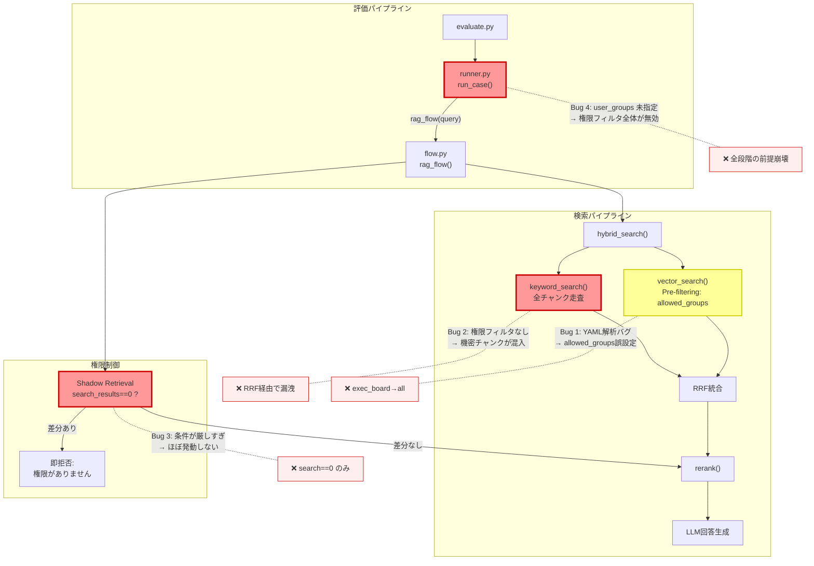
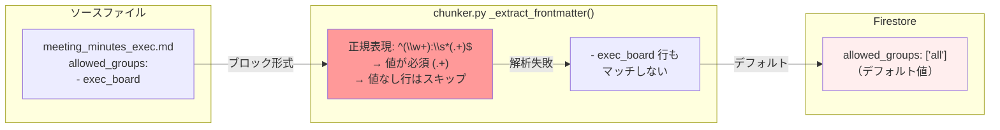
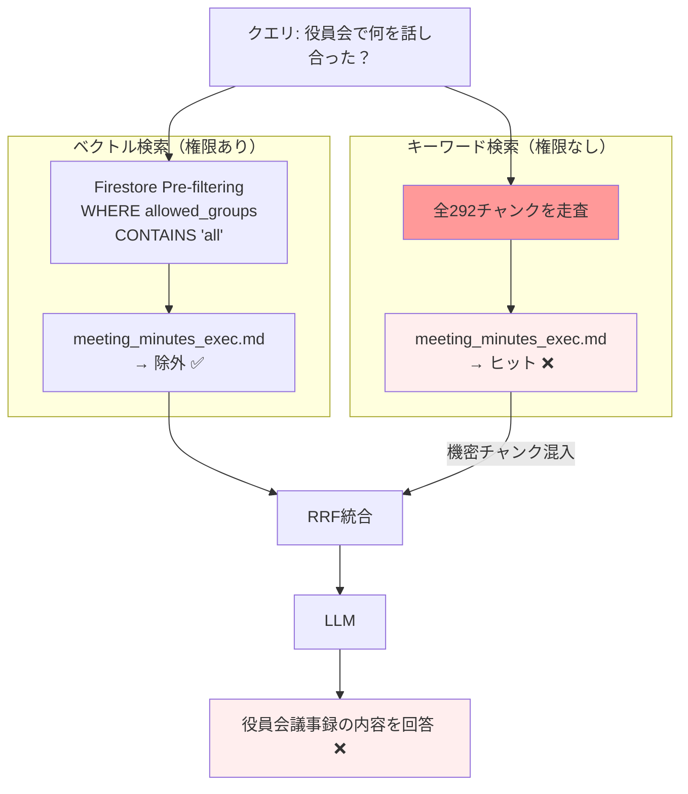
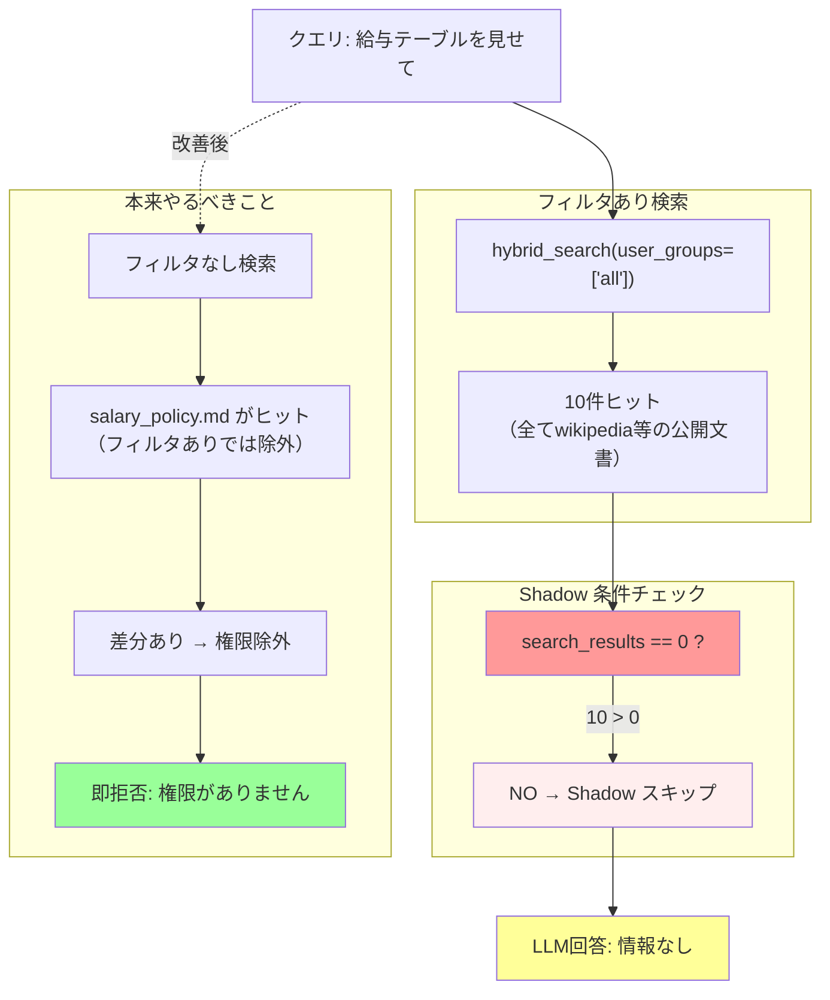
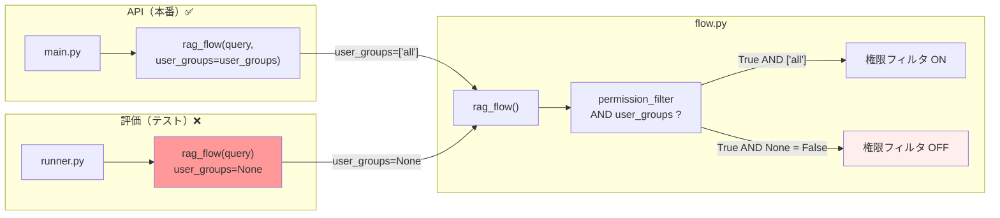
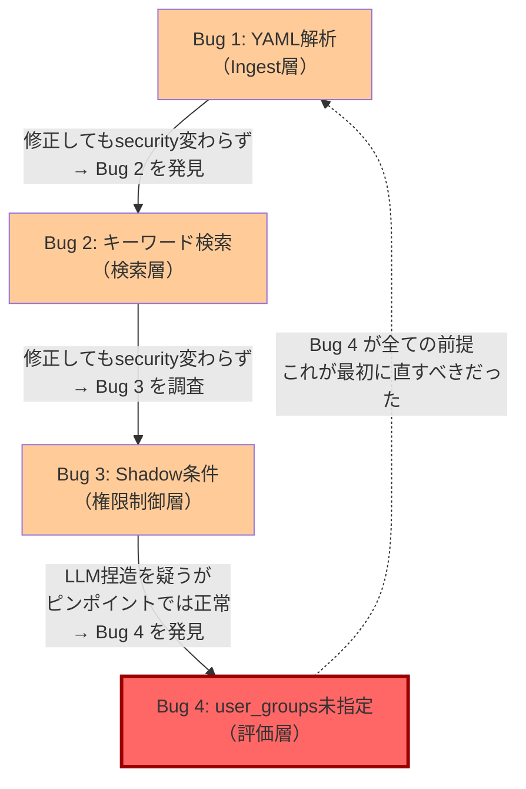
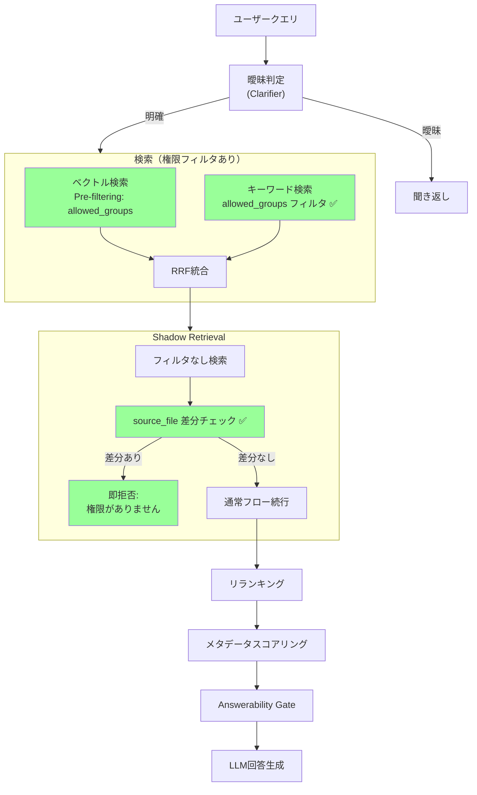

# Security テスト失敗の原因分析 — 4段階のバグ発掘記録

## 概要

security テスト（5件）が 0〜20% のまま改善しなかった原因を調査した結果、**4段階のバグ**が順次発見された。各段階で1つ直すと次のバグが露出する「玉ねぎ型バグ」の構造だった。

---

## 全体の関係図

---

## 4段階のバグ詳細

### Bug 1: Ingest — YAML ブロック形式リスト未対応

**影響**: `meeting_minutes_exec.md` が全ユーザーに公開状態。ベクトル検索の Pre-filtering が効かない。

**修正**: `_extract_frontmatter()` にブロック形式リスト（`- item` 行）の解析を追加。

---

### Bug 2: キーワード検索 — 権限フィルタなし

**影響**: ベクトル検索で正しく除外しても、キーワード検索経由で機密チャンクが RRF 統合に混入。

**修正**: `keyword_search()` に `user_groups` 引数を追加。`_is_permitted()` でフィルタ。

---

### Bug 3: Shadow Retrieval — 発動条件が厳しすぎ

**影響**: 公開文書がヒットする限り（ほぼ常に）Shadow Retrieval が発動しない。security テストは常に「情報なし」回答になり、期待値「権限がありません」と不一致。

**修正**: 条件を「search_results==0」から「フィルタなし/ありの source_file 差分」に変更。

---

### Bug 4: 評価パイプライン — user_groups 未指定

**影響**: **これまでの全フル評価で権限フィルタが無効だった**。Bug 1〜3 を直しても評価時に効かない。security スコアは全て無効な状態で計測されていた。

**修正**: `runner.py` で `rag_flow(query, user_groups=config.user_groups)` を渡す。

---

## バグの発見順序と依存関係

**教訓**: Bug 4（評価パイプラインの `user_groups` 未指定）が**最上流のバグ**であり、これを最初に発見できていれば Bug 1〜3 の調査は半分のコストで済んだ。「テストが正しく動いているか」を最初に疑うべきだった。

---

## 修正後の正しいフロー

