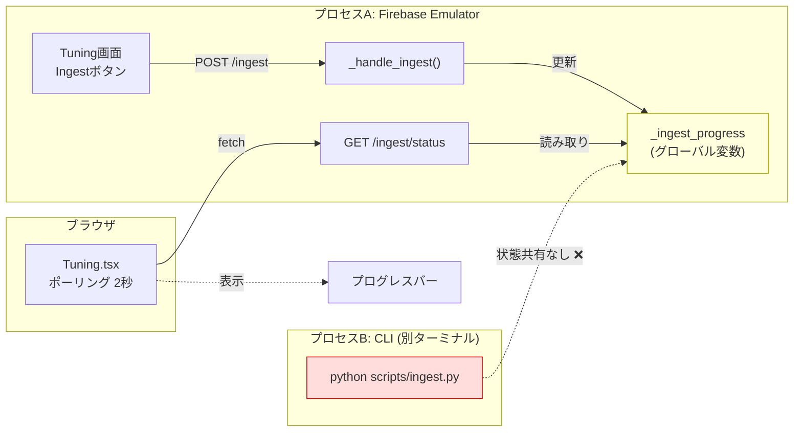
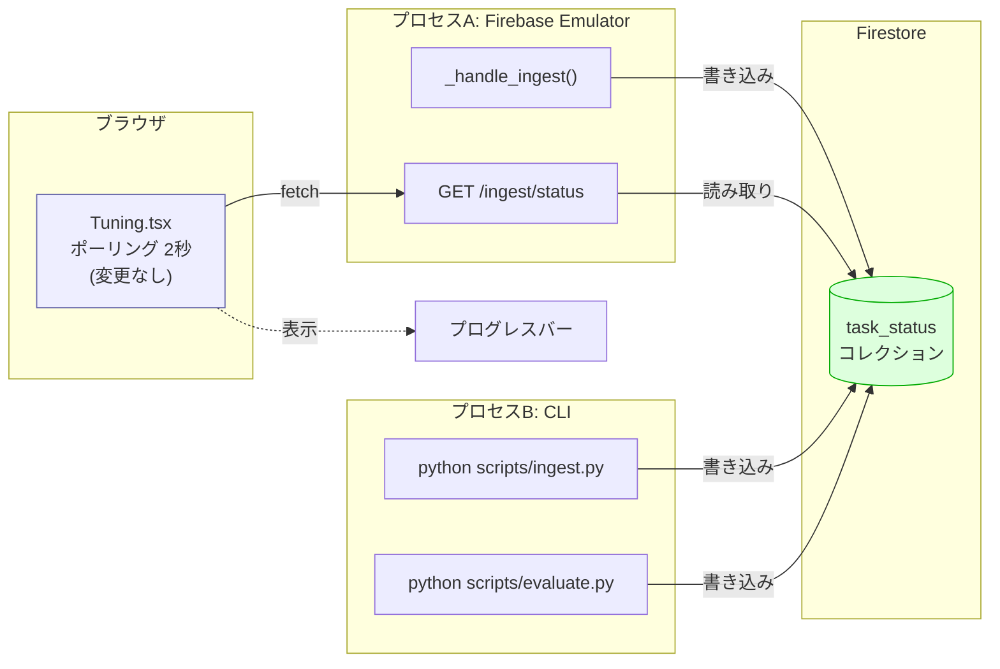
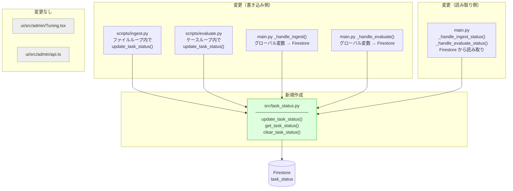

# アーキテクチャ図

## 現状（DD-019-3-2: インメモリ管理）

```mermaid
graph LR
    subgraph "プロセスA: Firebase Emulator"
        UI_BTN["Tuning画面<br/>Ingestボタン"]
        HANDLER["_handle_ingest()"]
        GLOBAL["_ingest_progress<br/>(グローバル変数)"]
        STATUS_API["GET /ingest/status"]

        UI_BTN -->|POST /ingest| HANDLER
        HANDLER -->|更新| GLOBAL
        STATUS_API -->|読み取り| GLOBAL
    end

    subgraph "ブラウザ"
        TUNING["Tuning.tsx<br/>ポーリング 2秒"]
    end

    TUNING -->|fetch| STATUS_API
    TUNING -.->|表示| PROGRESS["プログレスバー"]

    subgraph "プロセスB: CLI (別ターミナル)"
        CLI_INGEST["python scripts/ingest.py"]
    end

    CLI_INGEST -.->|状態共有なし ❌| GLOBAL

    style CLI_INGEST fill:#fdd,stroke:#c00
    style GLOBAL fill:#ffd,stroke:#aa0
```

> **問題**: CLI（プロセスB）はグローバル変数にアクセスできない

---

## 改善後（DD-019-3-3: Firestore経由）

```mermaid
graph LR
    subgraph "Firestore"
        TS[("task_status<br/>コレクション")]
    end

    subgraph "プロセスA: Firebase Emulator"
        HANDLER["_handle_ingest()"]
        STATUS_API["GET /ingest/status"]

        HANDLER -->|書き込み| TS
        STATUS_API -->|読み取り| TS
    end

    subgraph "プロセスB: CLI"
        CLI_INGEST["python scripts/ingest.py"]
        CLI_EVAL["python scripts/evaluate.py"]

        CLI_INGEST -->|書き込み| TS
        CLI_EVAL -->|書き込み| TS
    end

    subgraph "ブラウザ"
        TUNING["Tuning.tsx<br/>ポーリング 2秒<br/>(変更なし)"]
    end

    TUNING -->|fetch| STATUS_API
    TUNING -.->|表示| PROGRESS["プログレスバー"]

    style TS fill:#dfd,stroke:#0a0
    style TUNING fill:#eef,stroke:#66a
```

> **ポイント**: Firestoreが共有ストアとなり、どのプロセスから書き込んでも検出可能

---

## コンポーネント責務

```mermaid
graph TB
    subgraph "新規作成"
        TaskStatus["src/task_status.py<br/>─────────────────<br/>update_task_status()<br/>get_task_status()<br/>clear_task_status()"]
    end

    subgraph "変更（書き込み側）"
        INGEST_CLI["scripts/ingest.py<br/>ファイルループ内で<br/>update_task_status()"]
        EVAL_CLI["scripts/evaluate.py<br/>ケースループ内で<br/>update_task_status()"]
        INGEST_API["main.py _handle_ingest()<br/>グローバル変数 → Firestore"]
        EVAL_API["main.py _handle_evaluate()<br/>グローバル変数 → Firestore"]
    end

    subgraph "変更（読み取り側）"
        STATUS_R["main.py<br/>_handle_ingest_status()<br/>_handle_evaluate_status()<br/>Firestore から読み取り"]
    end

    subgraph "変更なし"
        FE["ui/src/admin/Tuning.tsx"]
        API_TS["ui/src/admin/api.ts"]
    end

    INGEST_CLI --> TaskStatus
    EVAL_CLI --> TaskStatus
    INGEST_API --> TaskStatus
    EVAL_API --> TaskStatus
    STATUS_R --> TaskStatus
    TaskStatus --> Firestore[("Firestore<br/>task_status")]

    style TaskStatus fill:#dfd,stroke:#0a0
    style FE fill:#eee,stroke:#999
    style API_TS fill:#eee,stroke:#999
```
