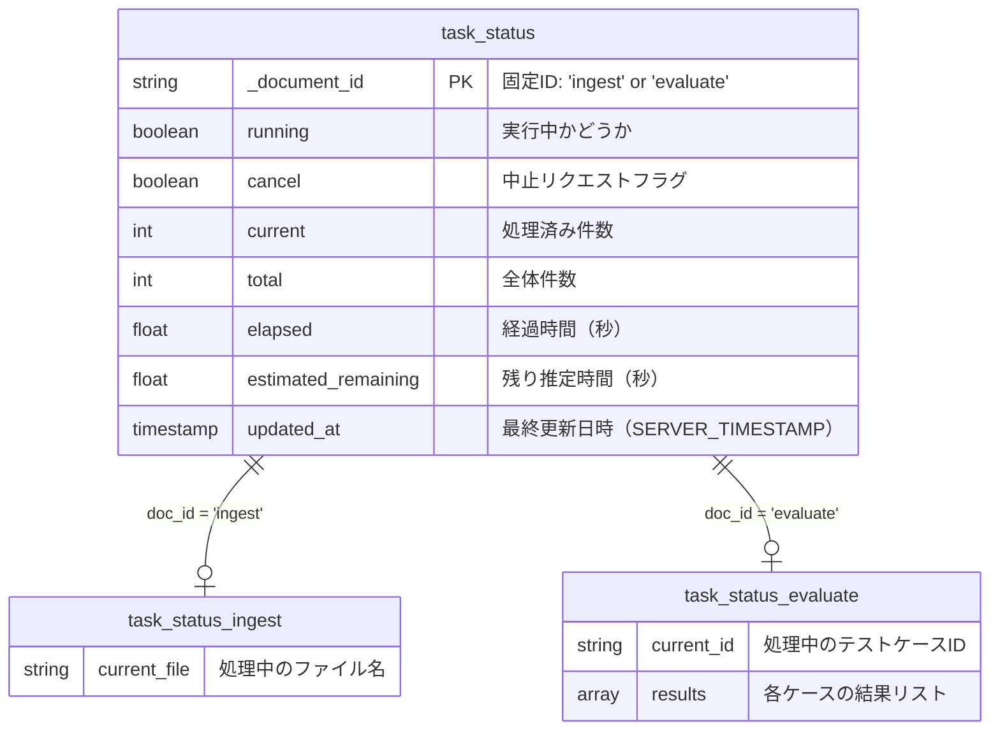
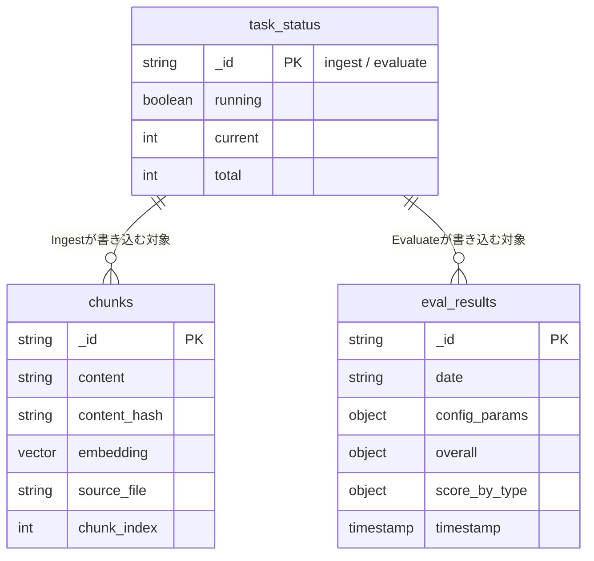

# Firestore データモデル

## task_status コレクション（新規）



## ドキュメント例

### `task_status/ingest`

```json
{
  "running": true,
  "cancel": false,
  "current": 15,
  "total": 61,
  "current_file": "社内規程/vpn_manual.md",
  "elapsed": 45.2,
  "estimated_remaining": 138.6,
  "updated_at": "2026-03-21T10:00:45Z"
}
```

### `task_status/evaluate`

```json
{
  "running": true,
  "cancel": false,
  "current": 12,
  "total": 45,
  "current_id": "exact_match_003",
  "elapsed": 120.5,
  "estimated_remaining": 330.0,
  "results": [
    { "id": "exact_match_001", "status": "PASS", "llm_label": "CORRECT" },
    { "id": "exact_match_002", "status": "FAIL", "llm_label": "INCORRECT" }
  ],
  "updated_at": "2026-03-21T10:02:00Z"
}
```

## 既存コレクションとの関係



> `task_status` は実行中の進捗を一時的に保持するだけで、
> 処理の結果は従来通り `chunks` / `eval_results` に保存される。
> タスク完了時に `running: false` に更新される。
