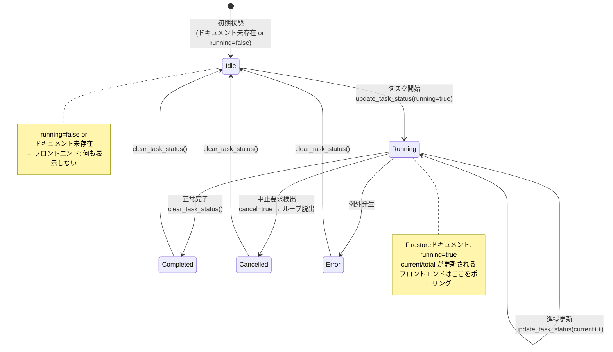
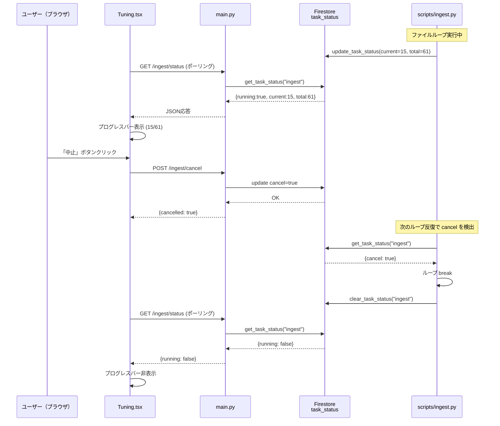
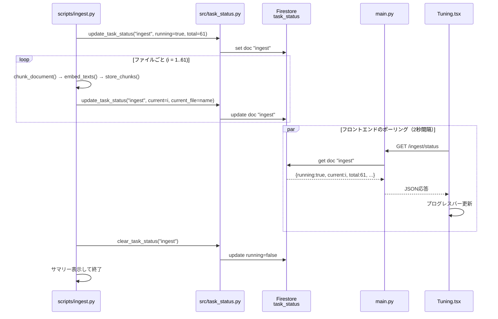

# 状態遷移図

## タスクのライフサイクル

## 中止フローの詳細

## 正常フロー（Ingest）

## Firestore書き込み頻度の考慮

| タスク | ループ単位 | 想定回数 | 書き込み間隔 |
|--------|-----------|---------|-------------|
| Ingest | ファイル単位 | 61回 | 数秒〜数十秒/ファイル |
| Evaluate | テストケース単位 | 45回 | 約10秒/ケース |

> PoCの規模（61ファイル / 45ケース）ではFirestoreの書き込みコストは無視できる水準。
> 仮に1回の実行で100回書き込みが発生しても、無料枠（20,000回/日）の範囲内。
