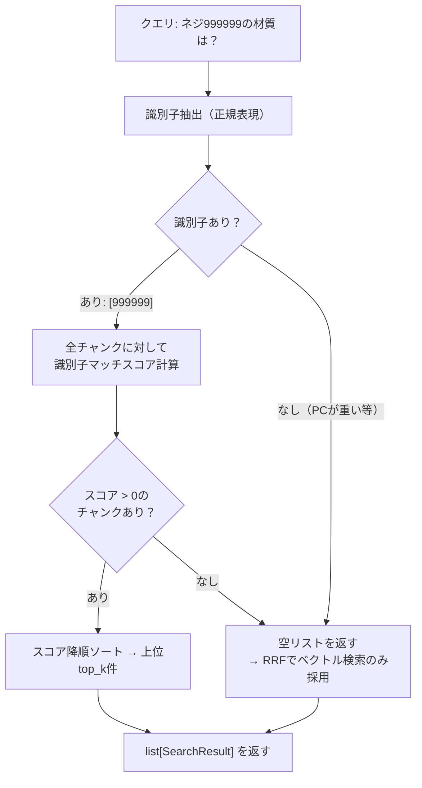
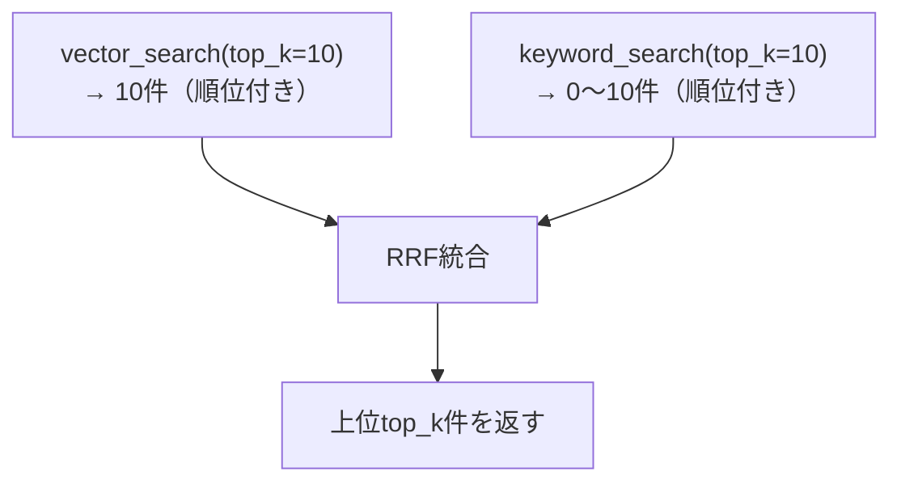

# DD-019-4: ハイブリッド検索（#06）

| 作成日 | 更新日 | ステータス |
|--------|--------|------------|
| 2026-03-21 | 2026-03-21 | 進行中 |

## 目的

ベクトル検索にキーワード検索を組み合わせたハイブリッド検索を導入し、型番・品番・固有名詞の完全一致精度を改善する。

## 背景・課題

グループAフル評価（34.8%）で**exact_match 0/8 (0%)**が最大のボトルネック。ベクトル検索は意味の近さで探すため、「ネジ999999」と「ネジ999998」を区別できない。

| テスト項目 | 現在のスコア | ハイブリッド検索で改善が見込めるか |
|-----------|------------|-------------------------------|
| exact_match | 0/8 (0%) | ◎ 直接の改善対象 |
| similar_number | 2/6 (33%) | ○ 型番の厳密一致で改善 |
| semantic | 2/12 (17%) | △ 間接的に改善の可能性 |

### 現在のパイプライン

```
曖昧判定 → vector_search(top_k=10) → rerank(top_n=5) → metadata_score → LLM生成
```

ベクトル検索のみで、キーワード（文字列一致）検索がない。ADR-004で「Recall不足が判明した時点でハイブリッド化」と決定済みであり、exact_match 0%はその条件を満たしている。

### 関連資料

- ADR-004: 検索方式（ベクトル検索のみで開始、ハイブリッド化を将来検討）
- `doc/research/03_セマンティック検索.md`: ハイブリッド検索ルーティング設計
- `doc/research/03-2_深堀.md`: RRFスコア融合の数学的背景
- `doc/presentation/20260320/06_hybrid-search.md`: プレゼン資料

## 検討内容

### キーワード検索の実装方式

| # | 方式 | メリット | デメリット | PoCとしての適性 |
|---|------|---------|-----------|---------------|
| 1 | **Firestoreインメモリ全文検索** | 追加サービス不要、Firestore内で完結 | 全チャンク取得が必要（454件なら許容範囲） | ◎ |
| 2 | Firestore where句（メタデータフィルタ） | シンプル | contentの部分一致検索ができない | △ |
| 3 | 外部検索エンジン（Elasticsearch等） | 本格的な全文検索 | 構築・運用コスト大 | ✕（PoC過剰） |

**→ 方式1を採用**: PoCの454チャンクであればインメモリで十分。全チャンクをFirestoreから取得し、Pythonの文字列マッチングでキーワード検索を行う。

### キーワード検索のロジック

テストケース分析により、exact_matchの8件中大半が**型番・品番（999999, 999998, 999997, 1000001等）**の完全一致を要求している。similar_numberの6件も同様。

#### 全体フロー



#### 識別子抽出（`_extract_identifiers`）

正規表現で型番・品番・英数コードをクエリから抽出する。

| パターン | 例 | 対象テスト |
|---------|---|----------|
| `\d{4,}` | 999999, 1000001 | exact_match, similar_number |
| `[A-Z][A-Za-z]*\d+` | SUS304, M8, M10 | similar_number (confuse-003〜006) |

識別子が1つも抽出できない場合（「PCが重い」等）、keyword_searchは**空リストを返す**。RRF統合ではベクトル検索の結果のみが使われ、既存動作と同じになる（regression なし）。

#### スコア計算式（`_score_chunk`）

```python
score = 0.0
for identifier in identifiers:
    if identifier in content:  # 部分文字列一致
        score += 2.0           # 識別子1つにつき +2.0
# 識別子マッチのみ。一般語マッチは行わない（理由は下記）
```

**一般語マッチを行わない理由**:
- 形態素解析なしでは日本語の分割ができない（「ネジ」「材質」を切り出せない）
- 一般語の検索精度はベクトル検索が担当し、RRFで統合される
- 識別子がないクエリでは空リストを返し、ベクトル検索のみにfallbackする方がシンプルで安全

#### 全チャンク取得（`_fetch_all_chunks`）

```python
db.collection(config.collection_name).stream()
```

- `collection.stream()`でFirestoreから全ドキュメントを順次取得（454件）
- 各ドキュメントから`content`, `source_file`, `chunk_index`, `category`, `security_level`を取得し`SearchResult`に変換（`score=0.0`で初期化）
- モジュールレベル変数`_chunk_cache`にキャッシュ。2回目以降はFirestoreアクセスなし

### スコア統合: RRF（Reciprocal Rank Fusion）

ベクトル検索とキーワード検索の結果を**順位ベース**で統合する。スコアのレンジが異なるため、順位のみを用いるRRFが最も安定する。



**計算式:**
```
RRFScore(d) = 1/(k + rank_vector(d)) + 1/(k + rank_keyword(d))
```

- `k = 60`（標準値）
- 片方にしか登場しないチャンクは、もう片方のRRF項を**0**として扱う（加算しない）
- keyword_searchが空リストを返した場合: ベクトル検索結果の順位だけでRRFスコアを計算 → ベクトル検索の順位がそのまま維持される

### パイプライン統合箇所

```
曖昧判定 → hybrid_search(top_k) → rerank(top_n=5) → metadata_score → LLM生成
             ├─ vector_search(top_k)
             └─ keyword_search(top_k)
             └─ RRF統合
```

`src/search/retriever.py`に`keyword_search()`と`hybrid_search()`を追加し、`flow.py`のStep 1を`hybrid_search()`に差し替える。

### ON/OFF制御

`config.hybrid_search: bool`で切替可能にする。OFFの場合は従来のベクトル検索のみ。

## 決定事項

- **方式**: インメモリキーワード検索 + RRFスコア統合
- **キーワード検索**: Firestoreから全チャンク取得→Python文字列マッチング
- **スコア統合**: RRF（k=60）
- **統合箇所**: `retriever.py`に追加、`flow.py`のStep 1を差替え
- **ON/OFF制御**: `config.hybrid_search`
- **キャッシュ無効化**: Ingest実行時（`store_chunks`/`clear_collection`）にキーワード検索のチャンクキャッシュを破棄する
- **再Ingest**: 不要

## タスク一覧

### Phase 0: 事前精査 ✅
- [x] 📋 **各Phaseのタスク精査・詳細化**
  - exact_matchテスト8件を分析: 型番（999999, 999998, 999997, 1000001）の完全一致が中心
  - similar_numberテスト6件も型番区別が中心
  - 日本語形態素解析ライブラリは未導入（requirements.txtにjanome/MeCab等なし）
  - → 正規表現による識別子抽出 + 全文部分一致の2段階方式で十分と判断
  - 各Phaseのタスクにファイルパス・具体的変更内容・機械検証を記載済み
- [x] 😈 **Devil's Advocate調査**（下記DA批判レビュー記録に詳細）

### Phase 1: キーワード検索ロジック ✅
- [x] `src/config.py`: `hybrid_search: bool = True`, `rrf_k: int = 60` を追加
- [x] `src/search/keyword_searcher.py`（新規作成）: 識別子ベースのキーワード検索モジュール
  - `_fetch_all_chunks()`: Firestoreから全チャンク取得・キャッシュ
  - `invalidate_chunk_cache()`: キャッシュ破棄
  - `_extract_identifiers()`: 正規表現で型番・品番・英数コードを抽出
  - `_score_chunk()`: 識別子がcontentに含まれれば+2.0/個
  - `keyword_search()`: 識別子なしなら空リスト、ありならスコア>0の上位top_k件
- [x] `src/search/hybrid.py`（新規作成）: RRF統合モジュール
  - `_rrf_score()`: `1/(k + rank)` 計算
  - `_merge_by_rrf()`: チャンクキー（source_file:chunk_index）で統合
  - `hybrid_search()`: vector_search + keyword_search → RRF → top_k件
- [x] 🔬 **機械検証**: syntax OK（3ファイル） + `ruff check` All checks passed
  - ※ GCPパッケージはローカル未インストールのためimportテストは既存コードと同様にスキップ
- [x] 😈 **DA批判レビュー**: 下記Phase 1 DA記録に詳細。`dataclasses.replace`のループ内import→修正済。他2件は許容

### Phase 2: パイプライン接続
- [ ] `src/search/flow.py`: Step 1を変更
  - before: `search_results = vector_search(query)`
  - after: `config.hybrid_search`がTrueなら`hybrid_search(query)`、Falseなら`vector_search(query)`を呼び出し
  - import追加: `from src.search.hybrid import hybrid_search`
  - ログ出力: `[HybridSearch]` or `[VectorSearch]` を表示
- [ ] `src/ingest/store.py`: `store_chunks()`と`clear_collection()`の末尾で`invalidate_chunk_cache()`を呼び出し（Ingest後にキーワード検索キャッシュが古くならないようにする）
- [ ] `src/evaluate/scorer.py`: `FEATURE_MAP`に`"hybrid_search": "hybrid_search"`を追加（`"contextual_retrieval"`の下に追記）
- [ ] 🔬 **機械検証**: `ruff check src/search/flow.py src/evaluate/scorer.py` → エラーなし
- [ ] 🔬 **機械検証**: `python scripts/evaluate.py --limit 10` → 実行完了、`[HybridSearch]` ログ出力確認
- [ ] 😈 **DA批判レビュー（「このPhaseで何が壊れるか」を最低1件発見）**

### Phase 3: 評価・記録
- [ ] 簡易評価結果（`--limit 10`）をDD-019-4ログに記録
- [ ] DD-019の子DD一覧にステータス・スコア変動を更新
- [ ] 👀 **目視確認**: exact_matchテスト項目のスコアが改善しているか確認

## ログ

### 2026-03-21
- DD起票（待機）
- グループAフル評価完了後、グループBの最初の子DDとして起票
- exact_match 0%が最大のボトルネック → ハイブリッド検索で直接改善を狙う
- 実装方式: インメモリキーワード検索 + RRFスコア統合に決定
- Phase 0完了:
  - exact_matchテスト8件を分析 → 型番（999999等）の完全一致が中心
  - similar_numberテスト6件も型番区別が中心（999999 vs 999998 vs 999997）
  - 日本語形態素解析は不要と判断（正規表現による識別子抽出で十分）
  - モジュール分割を決定: `keyword_searcher.py`（キーワード検索）+ `hybrid.py`（RRF統合）を新規作成
  - DA調査: Firestoreフルスキャンのレイテンシリスク → キャッシュで対処。ストップワード問題 → 識別子重視のスコアリングで対処
- Phase 1完了:
  - `src/config.py`: `hybrid_search`, `rrf_k` 追加
  - `src/search/keyword_searcher.py` 新規作成: 識別子ベースキーワード検索 + Firestoreキャッシュ
  - `src/search/hybrid.py` 新規作成: RRFスコア統合
  - syntax + ruff lint全パス
  - DA: `dataclasses.replace`のループ内import → 修正済。`_get_db()`重複・ハイフン付きコード非対応は許容

---

## DA批判レビュー記録

<!-- DA批判レビューの手順・品質フィルター・再チェック条件は doc/da-method.md を参照 -->

### Phase 0 DA批判レビュー

**DA観点:** インメモリキーワード検索の実現可能性とスケーラビリティ

| # | 発見した問題/改善点 | 重要度 | 再現手順（高/中は必須） | DA観点 | 対応 |
|---|-------------------|--------|----------------------|--------|------|
| 1 | Firestoreから全454チャンク取得はクエリごとに実行するとレイテンシ増大（1回あたり数百ms〜1秒） | Medium | ハイブリッド検索ONでクエリ実行 → Firestoreフルスキャン → 応答遅延 | パフォーマンス | モジュールレベルキャッシュで初回のみ取得。チャンクはIngest時にしか変更されないため、プロセス再起動まで有効 |
| 2 | 日本語クエリでの一般キーワード抽出精度: 形態素解析なしでは「締付トルク」を「締付」と「トルク」に分割できない | Low | `ネジ999999の締付トルクは？` → 識別子`999999`は抽出可能だが一般語の分割は不完全 | 検索精度 | exact_match/similar_numberの主要改善対象は型番（数字列）であり、識別子抽出（正規表現）で対応可能。一般語の検索精度はベクトル検索側が担当するためRRF統合で補完される。形態素解析の導入はover-engineering |
| 3 | RRF k=60は大規模データセット向けの標準値。454チャンクではキーワード検索結果の順位差が小さく、RRFスコアの分解能が低い可能性 | Low | — | パラメータ適切性 | k=60は順位1位と2位の差を小さくする（0.0164 vs 0.0161）。454チャンクでも上位10件程度を使うため実質的な問題は小さい。configから変更可能にしておく |
| 4 | キーワード検索でストップワード（「の」「は」「を」等）がマッチしてノイズ増加 | Medium | `ネジ999999の材質は？` → 「の」「は」が全チャンクにマッチ → スコア差が出にくい | 検索精度 | スコアリングで識別子マッチに重み2.0を設定し、一般語マッチ（重み1.0）より優先。助詞がマッチしても識別子の有無でスコア差がつく設計 |
| 5 | Ingest実行後に同一プロセス内でキーワード検索すると、キャッシュが古いまま検索される | High | Tuning画面からIngest実行 → 直後にチャット検索 → 古いチャンクデータで検索 | データ整合性 | `store_chunks()`/`clear_collection()`実行時に`invalidate_chunk_cache()`を呼び出してキャッシュを破棄する |

### Phase 1 DA批判レビュー

**DA観点:** 実装コードの正確性・コード品質

| # | 発見した問題/改善点 | 重要度 | 再現手順（高/中は必須） | DA観点 | 対応 |
|---|-------------------|--------|----------------------|--------|------|
| 1 | `from dataclasses import replace`がforループ内にあった | Low | — | コード品質 | ✅修正済: モジュールトップに移動 |
| 2 | `_get_db()`が`retriever.py`と`keyword_searcher.py`に重複（Firestoreクライアント2インスタンス） | Low | — | コード重複 | ⏭️許容: PoCでは実害なし。本番化時にDB接続を共通化 |
| 3 | 識別子抽出の正規表現 `[A-Z][A-Za-z]*\d+` がハイフン付きコード（`B-2001`等）に非対応 | Low | `ベアリングB-2001の在庫状況は？` → `B-2001`は未抽出 | 網羅性 | ⏭️許容: `\d{4,}`で`2001`が抽出されるため実害なし |
