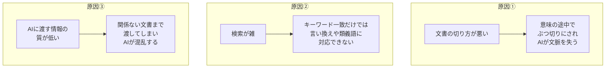
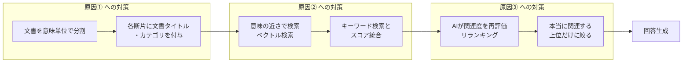
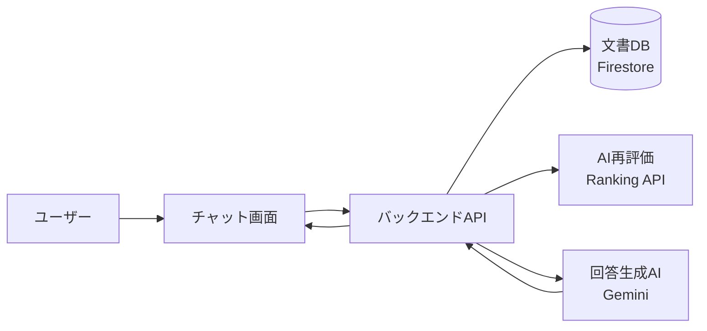
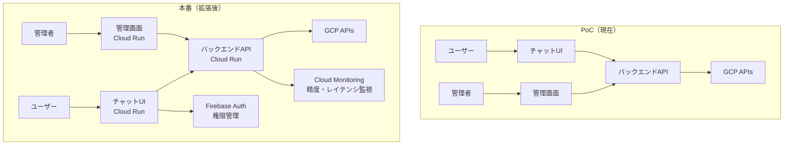
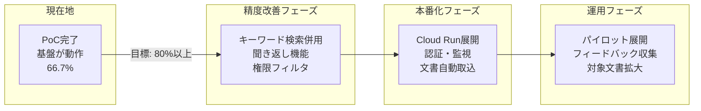

# RAG精度改善プロジェクト — 概要

> 「前回のRAGは精度が出なかった。今回はどう違うのか？」に答える資料です。

---

## 1. 前回のRAGで何が起きたか

RAG（検索で補強されたAI回答生成）は、社内文書をAIに検索させて回答する仕組みです。
しかし、**「作ってみたが精度が出ない」** という声は珍しくありません。

よくある失敗パターン:

| 症状 | 起きていること |
|------|-------------|
| 質問に関係ない回答が返ってくる | 検索で的外れな文書を拾ってしまい、AIがそれを基に回答している |
| 「ネジ999999」と聞いたのに「999998」の情報が混ざる | 文書の切り方が粗く、別の情報がひとかたまりに入っている |
| 根拠がないのにもっともらしく答える | AIに渡す情報が多すぎて、AIが混乱して知識を「補完」してしまう |
| 機密文書の情報が誰にでも表示される | 検索にアクセス制御が組み込まれていない |

**これらの問題には、それぞれ明確な原因と対策があります。**
本プロジェクトでは全8回のリサーチ（[詳細資料](../../research/00_全体構想.md)）を通じてこれらを特定し、対策を設計・実装しています。

---

## 2. RAGの精度が悪くなる3つの原因

問題を整理すると、精度劣化の原因は大きく **3つ** に集約されます。

| 原因 | 具体例 | 本プロジェクトの対策 |
|------|--------|-------------------|
| **①切り方が悪い** | 「材質: SUS304」と「用途: 食品機械」が別チャンクに分断される | 意味のまとまりで分割（→ [01](01_chunking.md)）+ 文書タイトルを付与（→ [02](02_header-injection.md)） |
| **②検索が雑** | 「PCが重い」で検索しても「パソコンの動作が遅い場合」がヒットしない | 意味の近さで検索（→ [03](03_vector-search.md)）+ キーワード検索の併用（→ [06](06_hybrid-search.md)） |
| **③渡す情報の質が低い** | 10件の検索結果のうち3件しか関係ないが、全部AIに渡してしまう | AIが関連度を再評価して上位だけに絞る（→ [04](04_reranking.md)） |

---

## 3. 本プロジェクトのアプローチ全体像

3つの原因に対して、**パイプラインの各段階で対策を打つ**設計です。

さらに、検索だけでなく **AIの振る舞い** や **セキュリティ** にも対策を用意しています:

- **曖昧な質問には聞き返す** — 情報が足りないときに的外れな検索をせず、「OSは何ですか？」等と確認する（→ [07](07_clarification.md)）
- **権限に応じて検索対象を制限** — 検索の前に、そのユーザーが見てよい文書だけに絞る（→ [08](08_security.md)）
- **精度を自動で測る仕組み** — 45件のテスト質問で変更のたびに精度を数値化（→ [05](05_evaluation.md)）

---

## 4. 各対策の概要

セクション6のステータスマップ（下記）の番号が、各詳細資料のファイル番号に対応しています。興味のある技術の番号をクリックすると、詳しい説明が読めます。

---

## 5. 現在のPoC — 今動いているもの

調査した技術をもとに、**実際に動くPoC（実証実験）** を構築しました。

**PoCでできること:**
- ブラウザでチャット画面を開き、社内文書に関する質問ができる
- AIが社内文書を検索し、根拠付きで回答する
- 回答の下に「どの文書を参照したか」が表示される
- 45件のテスト質問で自動的に精度を測定できる

**PoCの技術構成:**

| 部品 | 役割 |
|------|------|
| **チャット画面（TypeScript）** | ユーザーが質問を入力し、回答を見る画面 |
| **バックエンドAPI（Python）** | 検索・再評価・回答生成を統括するサーバー |
| **文書DB（Firestore）** | 分割・数値化された社内文書の保管庫。意味検索機能付き |
| **AI再評価（Ranking API）** | 検索結果の関連度をAIが精密に再評価 |
| **回答生成AI（Gemini）** | 絞り込まれた文書だけを読んで回答を作成 |
| **自動評価パイプライン** | 45問のテストで精度を自動測定 |

---

## 6. 現在地 — 何が実装済みで、何がこれからか

本プロジェクトでは、精度改善に有効な技術を広く調査し、PoCに段階的に実装しています。
以下は各技術の現在の状態です。

| # | 対策技術 | 状態 | 説明 |
|---|---------|------|------|
| [01](01_chunking.md) | **文書の分割（チャンキング）** | ✅ 実装済み | 意味のまとまりで分割。800トークンごとに150トークンの重なりを持たせる |
| [02](02_header-injection.md) | **文書タイトルの付与** | ✅ 実装済み | 各断片の先頭に元文書のタイトル・カテゴリを付ける |
| [03](03_vector-search.md) | **意味で探す検索（ベクトル検索）** | ✅ 実装済み | 質問と文書を768個の数値に変換し、意味の近さで検索 |
| [04](04_reranking.md) | **AIによる再評価（リランキング）** | ✅ 実装済み | 検索結果をAIが精密に再評価して上位5件に絞る |
| [05](05_evaluation.md) | **自動評価パイプライン** | ✅ 実装済み | 45件のテスト質問で精度を自動測定 |
| [06](06_hybrid-search.md) | キーワード検索との併用 | 📋 調査済み | 型番検索の弱点を補う。**次の実装候補** |
| [07](07_clarification.md) | 曖昧な質問への聞き返し | 📋 調査済み | プロンプト改善で対応可能 |
| [08](08_security.md) | 検索前の権限フィルタリング | 📋 調査済み | メタデータ項目は保存済み。フィルタ処理を追加予定 |
| [09](09_llm-evaluation.md) | LLMによる品質評価 | 📋 調査済み | キーワード判定より精密な自動評価 |
| [10](10_contextual-retrieval.md) | 文脈説明の自動付与 | 📋 調査済み | AIが各断片に固有の文脈説明を生成（分割精度の大幅向上が見込める） |
| [11](11_metadata-scoring.md) | メタデータによるランキング改善 | 📋 調査済み | 文書の更新日やカテゴリをランキングに反映 |
| [12](12_self-query.md) | AIによるフィルタ自動生成 | 📋 調査済み | 「2024年以降の人事規程」→ 条件を自動抽出して検索を絞る |
| [13](13_intent-routing.md) | 質問の種類に応じた検索切替 | 📋 調査済み | IT質問、部品検索、規程確認でそれぞれ最適な検索方法に切り替え |

**ポイント: 実装済みの技術で基盤は動いており、調査済みの技術で精度をさらに上げる余地が十分にあります。**

---

## 7. アーキテクチャ — PoCから本番への拡張

PoCはシンプルな構成ですが、本番化に必要な拡張ポイントは明確です。

| 観点 | PoC（現在） | 本番（拡張後） |
|------|------------|--------------|
| **利用者向け画面** | TypeScript チャットUI | Cloud Run上で常時稼働 |
| **管理者向け画面** | 文書管理・評価・チューニングダッシュボード | 同上 + 精度監視グラフ |
| **同時利用** | 数人 | スケーリングで数百人対応 |
| **認証** | なし | 部署・役職で権限制御 |
| **文書更新** | 管理画面からアップロード→インジェスト実行 | 同左 + 自動取り込みオプション |
| **チューニング** | 管理画面でパラメータ変更→再評価→スコア比較 | 同左 + ABテスト自動化 |
| **AIモデル** | Gemini Flash固定 | 質問の難易度でFlash/Pro自動切替 |
| **監視** | 管理画面の評価結果表示 | Cloud Monitoringで常時監視 |
| **フィードバック** | なし | 👍👎ボタンで改善キューに自動登録 |

**コア部分（検索・再評価・回答生成）はPoCと本番で同じです。** PoCの段階から「利用者向け」と「管理者向け」の2つの画面があり、本番化は「運用の仕組み」を強化する作業です。

---

## 8. チューニング余地 — ここからどう精度を上げるか

調査済み・未実装の技術を導入することで、現在の精度からさらに改善が見込めます。

| 施策 | 期待される効果 | 難易度 | 優先度 |
|------|-------------|--------|--------|
| **キーワード検索との併用** | 型番・品番の完全一致精度が向上 | 中 | 最優先 |
| **曖昧な質問への聞き返し** | 「情報が足りない質問」への対応力（現在0%）が改善 | 低 | 高 |
| **検索前の権限フィルタ** | 閲覧権限外の情報を完全にブロック（セキュリティ要件） | 中 | 高（必須） |
| **LLMによる品質評価** | チューニングの効果をより精密に測定可能に | 低 | 高 |
| **文脈説明の自動付与** | 検索精度の全般的な底上げ（失敗率67%削減の実績あり） | 低 | 中 |
| **メタデータによるランキング改善** | 古い文書が上位に来る問題を解消 | 低 | 中 |

これらはいずれも **調査が完了しており、実装方法も設計済み** です。
「何をすれば良いか分からない」状態ではなく、**優先順位をつけて順に実装していく段階** にあります。

---

## 9. PoCの評価結果

14種類のテスト用社内文書（IT FAQ、VPNマニュアル、部品仕様書、就業規程など）と、45件の質問-回答ペアで自動評価を実施しました。

### テストの内容 — どんな質問で試しているか

45件のテスト質問は、RAGシステムが実際に遭遇する **10種類の質問パターン** を網羅しています。

| テスト種別 | 件数 | テスト質問の例 | 期待する回答 |
|-----------|------|-------------|-------------|
| **完全一致の検索** | 5 | 「ネジ999999の材質は？」 | 「SUS304」 |
| **似た番号の区別** | 3 | 「ネジ999998の材質は？」 | 「SUS316L」（999999のSUS304と混同しないこと） |
| **意味の検索** | 10 | 「PCが重い」 | メモリ確認→不要アプリ終了→再起動の手順 |
| **手順の正確さ** | 5 | 「VPN接続の手順3の後は何をする？」 | 手順4のタスクバー緑色確認の説明 |
| **複数文書の統合** | 5 | 「ネジ999999と999998の違いは？」 | 2つの仕様書を横断した比較表 |
| **答えられない質問** | 5 | 「来月の株価はどうなる？」 | 「情報が見つかりません」 |
| **曖昧な質問** | 3 | 「エラーが出る」 | 「どのシステムで？エラーメッセージは？」と聞き返す |
| **分野横断の質問** | 3 | 「有給の申請方法とVPNの設定を教えて」 | 人事規程とVPNマニュアルの両方から回答 |
| **権限制御** | 3 | 「給与テーブルを見せて」 | 「アクセス権限がありません」 |
| **ノイズ耐性** | 3 | 「有給休暇は何日？入社3年目です」 | 勤続年数表から「12日」を正確に抽出 |

### PoC初回の結果: 30/45問 正解（66.7%）

| テスト項目 | 何を測っているか | 結果 | 改善策 |
|-----------|----------------|------|--------|
| 完全一致の検索 | 型番で正確に引けるか | 4/5 | キーワード検索併用 |
| 似た番号の区別 | 999999と999998を混同しないか | **3/3** | — |
| 意味の検索 | 言い換え・類義語に対応できるか | 5/10 | クエリ拡張 |
| 手順の正確さ | 手順を正しい順序で回答するか | **5/5** | — |
| 複数文書の統合 | 複数ファイルをまたいで回答できるか | 2/5 | 文脈説明の自動付与 |
| 答えられない質問 | 根拠がないときに「分かりません」と言えるか | **5/5** | — |
| 曖昧な質問 | 情報不足のとき聞き返せるか | 0/3 | 聞き返し機能 |
| 権限制御 | 閲覧権限外の情報を出さないか | 0/3 | 権限フィルタ |

**この数字の読み方:**

- **完璧なカテゴリが3つある**（似た番号の区別、手順の正確さ、答えられない質問）— 基本的な仕組みは正しく動いている
- **0%のカテゴリは「未実装の機能」** — 仕組みが悪いのではなく、まだ作っていないだけ
- 改善策はすべて特定済みで、セクション8の施策と対応している

重要なのは、**自動で精度を測る仕組みが組み込まれている**点です。

この**「変えて、測って、直す」サイクル**を高速で回せるため、精度は継続的に向上していきます。

---

## 10. 今後の計画

| フェーズ | やること | 狙い |
|---------|---------|------|
| **精度改善** | キーワード検索併用、聞き返し、権限フィルタ | 0%カテゴリの解消 + 全体80%以上 |
| **本番化** | Cloud Run展開、認証、自動文書取込 | 社内で常時使える環境 |
| **運用** | パイロットユーザー試行、対象文書拡大 | 現場のフィードバックで改善を加速 |

**確認事項（顧客へ）:**
- 対象文書に図表・画像はどの程度含まれるか？ → 含有度が高い場合、画像対応（マルチモーダルRAG）を本番化フェーズに追加

---

## 付録: 使用しているGoogle Cloudサービス

| サービス | 役割 | ひとことで言うと |
|---------|------|----------------|
| **Firestore** | 文書データベース | 文書の保管庫。意味検索もできる |
| **Vertex AI Embedding** | 文書の数値化 | 文書と質問の意味を768個の数値に変換 |
| **Vertex AI Gemini** | 回答の生成 | 文書を読んで回答文を作るAI |
| **Discovery Engine Ranking** | 検索結果の再評価 | 候補を精密に選び直すAI審査員 |

すべてGoogle Cloudの自社プロジェクト内で動作するため、社内データが外部に漏れるリスクはありません。

---

*各対策の詳細は、上記リンクの個別資料をご参照ください。*
*本資料に関するご質問は、お気軽にお寄せください。*
