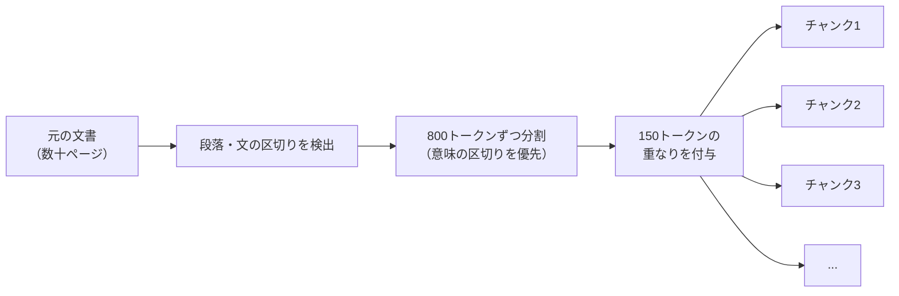

# 01. 文書の分割（チャンキング）

| 項目 | 内容 |
|------|------|
| PoC実装 | ✅ 実装済み |
| 説明 | 文書を意味のある単位に分割し、AIが必要な情報を正確に見つけられるようにする技術 |

---

## なぜ文書を分割する必要があるのか

RAG（検索拡張生成）では、ユーザーの質問に関連する情報を社内文書から探し出し、AIに渡して回答を作ります。
しかし、100ページのマニュアルをそのままAIに渡すことはできません。AIが一度に読める量には上限があるためです。

そこで、文書を小さな「かたまり（チャンク）」に分割し、質問に関係のある部分だけをAIに渡す仕組みが必要になります。

## たとえ話：本を「章ごと」に切るか「ランダムに切る」か

200ページの料理本を想像してください。

- **良い切り方**: 「カレーの章」「パスタの章」と、レシピごとに分ける
- **悪い切り方**: 20ページずつ機械的に切る。カレーの材料が1つ目の束、作り方が2つ目の束に分かれてしまう

文書の分割でも同じことが起きます。意味の区切りを無視して切ると、重要な情報が途中で分断されてしまいます。

## 本PoCでの実装方法

### RecursiveCharacterTextSplitter（再帰的文字分割器）

本PoCでは「RecursiveCharacterTextSplitter」という分割手法を採用しています。
これは、以下の優先順位で「意味の区切り」を探して分割する方法です。

1. まず段落の区切り（空行）で分けようとする
2. 段落で分けられなければ、文の区切り（改行）で分ける
3. それでも大きければ、句点（。）や読点（、）で分ける

### 設定値

- **チャンクサイズ**: 800トークン（約800文字相当）
- **オーバーラップ（重なり）**: 150トークン

オーバーラップとは、隣り合うチャンクに「重なり部分」を持たせることです。
たとえば、チャンクAの最後に「その理由は...」と書いてあり、理由がチャンクBにある場合、
重なりがないとAIは理由を見つけられません。重なりを持たせることで、情報の取りこぼしを防ぎます。

## 分割の流れ

## ポイント

- 分割サイズが**小さすぎる**と、1つのチャンクだけでは意味が通じなくなる
- 分割サイズが**大きすぎる**と、関係ない情報が混ざり、AIが混乱する
- 800トークン・150オーバーラップは「まず試す出発点」として採用し、自動評価（第5回参照）でスコアを見ながら調整する

---

## まとめ

文書分割は、RAGの精度を左右する最初の重要なステップです。
「意味の区切り」を尊重して分割し、適切な重なりを持たせることで、AIが必要な情報を正確に見つけ出せるようになります。

---

[← 概要](00_project-overview.md) | [📋 概要](00_project-overview.md) | [02. タイトル付与 →](02_header-injection.md)
