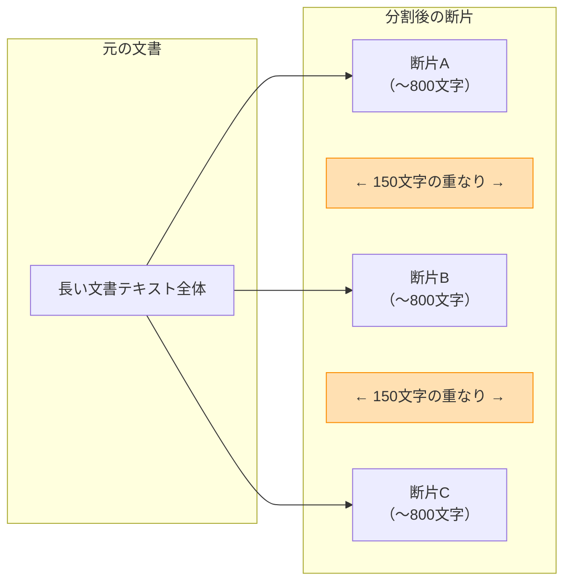
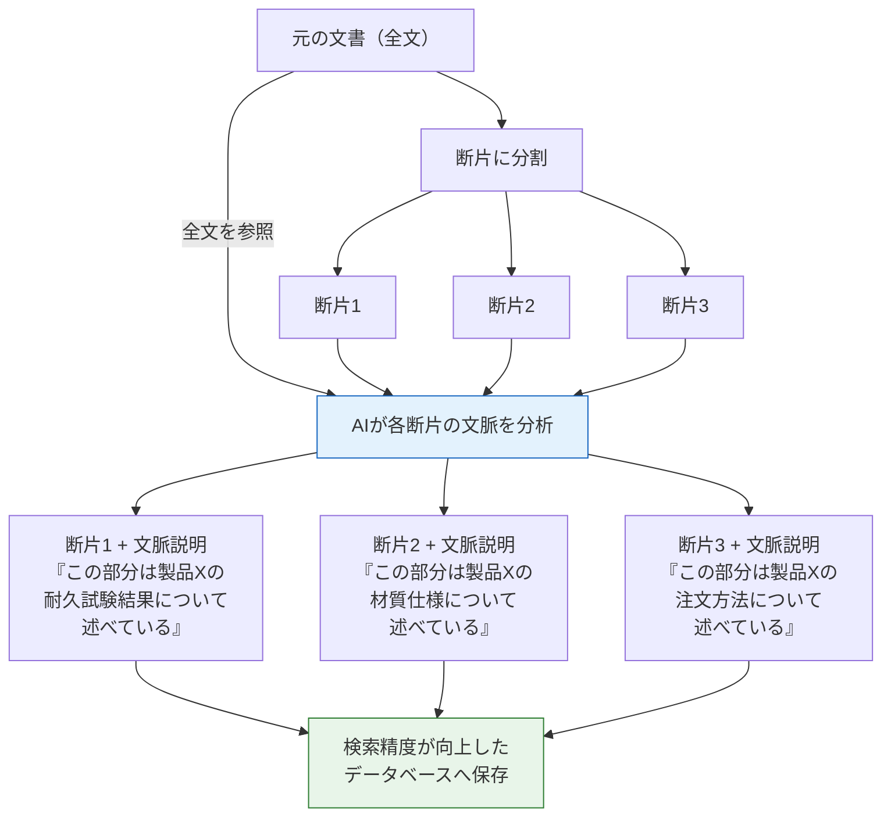

# 文書の分割（チャンキング）― なぜ「切り方」で回答精度が変わるのか

[← 概要に戻る](00_project-overview.md)

---

## 1. なぜ文書の「切り方」で精度が変わるのか

AIに社内文書を検索させるとき、文書はそのまま丸ごと読まれるわけではありません。
**事前に小さな断片（チャンク）に分割**され、質問に近い断片だけが選ばれてAIに渡されます。

この「切り方」が雑だと、AIは正しい情報を見つけられません。

### たとえ話: 百科事典と付箋

百科事典を想像してください。質問に答えるために、該当するページを探して渡す作業がRAGの検索です。

- **悪い切り方**: 百科事典を50ページずつ機械的にちぎる。「東京の人口」の説明が47ページ目の末尾と51ページ目の冒頭に分断され、どちらの断片を渡しても回答できない
- **良い切り方**: 項目ごと（「東京」「大阪」…）の区切りで切る。1つの断片に必要な情報がまとまっているので、AIが正確に回答できる

**以前のシステムで精度が出なかった原因の多くは、この「切り方」にあります。**
文書を一定の文字数で機械的に切っていると、意味のまとまりが壊れ、AIが「文脈の分からない断片」を渡されることになります。

---

## 2. 本プロジェクトの分割方法

本プロジェクトでは、**意味の区切りを優先する分割方式**を採用しています。

### 再帰的文字分割（RecursiveCharacterTextSplitter）

「段落の区切り → 改行 → 句点」の順に、**意味のまとまりが大きい区切りから優先的に分割**します。機械的に文字数だけで切るのではなく、文章の構造を尊重します。

| 設定項目 | 値 | 意味 |
|---------|-----|------|
| チャンクサイズ | 約800文字 | 1つの断片の目安の長さ |
| オーバーラップ（重なり） | 約150文字 | 隣の断片と重複させる部分 |

### なぜ「重なり」が必要なのか

断片Aの最後に「その理由は…」と書いてあり、理由の本文が断片Bにある場合を考えてください。重なりがないと、断片Aだけでは回答が不完全になります。

隣り合う断片の端を少し重ねておくことで、**情報の取りこぼしを防ぎます**。

---

## 3. ヘッダーインジェクション ― 各断片に「名札」を付ける

### 問題: 断片だけ見ても「何の話か」分からない

たとえば部品仕様書を分割したとき、ある断片に「材質: SUS304、耐熱温度: 800度」とだけ書かれていたら、これが**どの製品の情報か**分かりません。

### 解決策: 断片の先頭に文書タイトルを付ける

すべての断片の先頭に、元の文書名やカテゴリを自動で付与します。

| | 断片の内容 |
|---|---|
| **付与前** | 材質: SUS304、耐熱温度: 800度… |
| **付与後** | **[ネジ仕様書 v2.1 / 部品カタログ]** 材質: SUS304、耐熱温度: 800度… |

これにより、どの断片を拾っても**AIが「これはネジ仕様書の話だ」と判断でき**、正確な回答につながります。

---

## 4. さらなる改善: Contextual Retrieval（文脈付与検索）

ヘッダーインジェクションは「名札を貼る」ようなものでした。
次のステップとして検討しているのが、**AIが各断片に固有の説明文を書き添える**手法です。

### ヘッダーインジェクションとの違い

| | ヘッダーインジェクション（現在） | Contextual Retrieval（将来の改善） |
|---|---|---|
| **たとえ** | 本に「書名シール」を貼る | 司書が各ページに「この部分は○○の文脈で△△を説明しています」とメモを添える |
| **付ける情報** | 文書タイトル（全断片に同じ内容） | AIが生成した文脈の説明（断片ごとに異なる） |
| **精度への効果** | 基本的だが有効 | 検索失敗率を最大67%削減（業界ベンチマーク） |

### どのように機能するか

### 本プロジェクトでの位置づけ

本調査（DD-010-3）の結果、Contextual Retrieval は**ヘッダーインジェクションの上位互換**であり、本番環境での採用を推奨しています。現在のPoC（試作段階）ではまずハイブリッド検索（あいまい検索とキーワード検索の組み合わせ）を優先し、その次の改善ステップとして導入を計画しています。

コスト面でも、断片のデータベース登録時に一度だけAIを使う処理のため、**検索のたびに追加費用がかかるわけではありません**。

---

## まとめ

| ステップ | 何をしているか | たとえ |
|---------|-------------|-------|
| 意味の区切りで分割 | 文章の構造に沿って断片化 | 百科事典を項目ごとに切り分ける |
| オーバーラップ | 断片の端を少し重ねる | ページの端に次ページの冒頭を印刷しておく |
| ヘッダーインジェクション | 断片に文書名を付与 | すべてのページに書名シールを貼る |
| Contextual Retrieval | AIが文脈説明を付与 | 司書が各ページにメモを添える |

これらの工夫により、**「断片を見ただけでは文脈が分からない」問題を段階的に解消**し、AIの回答精度を高めています。

---

[← 概要に戻る](00_project-overview.md)
