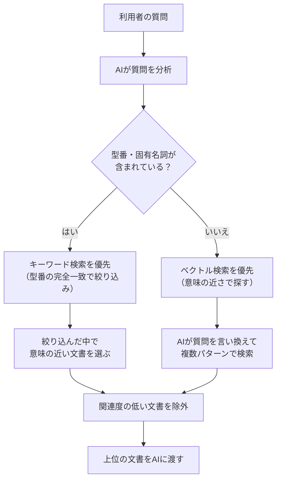
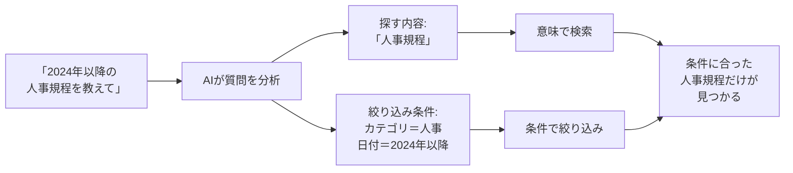

# 検索の仕組み ― なぜ「探し方」で回答の質が変わるのか

> 前回のRAGシステムがうまくいかなかった原因の多くは、「AIの頭が悪い」のではなく「検索で正しい資料を見つけられていない」ことにあります。このページでは、検索の仕組みを5つのステップで説明します。

---

## 1. キーワード検索の限界

従来のシステムは「キーワードが一致するか」で文書を探します。

**たとえ話:** 図書館で「PCが重い」と司書に伝えたら、「PC」と「重い」という単語が書かれた本だけを持ってきます。「パソコンが遅い」「動作が鈍い」という本は、言葉が違うので棚に置いたままです。

| 検索したい内容 | キーワード検索でヒットする | ヒットしない（同じ意味なのに） |
|---|---|---|
| PCが重い | 「PC 重い 原因」 | 「パソコンが遅い」「動作が鈍い」 |
| 電源が入らない | 「電源 入らない」 | 「起動しない」「画面が真っ暗」 |
| VPNが繋がらない | 「VPN 繋がらない」 | 「テレワーク接続エラー」 |

これが「検索の見落とし」です。正しい資料が社内にあるのに、言葉が違うだけで見つけられない。結果、AIは手元にある不十分な資料から無理やり回答を作り、的外れな答えになります。

---

## 2. ベクトル検索 ― 意味で探す検索

ベクトル検索は、言葉の「意味の近さ」で文書を探します。

**たとえ話:** 今度の司書は、本の内容を全部読んで「この本はこういう話題だ」と要約メモを作っています。あなたが「PCが重い」と言うと、「ああ、パソコンの動作が遅い話ですね」と理解して、「パソコンが遅い場合の対処法」という本も持ってきてくれます。

**仕組み:**
- 文書も質問も、AIが「数値の列」（ベクトル）に変換します
- 意味が似ている文章は、似た数値になります
- 「PCが重い」と「パソコンが遅い」は、言葉は違っても数値が近くなるので見つかります

**ただし弱点もあります。** 「ネジ番号 999999」のような型番や固有名詞は苦手です。AIは「999999」と「999998」を「だいたい同じ」と判断してしまい、肝心の番号を外すことがあります。

---

## 3. ハイブリッド検索 ― 二人の司書に同時に聞く

ベクトル検索の弱点を補うために、「意味で探す検索」と「キーワードで探す検索」を組み合わせます。

**たとえ話:** 二人の司書がいる図書館です。一人は「意味を理解する司書」、もう一人は「型番や固有名詞に強い司書」。質問の内容に応じて、どちらの司書に先に聞くかを自動で判断します。

**なぜ両方必要か:**
- 「PCが重い」のような曖昧な相談 → 意味で探す検索が得意
- 「ネジ番号 999999」のような厳密な照会 → キーワード検索が得意
- 実際の社内問い合わせでは、両方が混在します

---

## 4. メタデータによるランキング改善

検索で候補が見つかった後、「どの文書を上位に表示するか」の順位づけも重要です。

**たとえ話:** 司書が10冊の候補を持ってきました。でも、3年前の古い手順書と、先月更新された最新版が混ざっています。言葉の意味だけで選ぶと、古い文書が上に来てしまうことがあります。

**メタデータ（文書の属性情報）を使った改善:**

文書に付いている「更新日」「カテゴリ」「文書の種類」といった情報を、検索スコア（順位を決める点数）に反映します。

| 反映する情報 | 効果 |
|---|---|
| 更新日が新しい | 最新の手順書が優先される |
| カテゴリが質問と一致 | 関係ない部署の文書が下がる |
| 文書の種類（規程/マニュアル等） | 質問に合った種類の文書が上がる |

調査の結果、この方法で検索精度が約12%向上したという報告があります。しかも、既存のシステムに少しの追加で実装できるため、費用対効果が高い改善策です。

---

## 5. AIによるフィルタ自動生成

利用者の質問から、検索条件をAIが自動で読み取る仕組みです。

**たとえ話:** 「2024年以降の人事規程を教えて」と聞かれたとき、賢い司書は二つのことを同時に理解します。

1. **探す内容:** 「人事規程」（意味で探す）
2. **絞り込み条件:** 「2024年以降」「人事カテゴリ」（条件で絞る）

これをAIが自動で行います。

**従来との違い:**
- **従来:** 「2024年以降の人事規程」をそのまま一つの文章として意味検索 → 古い人事規程も混ざる
- **改善後:** AIが「人事規程」と「2024年以降」を分離 → 条件に合う文書だけ検索

調査では、この手法により検索の正確さが約88%まで向上したというベンチマーク結果が報告されています（通常のベクトル検索は約75%）。

---

## まとめ ― 5つの検索技術の関係

| 段階 | 技術 | 解決する問題 |
|------|------|------------|
| 第1段階 | ベクトル検索 | 言葉が違っても意味で見つける |
| 第2段階 | ハイブリッド検索 | 型番・固有名詞も確実に見つける |
| 第3段階 | メタデータによるランキング | 古い文書より最新文書を優先する |
| 第4段階 | AIによるフィルタ自動生成 | 「いつの」「どの部署の」を自動で絞り込む |

前回のシステムでうまくいかなかった原因が「検索の仕組み」にあったとすれば、これらの技術を段階的に導入することで、AIが正しい資料を見つけられるようになり、回答の質が大きく改善します。

---

[← 概要に戻る](00_project-overview.md)
