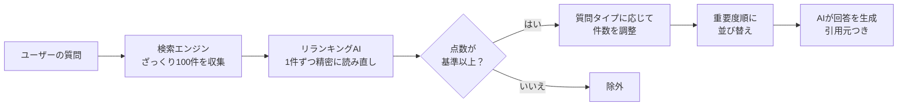

# リランキング — AIによる検索結果の再評価

> 検索で集めた候補を、AIがもう一度じっくり読み直して「本当に役立つ情報」だけに厳選する仕組みです。

---

## 1. なぜ検索結果をそのまま使うと精度が落ちるのか

社内検索システムで「ネジ999999の公差」と検索したとします。
検索エンジンは **「似ている言葉が含まれる文書」** を上位に並べますが、それは必ずしも **「質問に正しく答えている文書」** とは限りません。

たとえ話で言えば、検索エンジンは **「見た目が似ている本を棚から引っ張ってくる係」** です。
表紙やタイトルが似ていれば持ってきますが、中身をきちんと読んではいません。
そのため、「ネジ」という言葉が出てくるだけで関係のない文書まで混ざってしまいます。

この「似ているけど正しくない」情報をそのままAIに渡すと、AIが誤った内容を根拠にして回答してしまう危険があります。

---

## 2. リランキングとは

リランキング（再順位付け）とは、検索で集めた候補を **AIが1件ずつ丁寧に読み直して、本当に質問の答えになっているかを点数付けする** 処理です。

通常の検索では、質問と文書を「別々に」評価して似ている度合いを測ります。
一方、リランキングでは **質問と文書をセットにして一緒に読み込み**、「この文書はこの質問の直接的な証拠になるか？」を判定します。

この違いは大きく、たとえば「公差」と「寸法許容範囲」のように言葉は違うが意味が同じケースや、助詞の「が」と「を」で意味が変わるケースまで正確に見分けられます。

---

## 3. 2段階検索のたとえ話

この仕組みを図書館にたとえると、次のようになります。

**第1段階（検索）**: 図書館の司書に「この話題に関する本をください」と頼み、棚から10冊持ってきてもらう。速いが、ざっくりした選び方。

**第2段階（リランキング）**: 持ってきた10冊の目次と中身をじっくり読み、「この質問に直接答えている本」を5冊に厳選する。時間はかかるが、精度が高い。

さらに、点数が低い本（関連度0.5未満）は、たとえ検索で上位だったとしても除外します。
これにより、AIに「ハズレの情報」が渡ることを防ぎます。

---

## 4. 本プロジェクトの実装

本プロジェクトでは、Googleが提供する **Vertex AI Ranking API（バーテックスAI ランキング エーピーアイ）** というサービスを使っています。

このサービスの特徴は以下の通りです。

- **Google検索の技術を活用**: Googleが長年の検索エンジン開発で培った技術が使われており、日本語の微妙なニュアンスまで理解できる
- **点数による足切り**: 各文書に0から1の点数が付き、基準（0.5）を下回るものは自動的に除外される
- **情報の出典を保持**: 厳選された各文書には「どの資料の何ページ目か」という情報が紐付いており、AIの回答に必ず引用元が表示される

---

## 5. 動的コンテキスト調整

質問の種類によって、AIに渡す文書の数を自動的に変えています。

| 質問の種類 | 渡す文書数 | 理由 |
|---|---|---|
| 型番・品番の問い合わせ | 1件 | 答えが1つに決まるため、余計な情報は不要 |
| 手順・トラブル対応 | 5〜7件 | 複数の観点や手順を網羅する必要がある |

たとえ話で言えば、「東京タワーの高さは？」という質問には辞典1冊で十分ですが、「旅行の計画を立てたい」という相談にはガイドブックを何冊か見比べる必要がある、というのと同じ考え方です。

さらに、AIが長い文書を読むとき **最初と最後の情報はよく覚えているが、真ん中の情報を見落としやすい** という特性があります。
そこで、最も重要な情報を先頭と末尾に、次に重要な情報を中間に配置する並び替えも行っています。

---

## 6. 2段階検索フローの全体像

---

> このリランキングの仕組みにより、「検索で見つけた」だけの情報ではなく、「質問に本当に関係がある」と判断された情報だけがAIに届きます。これが回答精度を大きく向上させる鍵です。

[← 概要に戻る](00_project-overview.md)
