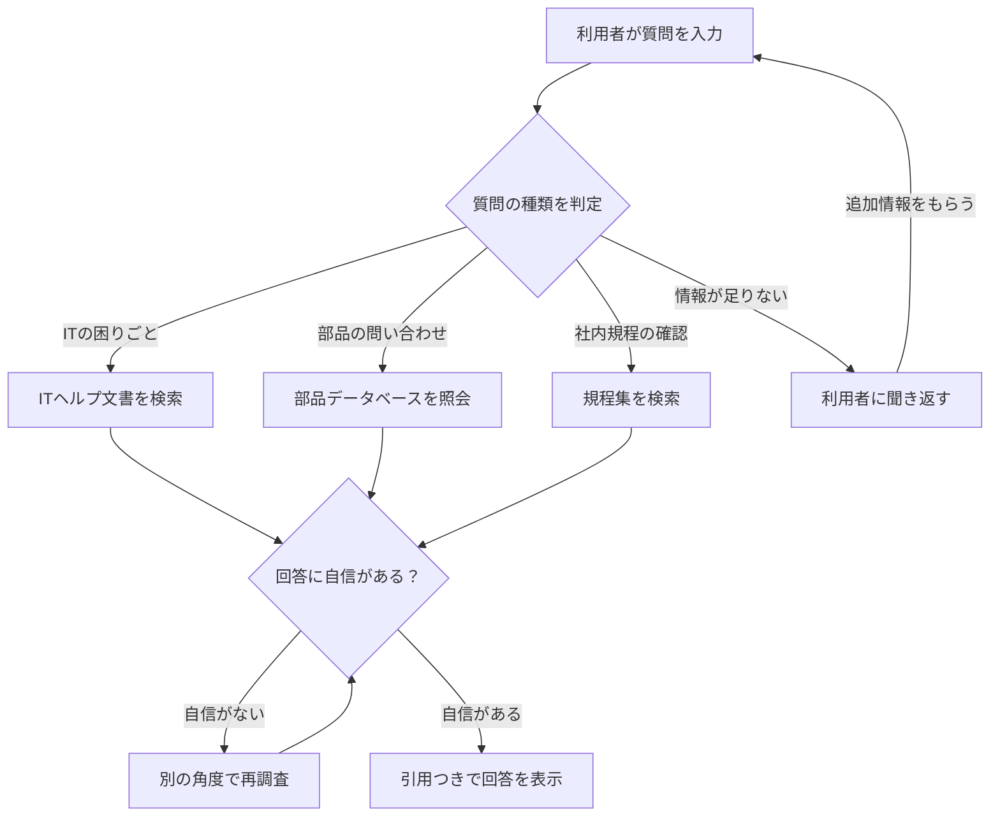

# AIの賢い振る舞い — ただ検索するだけじゃない

> このページでは、AIチャットボットが「賢く受け答えする仕組み」を、技術用語を使わずに説明します。

---

## 1. 単純なRAG（検索して答える方式）の問題

普通のAIチャットは、質問を受け取ると**何でもかんでも社内文書を検索**してしまいます。

たとえるなら、図書館で「最近調子が悪いんですが」と相談したら、司書さんが「調子」「悪い」というキーワードで片っ端から本を持ってきてしまうようなものです。

- 「エラーが出る」だけでは、何のシステムの話か分からない
- 「ネジの在庫を教えて」に対して、規程集の文書を返してしまう
- 曖昧な質問に無理やり答えて、**的外れな回答**になる

この「とにかく検索してしまう」問題を解決するために、3つの工夫を入れています。

---

## 2. インテントルーティング — 受付窓口で振り分ける

**たとえ話：病院の総合受付**

病院に行くと、まず総合受付で「内科ですか？外科ですか？」と聞かれますよね。いきなり手術室に通されることはありません。

AIチャットボットも同じです。質問を受け取ったら、まず**「これは何についての質問か？」を判定**します。

| 質問の種類 | 振り分け先 | 具体例 |
|---|---|---|
| パソコンやシステムの困りごと | ITヘルプ向けの文書を検索 | 「VPNが繋がらない」 |
| 部品・製品の問い合わせ | 部品データベースを照会 | 「ネジ番号999999の材質は？」 |
| 社内ルールの確認 | 規程集を検索 | 「出張旅費の上限は？」 |

このように、**質問の種類に応じて最適な調べ方を選ぶ**ことで、的確な回答ができるようになります。

---

## 3. 逆質問 — 曖昧な質問には聞き返す

**たとえ話：できる窓口担当者**

窓口で「書類をなくしました」と言われたら、優秀な担当者は「いつ頃の書類ですか？」「どの手続きの書類ですか？」と聞き返しますよね。いきなり全部の書類棚を探し始めたりはしません。

AIも同じように、**情報が足りないと判断したら、検索せずに聞き返します。**

**例：**
- 利用者：「エラーが出ます」
- AI：「お使いのシステムはどれですか？また、画面に表示されているエラーメッセージを教えていただけますか？」

これにより、**無駄な検索を減らし**、的確な回答にたどり着けます。「質問が曖昧なら検索しない」という判断ができることが、信頼できるAIの条件です。

---

## 4. 多段階推論 — 複雑な質問は段階的に調べる

**たとえ話：ベテラン調査員**

「VPNが繋がらない。昨日までは使えていた」という相談を受けたベテランは、こう考えます。

1. **まず考える**：「設定は変えていないなら、認証の問題かネットワークの問題だな」
2. **調べる**：認証エラーに関する過去の対応事例を確認
3. **結果を見る**：「パスワードの期限切れ」という事例が見つかった
4. **回答する**：「パスワードの有効期限をご確認ください」

AIもこの**「考える → 調べる → 結果を見る → 必要ならもう一回調べる」**というサイクルを繰り返します。一発で答えが出なくても、角度を変えて何度か調べることで、複雑な質問にも対応できます。

---

## 質問の流れ（全体図）

---

## まとめ

| 工夫 | ひとことで言うと |
|---|---|
| インテントルーティング | 質問の種類で調べ方を変える |
| 逆質問 | 足りない情報は聞き返す |
| 多段階推論 | 複雑な質問は何回かに分けて調べる |

これらの工夫により、AIは「何でもかんでも検索する機械」ではなく、**「状況を判断して的確に対応できる窓口担当者」**のように振る舞います。

---

[← 概要に戻る](00_project-overview.md)
