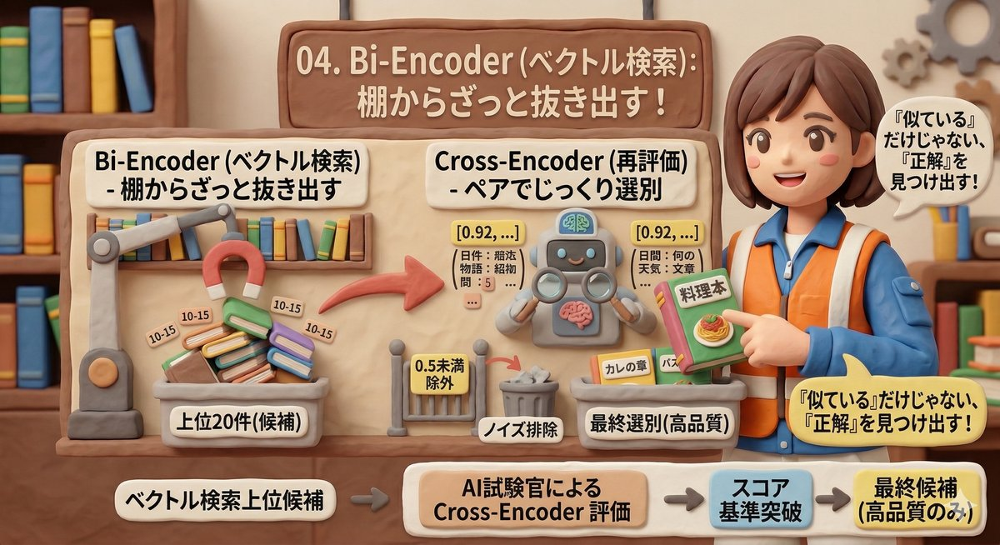
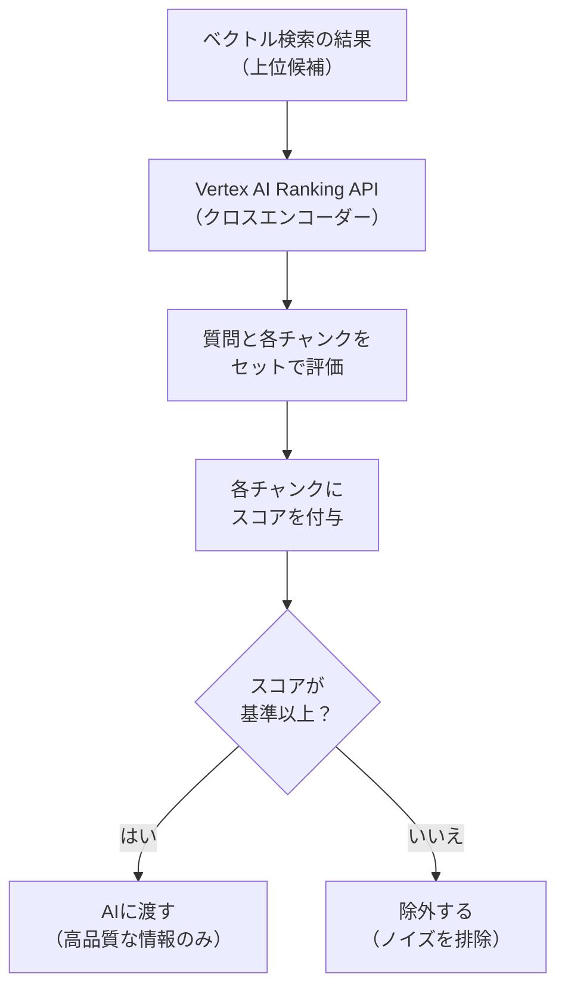

# 04. AIによる再評価（リランキング）

| 項目 | 内容 |
|------|------|
| PoC実装 | ✅ 実装済み |
| 説明 | 検索で見つけた候補をAIがもう一度読み直し、本当に関連するものだけを選び抜く技術 |

---

## なぜ検索結果をそのまま使ってはいけないのか

第3回のベクトル検索は、「意味が似ているもの」を素早く見つけます。
しかし、「似ている」と「質問の答えになっている」は別の話です。

たとえば、「ネジ999999の公差は？」と質問したとき、
ベクトル検索は「ネジ」「公差」に関連する文書を幅広く拾います。

- ネジ999999の材質の話（似ているが答えではない）
- ネジ全般の公差の説明（関連するが具体的でない）
- ネジ999999の公差の記載（これが正解）

検索結果の中から「本当に答えになるもの」を選び出す工程が、リランキング（Re-ranking）です。

## たとえ話：図書館での本選び

図書館で調べものをする場面を想像してください。

1. まず、棚から**関連しそうな本を10冊**ざっと抜き出す（= ベクトル検索）
2. 次に、各本の**目次をじっくり読んで**、本当に必要な本を**5冊に絞る**（= リランキング）

最初の「棚から抜き出す」は速さ重視で大雑把です。
2番目の「目次を読んで絞る」は時間がかかるが正確です。

この2段階のアプローチが、RAGの精度を大きく向上させます。

## Cross-Encoder（クロスエンコーダー）の仕組み

リランキングには「Cross-Encoder」という技術が使われています。

ベクトル検索（Bi-Encoder（バイエンコーダー））は、質問と文書を**別々に**数値化して距離を測ります。
速いですが、質問と文書の細かな関係を見落とすことがあります。

Cross-Encoderは、質問と文書を**セットで**AIに読み込ませます。
「この質問に対して、この文書はどれくらい直接的な証拠になるか？」を0.0から1.0の数値で判定します。

## 本PoCでの実装

- **使用サービス**: Google Cloud の Vertex AI Ranking API（バーテックスAI ランキングAPI）
- **処理の流れ**: ベクトル検索で上位候補を取得 → Ranking APIに質問と候補をまとめて送信 → スコア付きで返却
- **スコア閾値**: 0.5未満の候補は「関係なし」として除外
- **効果**: 関係ない情報がAIに渡されなくなるため、ハルシネーション（AIの嘘・でっちあげ）を防止できる

## なぜリランキングが精度に直結するのか

AIは「渡された情報の中から答えを作る」性質があります。
もし関係のない文書が混ざっていると、AIはそこから無理に答えを作ろうとし、
結果として**嘘の回答（ハルシネーション）**が生まれます。

リランキングで「純度の高い情報」だけをAIに渡すことで、
AIは自信を持って正確な回答を返せるようになります。

## まとめ

リランキングは、検索結果の「量」より「質」を重視する技術です。
ベクトル検索で素早く候補を集め、Cross-Encoderでじっくり選別する。
この2段階の仕組みが、RAGの回答精度を商用レベルに引き上げる重要な要素です。

[← 概要に戻る](00_project-overview.md)
