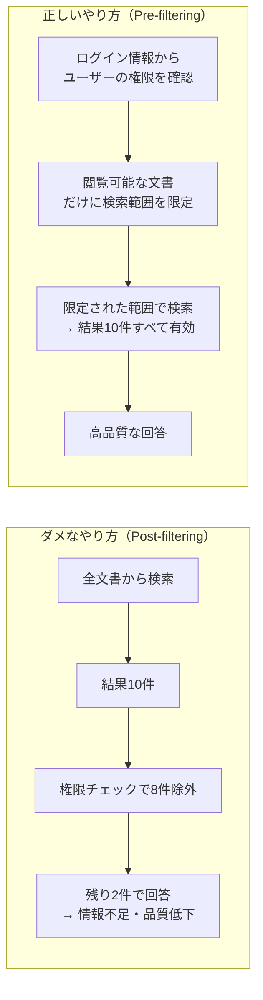

# セキュリティと権限制御 — 「見てよい人だけが、見てよい情報にたどり着く」仕組み

---

## 1. なぜRAGにセキュリティが必要か

社内文書には**機密レベル**があります。

- 全社員が見てよい資料（社内マニュアル、FAQ）
- 部署限定の資料（営業戦略、採用計画）
- 役員だけが見てよい資料（取締役会議事録、給与テーブル）

AIが「なんでも答えてくれる便利ツール」になった瞬間、**一般社員が役員向け資料の内容を引き出せてしまう**リスクが生まれます。どんなに回答が正確でも、権限を無視して情報が漏れたら一発アウトです。

> **たとえ話 — 図書館の閉架書庫**
> 図書館には誰でも入れる開架コーナーと、許可証がないと入れない閉架書庫があります。社内AIも同じで、「誰が何を読めるか」のルールが必要です。

---

## 2. ダメなやり方 — 「検索してから隠す」方式（Post-filtering）

まずAIに全文書を検索させ、結果が出てから「この人に見せてよいか？」をチェックして除外する方法です。

**何が問題か：**

- 権限のない文書ばかりが上位に来ると、除外した結果**回答に使える情報がゼロ**になる
- 「回答できません」が頻発し、使い物にならなくなる
- 内部処理の段階でAIが機密情報を一度「読んでしまう」ため、情報漏洩のリスクが残る

> **たとえ話**：図書館員が閉架書庫から本を10冊持ってきて、カウンターで「あ、これは貸出不可でした」と8冊戻す。残り2冊では調べ物になりません。しかも一瞬とはいえ、見せてはいけない本が利用者の目の前に並んでいました。

---

## 3. 正しいやり方 — 「検索する前に絞る」方式（Pre-filtering）

検索を実行する**前に**、そのユーザーが閲覧できる文書だけに範囲を限定します。

**メリット：**

- AIは最初から「見てよい文書」しか触れない
- 検索結果がすべて有効なので、回答の質が安定する
- 機密情報がAIの処理に一切入り込まない

> **たとえ話**：図書館員が最初から「あなたが入れるのは3階の開架コーナーだけですよ」と案内する。閉架書庫の本はそもそも検索対象に含まれません。

---

## 4. 本プロジェクトの実装方針

本システムでは、2つの仕組みを組み合わせて権限制御を行います。

| 仕組み | 役割 |
|---|---|
| **Firebase Auth（認証サービス）** | 「この人は営業部のマネージャーである」というユーザー情報を安全に管理する |
| **Firestoreのメタデータ（属性情報）** | 各文書に「営業部と経営企画部が閲覧可」といったタグを付けておく |

ユーザーがログインすると、そのユーザーの所属・役職に基づいて**自動的に**検索範囲が決まります。ユーザー自身が何か設定する必要はありません。

さらに、文書に含まれる個人情報（電話番号、メールアドレスなど）は、登録時にGoogle Cloudの検知サービスが自動で見つけ出し、伏せ字にしてから保存します。**AIが生の個人情報に触れること自体を防ぐ**設計です。

---

## 5. データが外部に出ない仕組み

「AIにデータを渡して大丈夫なのか？」という懸念に対する回答です。

- すべてのデータは**自社のGoogle Cloudプロジェクト内**で処理される
- 外部のサーバーにデータが送られることはない
- AI（Gemini）への問い合わせも、Google Cloudの中で完結する
- 誰が・いつ・どの資料を使って回答を得たかの**操作記録**が自動で残る

> **たとえ話**：社内の会議室で資料を広げて相談しているイメージです。資料を社外に持ち出して外部の人に見せているわけではありません。

---

## 6. アクセス制御の流れ

---

## まとめ

| 観点 | 本システムの対応 |
|---|---|
| 誰が見てよいか | ログイン情報から自動判定 |
| いつ絞り込むか | 検索の**前**（Pre-filtering方式） |
| 個人情報の扱い | 登録時に自動で伏せ字処理 |
| データの保管場所 | 自社Google Cloud内で完結 |
| 操作の追跡 | 全操作を自動記録 |

**「権限というフィルターを通り抜けた情報だけが、AIに届く」** — これが本システムの安全設計の基本方針です。

---

[← 概要に戻る](00_project-overview.md)
