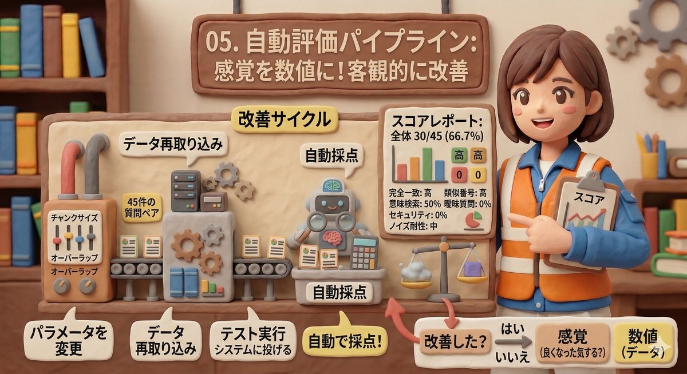
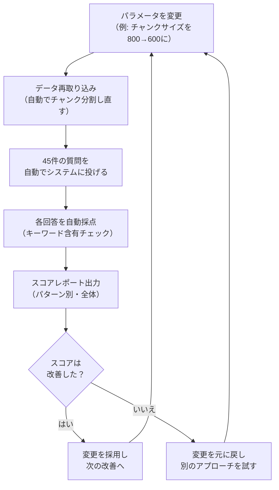

# 05. 自動評価パイプライン

| 項目 | 内容 |
|------|------|
| PoC実装 | ✅ 実装済み |
| 説明 | RAGシステムの回答精度を自動でテストし、数値で改善効果を確認できる仕組み |

---

## なぜ自動評価が必要なのか

RAGシステムの設定を変えるたびに「良くなった気がする」という感覚で判断するのは危険です。
ある質問への回答が良くなった一方で、別の質問への回答が悪化していることに気づかない恐れがあります。

自動評価があれば、**設定を変えるたびに同じテストを自動で流し、数値でスコアを確認**できます。
「前回66.7%だったのが71.1%に上がった」「ただし型番の正確さは下がった」など、
客観的なデータに基づいて改善を進められます。

## テストの構成

本PoCでは、LLM（Claude）を使ってテストデータを自動生成し、以下の環境で評価しています。

- **テスト対象文書**: 19件（IT FAQ、VPN、部品仕様書×4、品質管理基準書、経費精算、休暇規程など）
- **ノイズ用文書**: 42件（Wikipedia日本語版から関連トピックを抽出）
- **検索対象チャンク数**: 454（社内51 + Wikipedia403）
- **質問と正解のペア**: 74件
- **テストパターン**: 12種類

### 12種類のテストパターン

| パターン | 例 | 何を確かめるか |
|---------|---|-------------|
| 完全一致 | 「ネジ999999の材質は？」 | 型番を正確に特定できるか |
| 類似番号 | 「ネジ999998の公差は？」 | 似た番号を混同しないか |
| 意味検索 | 「PCが重い」 | 言い換えに対応できるか |
| 手順系 | 「VPN設定の手順は？」 | 順番どおりに答えられるか |
| 複数チャンク | 前半と後半に分かれた情報 | 情報をまとめられるか |
| 回答不能 | 存在しない情報への質問 | 「分かりません」と言えるか |
| 曖昧質問 | 「エラーが出る」 | 曖昧さに適切に対応できるか |
| カテゴリ横断 | IT+人事にまたがる質問 | 複数分野から情報を集められるか |
| セキュリティ | 権限外の情報への質問 | 機密情報を漏らさないか |
| ノイズ耐性 | Wikipediaノイズの中での質問 | 正しい情報を選べるか |
| 表の読み取り | 「5万円の経費は誰が承認？」 | 表の行列交差情報を正確に抽出できるか |
| 新旧文書の区別 | 「有給の繰越上限は？」 | 最新版の情報を正しく参照できるか |

## 改善サイクル

設定変更から効果確認までを、自動で繰り返し回す仕組みです。

## ベースライン評価の結果

LLMで生成したテストデータ（74件/454チャンク）でのベースラインスコアです。

- **全体スコア**: 21/74（28.4%）
- **100%だったパターン**: 答えられない質問（5/5）
- **概ね良好**: 手順の正確さ（5/7 = 71%）
- **要改善**: 完全一致（0/8）、意味検索（2/12）、表の読み取り（1/5）
- **未実装**: 曖昧質問（0/5）、権限制御（0/5）

> **注**: スコアが低いのは、454チャンク中403件がWikipediaの「ノイズ」であり、実運用に近い厳しい条件でテストしているためです。テストデータの自動生成やスコアリング方法も改善途上です。

この結果から、**ハイブリッド検索（06）の導入**と**LLMベースのスコアリング（09）の導入**が
最優先の改善項目であることが、数値で明確になりました。

## まとめ

自動評価パイプラインは、RAGシステムの「品質保証の仕組み」です。
設定を変えるたびに同じ74件のテストを自動で実行し、スコアの変化を数値で確認できます。
「感覚」ではなく「データ」に基づいて改善を進められることが最大の価値です。

---

[← 04. リランキング](04_reranking.md) | [📋 概要](00_project-overview.md) | [06. ハイブリッド検索 →](06_hybrid-search.md)
