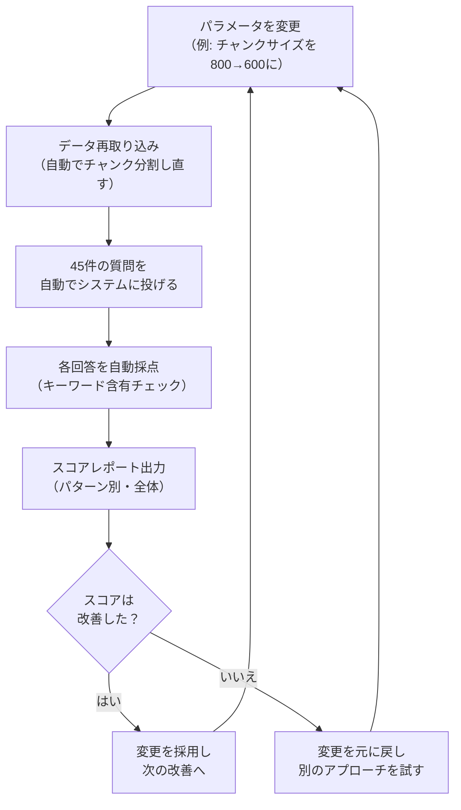

# 05. 自動評価パイプライン

| 項目 | 内容 |
|------|------|
| PoC実装 | ✅ 実装済み |
| 説明 | RAGシステムの回答精度を自動でテストし、数値で改善効果を確認できる仕組み |

---

## なぜ自動評価が必要なのか

RAGシステムの設定を変えるたびに「良くなった気がする」という感覚で判断するのは危険です。
ある質問への回答が良くなった一方で、別の質問への回答が悪化していることに気づかない恐れがあります。

自動評価があれば、**設定を変えるたびに同じテストを自動で流し、数値でスコアを確認**できます。
「前回66.7%だったのが71.1%に上がった」「ただし型番の正確さは下がった」など、
客観的なデータに基づいて改善を進められます。

## テストの構成

本PoCでは、以下のテストデータを用意しています。

- **テスト対象文書**: 14件（ITヘルプ、部品仕様書、人事規定など）
- **質問と正解のペア**: 45件
- **テストパターン**: 10種類

### 10種類のテストパターン

| パターン | 例 | 何を確かめるか |
|---------|---|-------------|
| 完全一致 | 「ネジ999999の材質は？」 | 型番を正確に特定できるか |
| 類似番号 | 「ネジ999998の公差は？」 | 似た番号を混同しないか |
| 意味検索 | 「PCが重い」 | 言い換えに対応できるか |
| 手順系 | 「VPN設定の手順は？」 | 順番どおりに答えられるか |
| 複数チャンク | 前半と後半に分かれた情報 | 情報をまとめられるか |
| 回答不能 | 存在しない情報への質問 | 「分かりません」と言えるか |
| 曖昧質問 | 「エラーが出る」 | 曖昧さに適切に対応できるか |
| カテゴリ横断 | IT+人事にまたがる質問 | 複数分野から情報を集められるか |
| セキュリティ | 権限外の情報への質問 | 機密情報を漏らさないか |
| ノイズ耐性 | 関係ない情報が多い中での質問 | 正しい情報を選べるか |

## 改善サイクル

設定変更から効果確認までを、自動で繰り返し回す仕組みです。

## 初回評価の結果

DD-008で実施した初回の自動評価結果は以下のとおりです。

- **全体スコア**: 30/45（66.7%）
- **100%だったパターン**: 類似番号、手順系、回答不能、カテゴリ横断
- **要改善**: 曖昧質問（0%）、セキュリティ（0%）、意味検索（50%）

この結果から「曖昧な質問への対応」と「セキュリティフィルタリング」が
最優先の改善項目であることが、数値で明確になりました。

## まとめ

自動評価パイプラインは、RAGシステムの「品質保証の仕組み」です。
設定を変えるたびに同じ45件のテストを自動で実行し、スコアの変化を数値で確認できます。
「感覚」ではなく「データ」に基づいて改善を進められることが最大の価値です。

[← 概要に戻る](00_project-overview.md)
