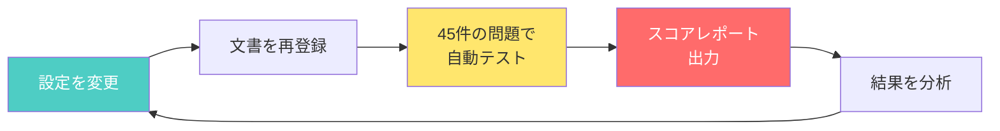

# 品質評価の仕組み — AIの回答を「模擬試験」で採点する

[← 概要に戻る](00_project-overview.md)

---

## 1. なぜ自動評価が必要か

AIチャットボットの回答品質を改善するとき、一番危険なのは**「なんとなく良くなった気がする」**という感覚に頼ることです。

たとえば、検索の設定を少し変えたとします。ある質問への回答は良くなったかもしれませんが、別の質問では逆に悪くなっているかもしれません。人間が毎回すべての質問を手作業で確認するのは現実的ではありません。

そこで本プロジェクトでは、**AIの回答を「数字」で測る自動評価の仕組み**を導入しました。

> たとえ話：学校の模擬試験と同じです。生徒（AI）に問題集を解かせて、点数で実力を把握します。勉強法（設定）を変えるたびに模擬試験を受け直し、点数が上がったかどうかで効果を判断します。

---

## 2. テストデータの設計 — 問題集をつくる

模擬試験には「良い問題集」が欠かせません。本プロジェクトでは2つの層でテストデータを用意しました。

### 層1：教科書にあたる社内文書（14種類）

AIが回答の根拠とする文書を、実際の業務を想定して作成しました。

| 分野 | 文書の例 | 狙い |
|------|---------|------|
| 部品情報 | 部品カタログ、個別仕様書 | 似た型番（999998と999999）を間違えないか |
| IT関連 | VPN接続手順、PCトラブル集 | 長い手順書から正しい箇所を探せるか |
| 人事・総務 | 有給休暇規定、給与規定 | 閲覧権限のない情報を見せないか |
| 経営情報 | 役員会議事録 | 機密文書の取り扱いが正しいか |

### 層2：試験問題にあたるQ&Aペア（45件・10パターン）

「こう聞かれたら、こう答えるべき」という正解付きの問題を45件用意しました。

| パターン | 例 | 何をテストするか |
|---------|-----|-----------------|
| 型番の完全一致 | 「ネジ999999の材質は？」→「SUS304」 | 正確な情報を返せるか |
| 似た番号の区別 | 「ネジ999998の公差は？」 | 別の部品と混同しないか |
| あいまいな質問 | 「PCが重い」 | 意味を読み取って適切に答えるか |
| 答えられない質問 | 「来月の株価は？」 | 「わかりません」と正直に言えるか |
| 権限チェック | 一般社員が「給与テーブルを見せて」 | きちんと拒否できるか |

---

## 3. 評価の仕組み — 改善サイクルを回す

設定を変えるたびに、45件の問題を自動で解かせてスコアを出します。

具体的な流れは次のとおりです。

1. **設定を変更する** — 文書の分割サイズや検索件数などのパラメータ（調整つまみ）を変える
2. **文書を再登録する** — 新しい設定で社内文書をデータベースに入れ直す
3. **自動テストを実行する** — 45件のQ&Aペアをすべて解かせる
4. **スコアレポートを確認する** — パターンごとの正答率と全体スコアが一覧で出る
5. **結果を分析する** — 点数が下がった問題を確認し、次の改善方針を決める

> たとえ話：料理のレシピ改良と同じです。調味料の量（設定）を変えるたびに、10人の試食員（テスト問題）に味見してもらい、点数をつけてもらいます。「塩を増やしたら肉料理の評価は上がったが、魚料理は下がった」といった変化が一目でわかります。

### 初回テスト結果

初回のテストでは **45問中30問正解（正答率66.7%）** でした。

- 満点だった分野：似た型番の区別、手順の取りこぼし、答えられない質問
- 改善が必要な分野：あいまいな質問への対応、権限チェック

この数字があるからこそ、「次に何を直すべきか」が明確になります。

---

## 4. 現在の評価方法と今後

### 現在：キーワード方式

回答の中に「正解のキーワード」が含まれているかどうかで採点しています。

- 例：「ネジ999999の材質は？」→ 回答に「SUS304」が含まれていれば正解
- 長所：仕組みが単純で、すぐに導入できた
- 短所：言い回しが違うだけで不正解になることがある（「ステンレス鋼SUS304」→ 正解にしたい）

### 今後：AI判定方式

別のAI（大規模言語モデル）を「試験官」として使い、回答の意味が正しいかどうかを判定する方式に進化させます。

- **忠実性（ウソがないか）**：回答が元の文書の内容と矛盾していないか
- **関連性（的を射ているか）**：質問の意図に沿った回答になっているか
- **検索精度（正しい資料を見つけたか）**：上位の検索結果に正解の文書が含まれているか

> たとえ話：現在はマークシート式の採点（キーワードの有無）ですが、今後は記述式の採点（意味の正しさを判断）に切り替えるイメージです。

---

## まとめ

| 項目 | 内容 |
|------|------|
| テストデータ | 社内文書14種類 + Q&Aペア45件 |
| 評価方法（現在） | キーワードが含まれているかで自動採点 |
| 評価方法（今後） | AIが意味の正しさを判定 |
| 改善サイクル | 設定変更 → 自動テスト → スコア確認 → 分析 → 改善 |
| 初回スコア | 45問中30問正解（66.7%） |

「数字で測り、数字で改善する」——この仕組みがあることで、プロジェクトの品質向上を客観的に証明できます。

[← 概要に戻る](00_project-overview.md)
