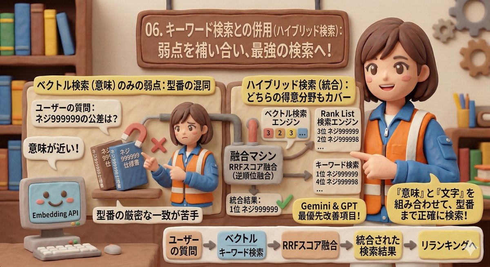
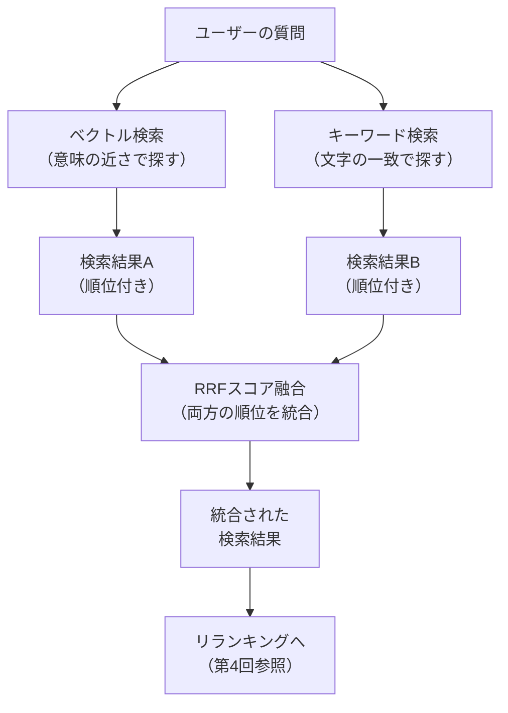

# 06. キーワード検索との併用（ハイブリッド検索）

| 項目 | 内容 |
|------|------|
| PoC実装 | 📋 調査済み・未実装 |
| 説明 | ベクトル検索とキーワード検索を組み合わせ、それぞれの弱点を補い合う検索手法 |

---

## ベクトル検索だけでは足りない場面

第3回で紹介したベクトル検索は「意味の近さ」で情報を探す強力な技術です。
しかし、型番や品番のような**数字の厳密な一致**が求められる場面では弱点があります。

### 具体例：ネジ番号の混同

- 質問:「ネジ**999999**の公差を教えて」
- ベクトル検索の結果: ネジ**999998**の情報も「意味が近い」として返してしまう

人間から見れば999999と999998はまったく別の部品ですが、
ベクトル検索にとっては「ネジの番号」という意味でほぼ同じに見えるのです。

## ハイブリッド検索（Hybrid Search）とは

ハイブリッド検索は、**2種類の検索を同時に行い、結果を統合**する手法です。

| 検索の種類 | 得意なこと | 苦手なこと |
|-----------|----------|----------|
| ベクトル検索（意味検索） | 言い換え・類義語への対応 | 型番・品番の厳密な一致 |
| キーワード検索（全文検索） | 型番・品番の正確なマッチ | 言い換え・表現の揺れへの対応 |

この2つを組み合わせることで、**どちらの得意分野もカバー**できます。

## 統合の仕組み：RRFスコア融合

2つの検索結果をどう1つにまとめるかが重要です。
本調査では「RRF（Reciprocal Rank Fusion：逆順位融合）」という手法を採用候補としています。

これは、各検索結果の**順位**に基づいてスコアを計算し、統合する方法です。
ベクトル検索で3位、キーワード検索で1位の文書は、
両方の検索で評価されているため、統合スコアが高くなります。

## なぜ優先度が高いのか

PoC評価において、Gemini（ジェミニ）とGPT（ジーピーティー）の両方のAIモデルに
「次に実装すべき改善は何か」を分析させたところ、
**両モデルとも「ハイブリッド検索の導入」を最優先と評価**しました。

その理由は、現在のベクトル検索のみの構成では、
型番を含む質問の正確性に限界があるためです。

## 実装に向けた検討事項

- **キーワード検索の基盤**: Firestoreの全文検索機能、または外部の検索エンジンを利用
- **RRFのパラメータ調整**: ベクトル検索とキーワード検索の重み付けバランス
- **ルーティング**: 質問に型番が含まれるかをAIまたは正規表現（Regular Expression）で判定し、
  キーワード検索の重みを動的に変える仕組み

## まとめ

ハイブリッド検索は、ベクトル検索の「意味で探す力」とキーワード検索の「正確に一致させる力」を
組み合わせる手法です。型番や品番の検索精度を大幅に向上させる効果が期待され、
次の実装フェーズでの最優先項目として位置づけています。

---

[← 05. 自動評価](05_evaluation.md) | [📋 概要](00_project-overview.md) | [07. 聞き返し →](07_clarification.md)
