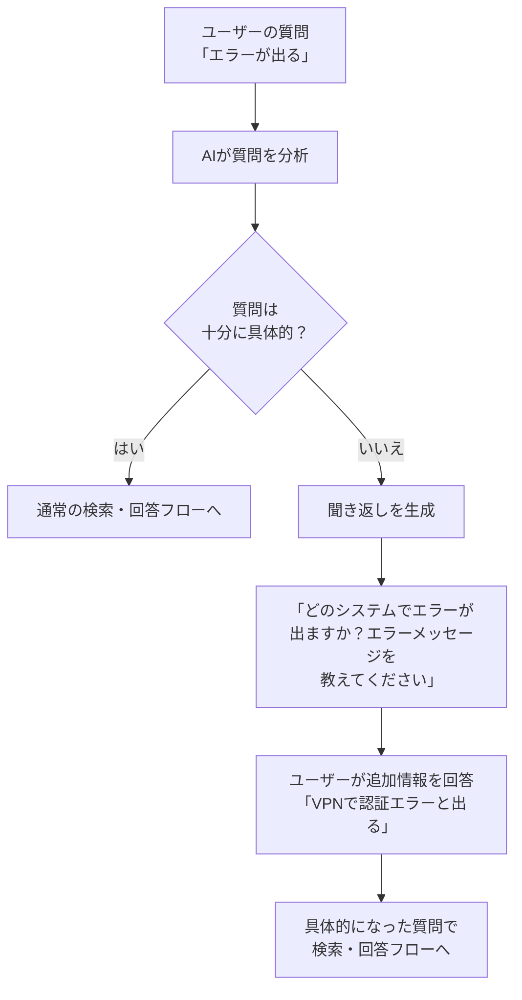

# 07. 曖昧な質問への聞き返し

| 項目 | 内容 |
|------|------|
| PoC実装 | 📋 調査済み・未実装 |
| 説明 | ユーザーの質問が曖昧な場合に、AIが検索する前に必要な情報を聞き返す仕組み |

---

## 現状の問題

現在のRAGシステムは、どんな質問が来ても**そのまま検索を実行**します。
たとえば、こんな質問が来た場合を考えてください。

> 「エラーが出る」

この質問では、以下の情報が不足しています。

- **どのシステム**でエラーが出るのか？（VPN？メール？社内ポータル？）
- **どんなエラーメッセージ**が表示されるのか？
- **いつから**エラーが出るのか？

情報が不足したまま検索すると、「エラー」に関連するあらゆる文書がヒットし、
AIは的外れな回答を返してしまいます。

## 自動評価で明らかになった課題

第5回の自動評価（DD-008）で、曖昧な質問に対するテストパターンの結果は**0/3（0%）**でした。
これは、システムが曖昧な質問をそのまま処理してしまい、
「情報が不足しているので確認させてください」という対応ができなかったためです。

## 理想的な動作：聞き返しの仕組み

## 聞き返すべき場面の例

| ユーザーの質問 | 不足している情報 | 理想的な聞き返し |
|-------------|--------------|---------------|
| エラーが出る | システム名、エラー内容 | どのシステムでどんなエラーが出ますか？ |
| 申請したい | 何の申請か | 何の申請ですか？（有給休暇、経費精算、備品購入など） |
| 動かない | 何が動かないか | 何が動かないですか？（PC、プリンター、ソフトウェアなど） |

## 設計上の難しさ：閾値（しきいち）の設計

聞き返しの仕組みで最も難しいのは、**「どこまで曖昧なら聞き返すか」の線引き**です。

- **聞き返しすぎ**: 具体的な質問にも細かく聞くと「面倒なシステム」と思われ、使われなくなる
- **聞き返さなすぎ**: 曖昧なまま処理すると的外れな回答になり、信頼を失う
- **バランス**: 主語や目的語がない場合のみ聞き返し、ある程度具体的なら回答しつつ補足を促す

## 実装に向けた検討事項

- **曖昧さの判定方法**: AIに質問を分析させ、「具体性スコア」を算出する
- **聞き返しテンプレート**: カテゴリごとに「何を聞くべきか」のパターンを用意する
- **会話の継続**: 聞き返し後のユーザーの回答を、元の質問と結合して検索に使う

## まとめ

曖昧な質問への聞き返しは、RAGシステムの回答精度を根本から改善する仕組みです。
自動評価で0%だったこのパターンの改善は、ユーザー体験に直結する重要な課題です。
ただし、聞き返しすぎると利便性が下がるため、閾値の設計が成功の鍵を握ります。

[← 概要に戻る](00_project-overview.md)
