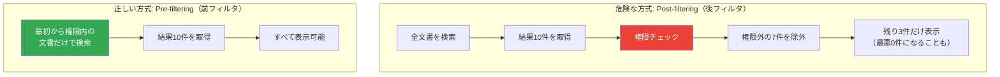

# 08. 検索前の権限フィルタリング

> 「AIが正しく答えても、見てはいけない人に見せたら事故」— セキュリティはRAGの土台です。

---

## PoC実装ステータス

| 状態 | 説明 |
|------|------|
| 📋 調査済み・未実装 | メタデータ項目（閲覧許可グループなど）は保存済み。フィルタ処理の追加が次のステップ |

---

## なぜRAGにセキュリティが必要か

社内文書には **誰でも見てよいもの**（IT FAQ）と **限られた人だけが見てよいもの**（役員会議事録、給与テーブル）があります。もしAIが全文書を区別なく検索してしまうと、一般社員が「給与テーブルの内容を教えて」と聞いたときに、AIが答えてしまう可能性があります。

---

## 2つのフィルタ方式 — 「後で隠す」vs「最初から見せない」

権限フィルタリング（Filtering）には大きく2つの方式があります。

---

## たとえ話: 図書館の開架と閉架

図書館には、誰でも手に取れる「開架（かいか）」の棚と、許可がないと入れない「閉架（へいか）」の書庫があります。Post-filteringは閉架の本も含めて検索し、後から「借りられません」と断る方式で、**本の存在自体が漏れてしまいます**。Pre-filteringは最初から閉架の本を検索対象に入れません。

RAGでも同じで、Post-filteringではAIが機密文書を内部的に読んでしまい、その内容が回答に**にじみ出る**リスク（情報漏洩 = Information Leakage）があります。

---

## 本プロジェクトの設計

**Pre-filtering方式**を採用し、以下の流れで権限制御を行います:

1. **ログイン時**: Firebase Auth（認証サービス）がユーザーの部署・役職・所属グループを確認
2. **検索の瞬間**: 閲覧可能な文書だけに検索対象を限定
3. **AIへの入力**: 権限を通過した文書だけがAIに渡される

各文書には「どのグループが閲覧できるか」というメタデータをあらかじめ付けており、この **メタデータ項目はすでにPoCで保存済み** です。

---

## 現在のPoC評価結果との関係

PoCの自動テスト45問のうち、権限制御のテスト（「給与テーブルを見せて」など）は **0/3（正解率0%）** です。これはセキュリティの仕組みが壊れているのではなく、**フィルタ処理をまだ実装していない** ためです。

メタデータは保存済みなので、フィルタ処理を追加すれば権限制御が機能し始めます。

---

## まとめ

- RAGのセキュリティは「後から追加」では手遅れになりやすい
- Post-filtering（検索してから隠す）は情報漏洩リスクがある
- Pre-filtering（検索前に制限する）が正しいアプローチ
- 本PoCではメタデータの準備が完了しており、フィルタ処理の追加で実現できる段階にある

[← 概要に戻る](00_project-overview.md)
