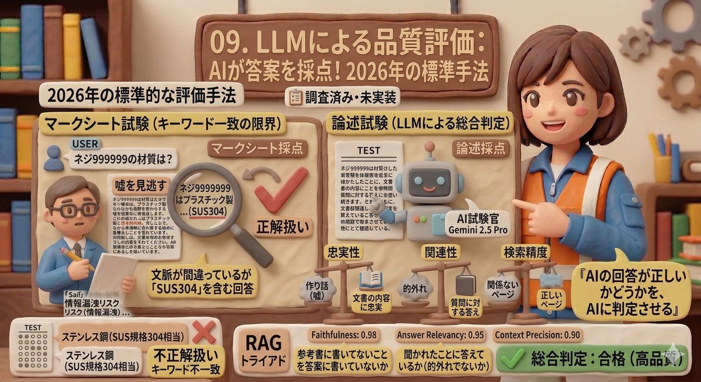

# 09. LLMによる品質評価

> 「AIの回答が正しいかどうかを、AIに判定させる」— 2026年の標準的な評価手法です。

---

## PoC実装ステータス

| 状態 | 説明 |
|------|------|
| 📋 調査済み・未実装 | 現在はキーワード一致による評価を実施中。LLMベースの評価は設計済みだが未実装 |

---

## 現在の評価方法 — キーワード一致の限界

PoCでは45件のテスト質問に対して、回答に**特定のキーワードが含まれるかどうか**で正誤を判定しています。

例: 質問「ネジ999999の材質は？」→ 回答に「SUS304」が含まれれば正解。

この方式は**マークシート試験**の採点と同じで、明確な答えがある質問には有効ですが限界があります。

| 状況 | キーワード判定の問題 |
|------|-------------------|
| 文脈が間違っているが「SUS304」を含む回答 | 正解扱いになってしまう（嘘を見逃す） |
| 「ステンレス鋼（SUS規格304相当）」という回答 | 意味は正しいがキーワード不一致で不正解になりうる |
| 手順説明の質問 | 「順序が正しいか」「漏れがないか」をキーワードでは判定できない |

RAGの回答は**論述試験の答案**に近く、「内容が正しいか」「質問の意図に沿っているか」を総合的に読み取る必要があります。

---

## LLMによる評価 — 「AI試験官」が答案を採点する

LLM（大規模言語モデル）による評価は、**AIに論述試験の採点者**の役割を与える手法です。高性能なAI（例: Gemini 2.5 Pro）を「試験官」として、別のAIが作った回答を評価させます。

---

## RAGの三要素（RAG Triad） — 何を評価するか

LLM評価では、回答の品質を **3つの観点** から測ります。これをRAG Triad（RAGトライアド = RAGの三要素）と呼びます。

| 評価観点 | 何を測るか | たとえ話 |
|---------|----------|---------|
| **Faithfulness（忠実性）** | 回答が検索した文書の内容に忠実か。嘘（ハルシネーション = AIの作り話）がないか | 参考書に書いてないことを答案に書いていないか |
| **Answer Relevancy（回答の関連性）** | 回答がユーザーの質問に対する答えになっているか | 聞かれたことに答えているか（的外れでないか） |
| **Context Precision（検索精度）** | 検索で拾ってきた文書が質問と本当に関係あるか | 参考書の正しいページを開いているか |

この3つをそれぞれ0.0〜1.0のスコアで測定します。

---

## キーワード判定とLLM評価の比較

| 比較項目 | キーワード判定（現在） | LLM評価（導入予定） |
|---------|---------------------|-------------------|
| **採点方法** | 特定の単語が含まれるかチェック | AIが回答全体を読んで総合判定 |
| **得意な質問** | 型番・固有名詞など答えが1つの質問 | 手順説明・比較・要約など自由記述の質問 |
| **嘘の検出** | できない（キーワードがあれば正解扱い） | 文書にない情報を回答に含めていないか確認できる |
| **コスト** | ほぼゼロ | AI呼び出し1回分の費用が追加で発生 |
| **2026年の位置づけ** | 簡易テスト向け | 商用RAGの標準的な評価手法 |

---

## まとめ

- 現在のキーワード判定は「マークシート採点」。単純な質問には有効だが限界がある
- LLM評価は「論述試験の採点」。回答の忠実性・関連性・検索精度を総合的に測定できる
- RAG Triad（忠実性・回答関連性・検索精度）の3軸で評価するのが2026年の標準
- 既存の45問テストにLLM評価を組み込むことで、精度改善サイクルが加速する

[← 概要に戻る](00_project-overview.md)
