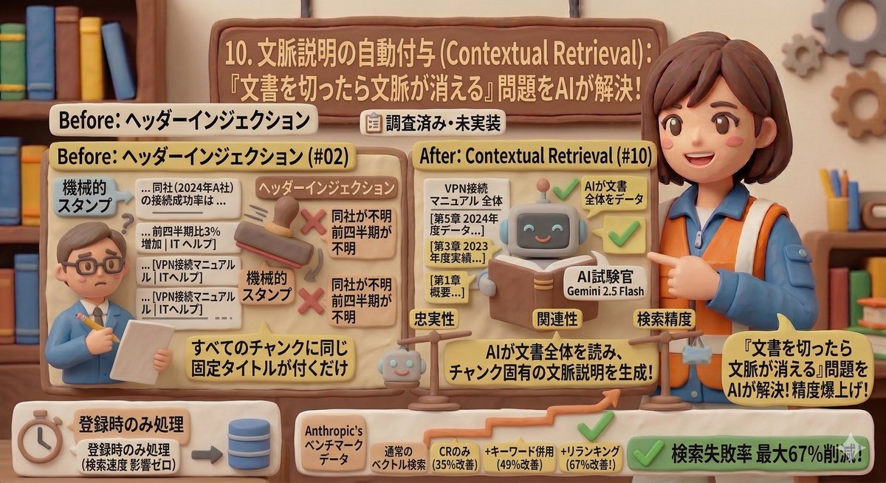

# 10. 文脈説明の自動付与（Contextual Retrieval）

> 「文書を切ったら文脈が消える」問題を、AIの力で解決する手法です。

---

## PoC実装ステータス

| 状態 | 説明 |
|------|------|
| 📋 調査済み・未実装 | DD-010-3で調査完了。ヘッダーインジェクション（#02）の上位互換として、次の改善候補に位置づけ |

---

## 背景 — ヘッダーインジェクション（#02）の進化形

[#02 文書タイトルの付与](02_header-injection.md)では、各断片（チャンク）の先頭に文書タイトルを機械的に付けていました。これだけでも効果はありますが、**すべてのチャンクに同じタイトルが付くだけ**で、「この部分が文書の中で何を述べているか」までは分かりません。

Contextual Retrieval（コンテクスチュアル・リトリーバル）は、2024年にAnthropic（アンソロピック = Claude（クロード）を開発するAI企業）が発表した手法で、**AIがドキュメント全体を読んで、各チャンクに固有の文脈説明を自動生成**し、その説明を付けた状態でデータベースに保存します。

---

## ヘッダーインジェクションとの違い — before/after

### Before（現在のヘッダーインジェクション）

> **[VPN接続マニュアル | ITヘルプ]** 同社の接続成功率は前四半期比3%増加しました。

→ 「同社」が何を指すか、「前四半期」がいつか分からない。タイトルから「VPN関係の何か」とは分かるが、検索で的確にヒットしにくい。

### After（Contextual Retrieval 適用後）

> **この段落は「VPN接続マニュアル」の第5章「運用実績」に記載されている2024年度の接続成功率の推移データです。** 同社の接続成功率は前四半期比3%増加しました。

→ AIが文書全体を読んだうえで「この部分は何について述べているか」を具体的に説明。検索時に「VPN接続 成功率 2024」のような質問に正確にヒットするようになる。

---

## 効果 — 検索失敗率が67%削減

Anthropicの公式ベンチマーク（検索上位20件の失敗率で測定）:

| 手法 | 検索失敗率 | 改善度 |
|------|-----------|--------|
| 通常のベクトル検索 | 5.7% | — |
| Contextual Retrieval のみ | 3.7% | 35%改善 |
| Contextual Retrieval + キーワード検索併用 | 2.9% | 49%改善 |
| 上記 + リランキング（#04）併用 | 1.9% | **67%改善** |

本PoCではすでにリランキング（#04）を実装済みなので、Contextual Retrievalを追加すれば、この最大効果に近い改善が見込めます。

---

## コストと検索速度への影響

この処理は**文書登録時（インデクシング時）だけ**に行われます。検索時は通常のベクトル検索と全く同じで、追加の遅延はありません。つまり**検索速度に影響なく、精度だけが上がります**。

コスト面でも、Gemini 2.5 Flashの利用とContext Caching（コンテキスト・キャッシング = 同じ文書の繰り返し読み取り費用を90%削減する仕組み）により、1,000チャンクで数百円程度の一回限りの費用です。

---

## 本PoCとの関係

DD-010-3の調査では、キーワード検索併用（#06）の次に費用対効果が高い改善候補として位置づけられています。既存のデータベース構造を拡張するだけで実装でき、ヘッダーインジェクションからの移行も容易です。

---

## まとめ

- ヘッダーインジェクション（#02）は「文書タイトル」という固定ラベルを付ける手法
- Contextual Retrievalは「AIが文書全体を読んでチャンク固有の文脈説明を生成」する上位互換
- 検索失敗率が最大67%改善されるという実績がある
- 登録時のみの処理で、検索速度への影響はゼロ
- 2026年時点でRAGのベストプラクティス（最善の方法）として広く採用されている

[← 概要に戻る](00_project-overview.md)
