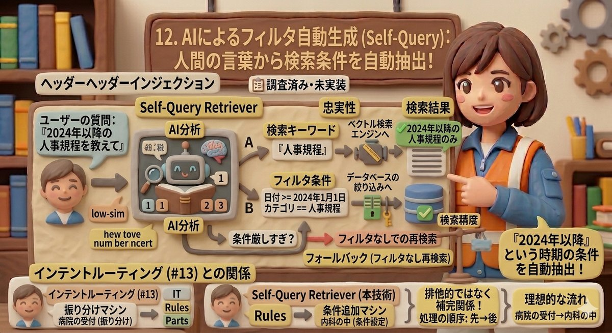

# 12. AIによるフィルタ自動生成（Self-Query）

> 「2024年以降の人事規程を教えて」— 人間が自然に付ける条件を、AIが自動で抽出する仕組みです。

---

## PoC実装ステータス

| 状態 | 説明 |
|------|------|
| 📋 調査済み・未実装 | DD-010-3で調査完了。インテントルーティング（#13）やメタデータ拡充の後に導入予定 |

---

## 問題 — 検索条件が質問文に隠れている

ユーザーは質問するとき、無意識に**検索条件**を含めています。

例:
- 「**2024年以降の**人事規程を教えて」→ 時期の条件が入っている
- 「**営業部向けの**出張精算ルールは？」→ 部署の条件が入っている
- 「**VPNマニュアル**の手順3は？」→ 特定文書の指定が入っている

通常のベクトル検索では、これらの条件を**意味の近さ**として大ざっぱに処理してしまいます。「2024年以降」という条件があっても、2020年の文書が意味的に近ければヒットしてしまうのです。

---

## Self-Query（セルフクエリ）とは

Self-Query Retrieval は、**AIが質問文を分析して、検索キーワードとフィルタ条件を自動的に分離する**手法です。

具体的な処理の流れ:

**入力**: 「2024年以降の人事規程を教えて」

AIが自動的に2つの要素に分解:
- **検索キーワード**: 「人事規程」→ ベクトル検索に使う
- **フィルタ条件**: 日付が2024年1月1日以降 + カテゴリが人事規程 → データベースの絞り込みに使う

**結果**: 2024年以降の人事規程カテゴリの文書だけがベクトル検索の対象になる

---

## インテントルーティング（#13）との関係

[#13 質問の種類に応じた検索切替](13_intent-routing.md)も「AIが質問を分析する」技術ですが、役割が異なります。

| 比較項目 | インテントルーティング（#13） | Self-Query（本技術） |
|---------|--------------------------|-------------------|
| **AIが判断すること** | 「この質問はどの種類か」（IT質問？部品照会？規程確認？） | 「この質問にどんな条件が含まれるか」（日付？カテゴリ？部署？） |
| **作用する範囲** | パイプライン（処理の流れ）全体を切り替える | 1つの検索の中でフィルタ条件を生成する |
| **たとえ話** | 病院の受付で「内科ですか？外科ですか？」と振り分ける | 内科の中で「いつからの症状ですか？」と条件を聞く |
| **処理の順序** | **先に動く**（上流） | **後から動く**（下流） |

この2つは排他的（どちらか一方）ではなく、**補完関係**にあります。

理想的な流れ:
1. インテントルーティング（#13）→「これは人事規程の質問だ」と判断
2. Self-Query（本技術）→「日付が2024年以降という条件がある」とフィルタ生成
3. フィルタ付きベクトル検索を実行

---

## リスクと対策

AIがフィルタを生成するため、間違った条件を作るリスクがあります。存在しないフィールドの指定はバリデーション（検証）層で防ぎ、条件が厳しすぎて結果が0件になった場合は**フォールバック（Fallback = フィルタなしでの再検索）**に自動的に切り替えます。日本語の「最近の」のような曖昧な表現は、定量的なフィルタに変換せずベクトル検索に任せる設計です。

---

## まとめ

- ユーザーの質問には、検索条件が自然言語で埋め込まれている
- Self-Queryは、AIが質問を分析して「検索キーワード」と「フィルタ条件」を自動分離する手法
- インテントルーティング（#13）が質問の種類を振り分け、Self-Queryが具体的なフィルタを生成する補完関係
- AIの誤りに備えたフォールバック（フィルタなし再検索）が必須
- メタデータの充実が前提条件であり、段階的に導入していく計画

---

[← 11. メタデータ](11_metadata-scoring.md) | [📋 概要](00_project-overview.md) | [13. ルーティング →](13_intent-routing.md)
