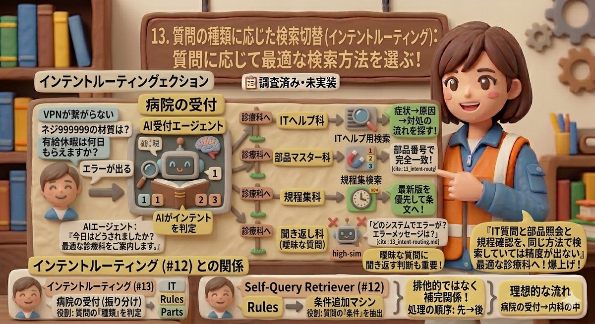
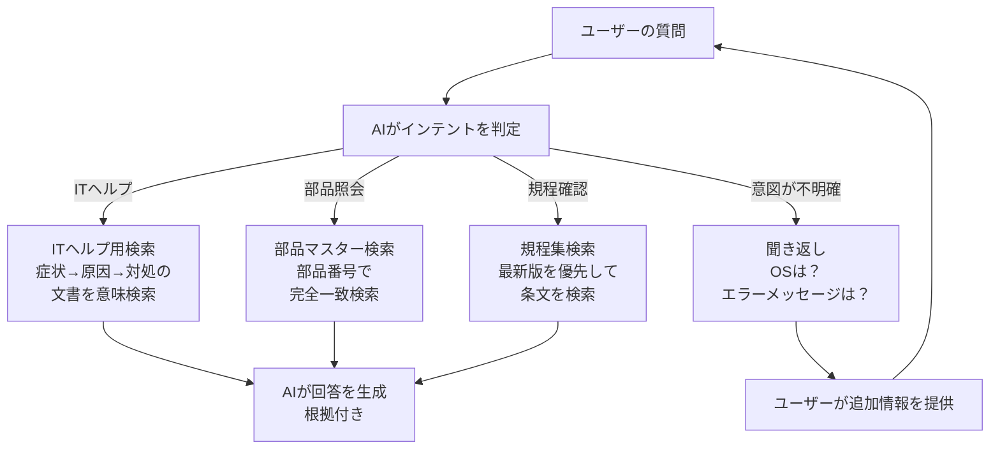

# 13. 質問の種類に応じた検索切替（インテントルーティング）

> 「IT質問と部品照会と規程確認を、同じ方法で検索していては精度が出ない」— 質問に応じて最適な検索方法を選ぶ仕組みです。

---

## PoC実装ステータス

| 状態 | 説明 |
|------|------|
| 📋 調査済み・未実装 | リサーチ第5回（Genkitによるエージェント・ワークフロー）で設計済み。Genkitのツール定義機能で実装予定 |

---

## 問題 — すべての質問を同じ方法で検索している

現在のPoCでは、どんな質問が来ても**同じベクトル検索**で文書を探しています。

しかし実際の社内問い合わせは、種類によって**最適な検索方法が異なります**。

| 質問の種類 | 例 | 求められる検索方法 |
|-----------|---|-----------------|
| IT質問 | 「VPNが繋がらない」 | トラブルシューティング文書から、症状→原因→対処の流れを探す |
| 部品照会 | 「ネジ999999の材質は？」 | 部品番号の**完全一致**で仕様書を引く |
| 規程確認 | 「有給休暇は何日もらえる？」 | **最新版**の就業規則から該当条文を探す |
| 曖昧な質問 | 「エラーが出る」 | 検索せずに「どのシステムで？」と聞き返す |

1つの検索方法ですべてに対応しようとすると、どこかで妥協が生まれます。

---

## インテントルーティングとは

インテント（Intent = 意図）ルーティング（Routing = 振り分け）とは、**AIが質問の種類を判定し、最適な検索方法に自動的に振り分ける**仕組みです。

**たとえ話: 病院の受付** — 受付で「今日はどうされましたか？」と聞かれ、適切な診療科に案内される仕組みと同じです。「お腹が痛い」なら内科へ、「なんとなく調子が悪い」なら「もう少し具体的に教えてください」と聞き返します。

---

## ルーティングの流れ

---

## Self-Query（#12）との関係

| 比較項目 | インテントルーティング（本技術） | Self-Query（#12） |
|---------|--------------------------|-----------------|
| **役割** | 質問の**種類**を判定して全体の方針を決める | 質問の中の**条件**を抽出してフィルタを作る |
| **たとえ話** | 「内科に行ってください」（診療科の選択） | 「いつからの症状ですか？」（診察前の問診票） |
| **処理順序** | **先に動く** | 後から動く |
| **関係** | 互いに補完し合う | 互いに補完し合う |

理想的な流れ: インテントルーティング →「規程確認だ」→ Self-Query →「2024年以降に絞ろう」→ 検索実行

---

## まとめ

- すべての質問を同じ方法で検索すると、質問の種類によって精度にばらつきが出る
- インテントルーティングは、AIが質問の意図を判定して最適な検索方法に振り分ける仕組み
- 曖昧な質問に対して「聞き返す」判断もルーティングの一部（PoC評価で0/3の改善に直結）
- Self-Query（#12）と組み合わせて、振り分け→条件抽出→検索の3段階で精度を最大化できる

---

[← 12. Self-Query](12_self-query.md) | [📋 概要](00_project-overview.md)
