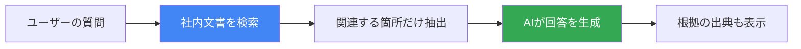
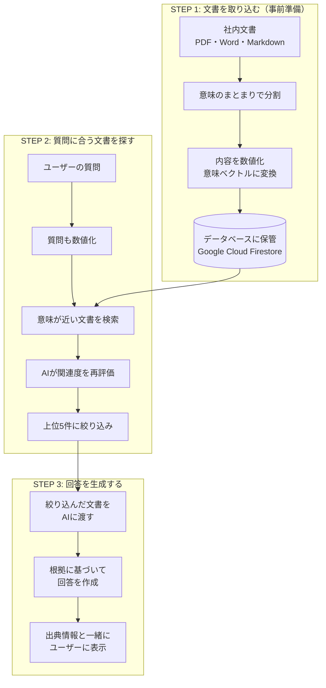
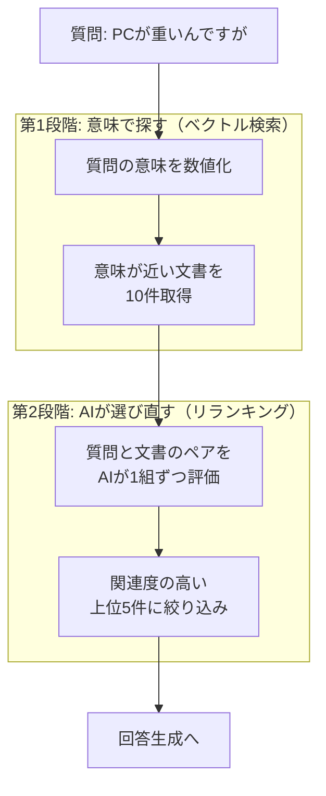
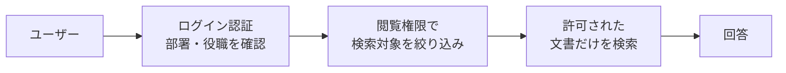
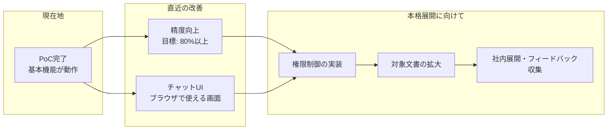

# 社内文書AIアシスタント — プロジェクト概要

> 「あのマニュアル、どこにあったっけ？」をなくす。

---

## 1. 解決したい課題

社内には大量のドキュメントがあります。マニュアル、FAQ、規程、部品仕様書、議事録——。
しかし、**必要な情報にたどり着くまでに時間がかかりすぎる**のが現状です。

| よくある困りごと | 原因 |
|-----------------|------|
| 検索しても関係ない文書がたくさん出てくる | キーワード一致だけでは「意味」を理解できない |
| 複数の文書に情報が散らばっている | 1つの質問に対して、複数ファイルを横断して読む必要がある |
| 最新版がどれか分からない | バージョン管理が属人化している |
| 機密文書が誰でも見えてしまう不安 | アクセス制御が文書検索と連動していない |

**このプロジェクトでは、AIに社内文書を読ませて、質問に対して根拠付きで回答できる仕組み**を構築しています。

---

## 2. どうやって実現するのか — RAGという技術

ChatGPTのようなAIは便利ですが、**社内の情報は知りません**。
社外のAIに機密文書を送るわけにもいきません。

そこで使うのが **RAG（Retrieval-Augmented Generation）** という手法です。
日本語にすると「検索で補強されたAI回答生成」です。

**ポイント:**

- AIが「知っている」のではなく、**毎回、社内文書を検索してから回答する**
- だから社内の最新情報に基づいた回答ができる
- 回答には「どの文書のどの部分を根拠にしたか」が表示される
- 社内のGoogle Cloud環境で動くので、**機密情報が外部に出ない**

> **ChatGPTとの違い:** ChatGPTは学習済みの知識で回答します。RAGは質問のたびに社内文書を検索し、見つけた情報だけを使って回答します。だから「嘘をつく（ハルシネーション）」リスクが大幅に下がります。

---

## 3. 全体の仕組み

システムは大きく **3つのステップ** で動きます。

### 各ステップの解説

**STEP 1「取り込み」** — 社内文書をAIが扱える形に変換して保管します。文書は意味のまとまりごとに分割（チャンキング）され、内容が数値（ベクトル）に変換されます。これにより「意味の近さ」で検索できるようになります。

**STEP 2「検索」** — ユーザーの質問も同じ方法で数値化し、意味が近い文書を探します。さらにAIが関連度を再評価（リランキング）して、本当に関係のある文書だけに絞り込みます。（詳しくは次のセクションで説明します）

**STEP 3「回答生成」** — 絞り込まれた文書だけをAIに渡し、その中の情報だけを使って回答を生成します。AIが勝手に知識を足すことはありません。

---

## 4. なぜ精度が高いのか — 2段階の検索

普通の検索（Google検索のような方式）では、**キーワードが一致するかどうか**で文書を探します。
しかし、例えば「PCが重い」と検索しても、「パソコンの動作が遅い場合の対処法」という文書は見つかりません。言葉が違うからです。

このシステムでは、**2段階の検索** で精度を高めています。

| 段階 | やっていること | たとえ話 |
|------|--------------|---------|
| 第1段階 | 意味の近さで候補を広く集める | 図書館で関連しそうな棚から本を10冊取ってくる |
| 第2段階 | AIが質問との関連度を精密に評価して絞る | 10冊の目次を読んで、本当に役立つ5冊だけ選ぶ |

この2段階方式により、「PCが重い」→「パソコンの動作が遅い場合」のような、**言葉は違うが意味が同じ質問**にも正しく回答できます。

---

## 5. セキュリティ — 誰が何を見られるか

社内文書には機密レベルがあります。給与規程は人事だけ、経営会議の議事録は役員だけ、といった制御が必要です。

このシステムでは、**検索の前に**アクセス権をチェックします。

| 仕組み | 説明 |
|--------|------|
| **事前フィルタリング** | 検索する前に、そのユーザーが見てよい文書だけに絞る。「見つけた後に隠す」のではなく「最初から見せない」 |
| **文書ごとの権限設定** | 各文書に「公開」「管理者のみ」「役員のみ」等のラベルを付与 |
| **社内環境で完結** | Google Cloudの自社プロジェクト内で動作し、外部にデータが出ない |

---

## 6. 現在の成果

### テスト環境での評価

14種類のテスト用社内文書（FAQ、マニュアル、部品仕様書、規程など）と、45件の質問-回答ペアで自動評価を実施しました。

**PoC初回の結果: 30/45問 正解（66.7%）**

| テスト項目 | 内容 | 結果 |
|-----------|------|------|
| 完全一致の検索 | 「ネジ999999の材質は？」→「SUS304」 | 4/5 |
| 似た番号の区別 | 999999と999998を混同しないか | 3/3 ✅ |
| 意味の検索 | 「PCが重い」→トラブルシュート手順 | 5/10 |
| 手順の正確さ | VPN設定の手順を正しい順序で回答 | 5/5 ✅ |
| 複数文書の統合 | 複数ファイルにまたがる回答 | 2/5 |
| 答えられない質問 | 「来月の株価は？」→「情報がありません」 | 5/5 ✅ |
| 曖昧な質問 | 情報不足のとき聞き返せるか | 0/3 |
| 権限制御 | 閲覧権限外の情報を出さないか | 0/3 |

### この数字をどう読むか

66.7%は**PoC初回としては想定通り**です。重要なのは、このプロジェクトには**自動で精度を測る仕組み**が組み込まれている点です。

- パラメータを変える（分割サイズ、検索件数など）
- 自動で45件のテストを再実行
- スコアの変動を数値で確認
- 下がったケースを分析して次の改善へ

この**「変えて、測って、直す」サイクル**を高速で回せる仕組みがあるため、精度は継続的に向上していきます。

すでに判明している改善ポイント:

| 課題 | 原因 | 対策 |
|------|------|------|
| 曖昧な質問への対応（0%） | 「もう少し詳しく教えてください」と聞き返す機能が未実装 | プロンプト改善で対応可能 |
| 権限制御（0%） | 検索前フィルタリングが未実装 | アクセス制御機能の追加で対応 |
| 意味検索の精度（50%） | チャンク分割のサイズ調整が必要 | パラメータチューニングで改善見込み |

---

## 7. 今後の計画

| フェーズ | やること | 狙い |
|---------|---------|------|
| **精度向上** | パラメータ調整、プロンプト改善 | テストスコア80%以上を達成 |
| **チャットUI** | ブラウザで質問できる画面の開発 | 誰でもすぐに試せる環境 |
| **権限制御** | 部署・役職に応じたアクセス制限 | 機密文書も安心して登録できる |
| **文書拡大** | 対象文書を段階的に追加 | カバー範囲を広げて実用性を高める |
| **社内展開** | パイロットユーザーでの試行 | 現場のフィードバックで改善を加速 |

---

## 使用しているGoogle Cloudサービス

| サービス | 役割 | ひとことで言うと |
|---------|------|----------------|
| **Firestore** | 文書データベース | 文書の保管庫。意味検索もできる |
| **Vertex AI（Embedding）** | 文書の数値化 | 文書の意味を768個の数値に変換 |
| **Vertex AI（Gemini）** | 回答の生成 | 質問に対する回答文を作るAI |
| **Discovery Engine** | 検索結果の再評価 | 候補を選び直すAI審査員 |

すべてGoogle Cloudの自社プロジェクト内で動作するため、社内データが外部に漏れるリスクはありません。

---

*本資料に関するご質問は、お気軽にお寄せください。*
