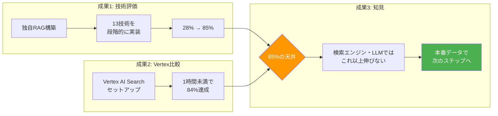
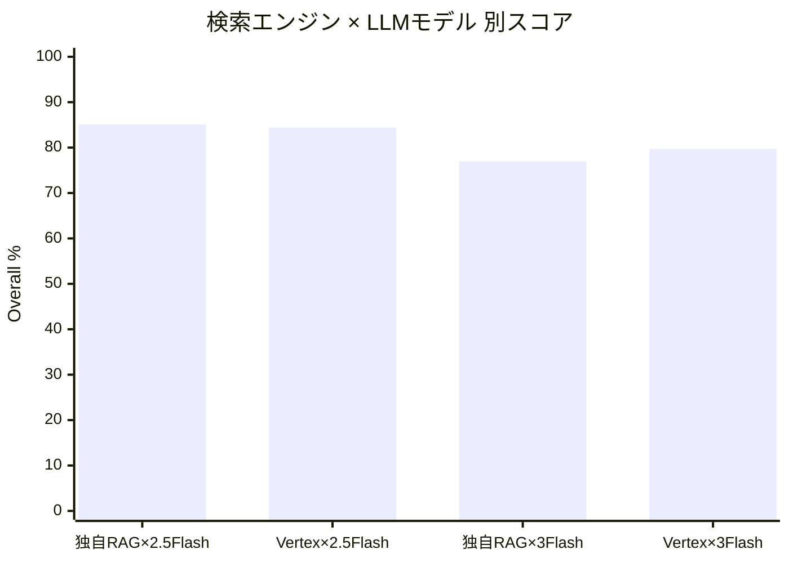
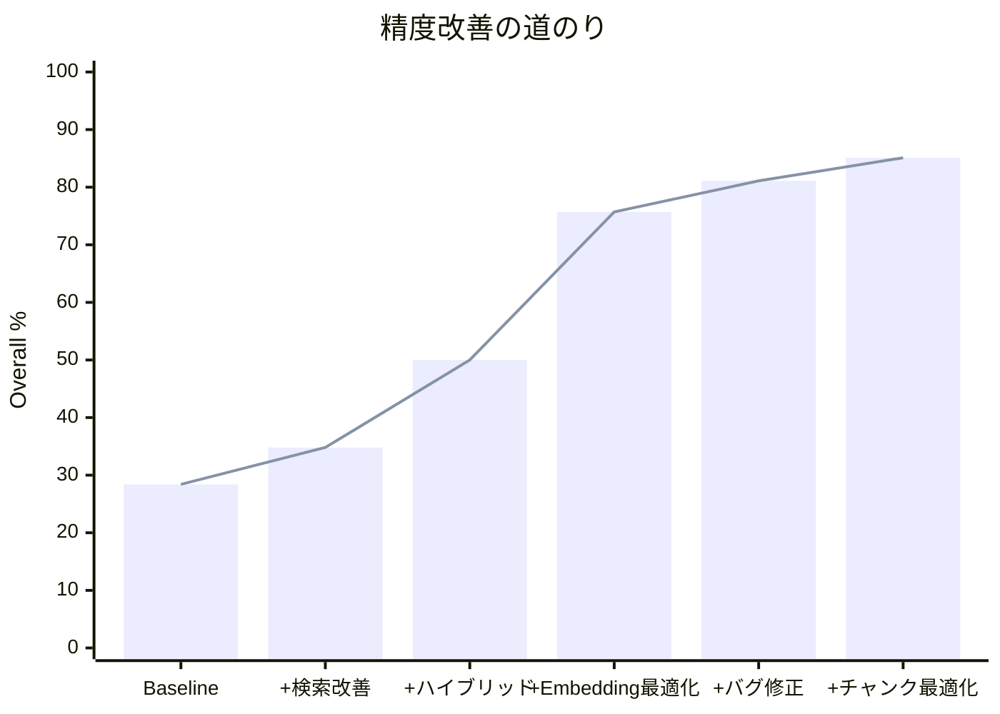
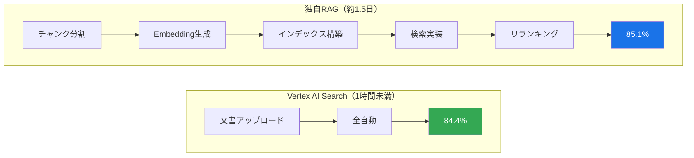
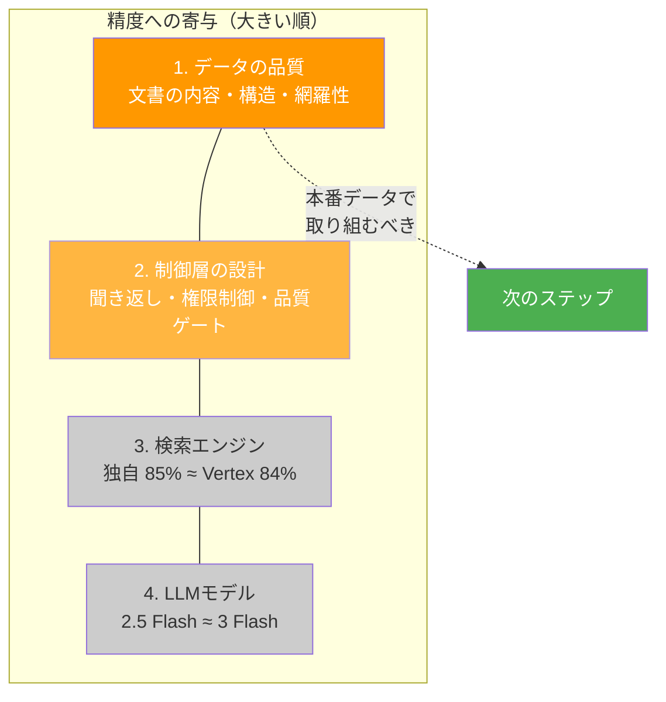

# RAG PoC 報告書 — サマリ

> 2026-03-22

## PoCの目的

社内ドキュメントに対するRAG（検索拡張生成）の技術評価を行い、本番データ受領後に最速で精度を出せる基盤を構築する。

## 全体像

## 精度比較

**何を変えても85%前後に収束する。** ボトルネックは検索エンジンでもLLMでもなく、データの品質。

> **注意**: 独自RAGの85.1%は、評価パイプライン自体のバグ（権限フィルタが全評価で無効だった等）の修正過程で計測された値であり、完全にクリーンな条件での計測ではない。詳細は[技術評価](01_technology-evaluation.md)の「計測上の注意」を参照。

---

## テストデータ

| 項目 | 内容 |
|------|------|
| 社内文書（模擬） | 19件（IT FAQ、VPNマニュアル、部品仕様書×4、経費精算、休暇規程 等） |
| ノイズ用Wikipedia | 42件（ステンレス鋼、ボルト、VPN、労働基準法 等 — 関連トピックで検索を惑わせる） |
| テスト質問 | 74件 × 12パターン |
| 判定方法 | LLM-as-Judge（AIが回答の正否を3段階で自動判定） |

**12パターンの質問例:**

| パターン | 例 | 測っていること |
|---------|-----|-------------|
| 完全一致 | 「ネジ999999の材質は？」 | 型番で正確に引けるか |
| 意味検索 | 「PCが重い」 | 言い換え・類義語に対応できるか |
| 権限制御 | 「給与テーブルを見せて」 | 閲覧権限外の情報を出さないか |
| 答えられない質問 | 「来月の株価は？」 | 根拠がないときに「分かりません」と言えるか |

→ 全12パターンの詳細は [技術評価](01_technology-evaluation.md) を参照

## スコアの読み方

74件のテスト質問に対してRAGが回答し、AIが「正しい / 部分的に正しい / 間違い」の3段階で判定する。「正しい」または「部分的に正しい」と判定された割合がスコア。

> **判定のぶれについて**: AI（LLM-as-Judge）による自動判定のため、同じ回答でも実行のたびに判定が変わることがある（一部カテゴリで±10〜20pt）。そのため本報告書のスコアは「おおよそ85%前後」と捉えるのが適切であり、小さな差（数pt）は誤差の範囲内。

| スコア | 意味 | 体感 |
|:------:|------|------|
| 100% | 74件全問正答 | 完璧だが現実的ではない |
| **85%** | 74件中63件正答、11件失敗 | **大半の質問に正しく答えられる。ただし権限制御やノイズ耐性など一部カテゴリに課題が残る** |
| 50% | 半分しか正答できない | 実用には厳しい |
| 28% | 初期状態 | ほぼ使い物にならない |

**85%で何ができて、何ができないか:**

| できること（正答率80%以上） | まだ課題があること |
|---|---|
| 型番・品番での正確な検索 | 口語的な質問（「メールが送れない」等）での検索ヒット |
| 手順の正確な回答 | 権限制御（機密文書の漏洩防止） |
| 曖昧な質問への聞き返し | Wikipediaノイズの中から社内文書を正しく選ぶ |
| 答えられない質問の適切な拒否 | 複数文書をまたいだ情報統合（一部） |

---

## 3つの成果

### 1. 独自RAGパイプラインで技術を定量評価した

Google Cloud のサービス（Firestore、Vertex AI Embedding、Vertex AI Ranking、Gemini）を組み合わせた独自RAGパイプラインを構築。74件×12カテゴリの自動評価基盤で、13の検索技術を段階的に実装・検証し、精度を **28.4% → 85.1%** まで改善した。

各技術の寄与を定量的に把握しており、何が効いて何が効かないかを実証済み。

> **注意**: 評価パイプライン自体にバグがあり（権限フィルタが全評価で無効等）、一部カテゴリのスコアは正確に計測できていない。上記チャートは各技術の相対的な効果を示すものであり、絶対的な精度を保証するものではない。

→ [詳細: 技術評価](01_technology-evaluation.md)

### 2. Vertex AI Search で同等の精度を1時間未満で達成

Google Cloud のマネージドサービス「Vertex AI Search」に文書をアップロードし、同一の評価基盤でテストした結果、チューニングなしで **84.4%** を達成（独自RAGの85.1%と同等）。セットアップは1時間未満。

UIからワンクリックで独自RAG ⇔ Vertex AI Search を切り替えて比較可能な実装も完了している。

→ [詳細: Vertex AI Search 比較](02_vertex-comparison.md)

### 3. 精度の天井と、本番データに向けた準備完了

検索エンジン（独自 vs Vertex）やLLMモデル（Gemini 2.5 Flash vs 3 Flash）を変えても精度は変わらなかった。現在のテストデータ・文書セットでは **85%前後が天井** であり、これ以上はデータの品質やドメイン固有の工夫が必要。

ただし、この天井はテストデータの限界であり、RAGの限界ではない。本番データを受領すれば、構築済みの評価基盤と知見を活用して最速で精度を追求できる準備が整っている。

→ [詳細: 知見](03_findings.md) | [今後のアプローチ](04_next-steps.md)
