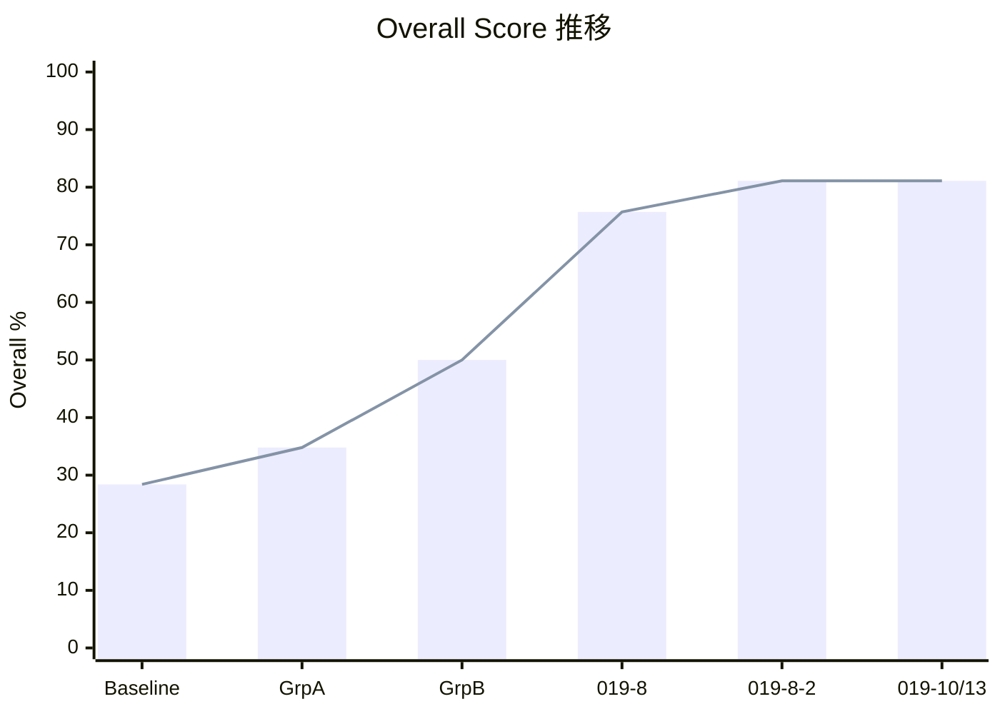

# 技術評価 — 独自RAGパイプラインの構築と精度改善

## 構成

Google Cloud のサービスを組み合わせた独自RAGパイプラインを構築した。

| コンポーネント | 使用サービス | 役割 |
|-------------|------------|------|
| 文書DB | Firestore | チャンク化された社内文書の保管・ベクトル検索 |
| Embedding | Vertex AI Embedding API | 文書と質問を768次元のベクトルに変換 |
| リランキング | Vertex AI Ranking API | 検索結果の関連度をAIが再評価 |
| 回答生成 | Gemini 2.5 Flash | 検索結果を読んで回答を生成 |
| チャット画面 | TypeScript (React) | ユーザーが質問を入力し、回答を閲覧 |
| 管理画面 | TypeScript (React) | 文書管理・評価実行・パラメータ調整 |

## 評価基盤

| 項目 | 内容 |
|------|------|
| テスト質問数 | 74件 |
| テストパターン | 12カテゴリ（完全一致検索、意味検索、権限制御、曖昧質問、ノイズ耐性 等） |
| 判定方法 | LLM-as-Judge（Gemini 2.5 Flash が回答の正否を3段階で判定） |
| ノイズ源 | Wikipedia日本語版42記事（実運用に近い「大量の候補から正解を見つける」条件） |
| 検索対象 | 454チャンク（社内文書51 + Wikipedia 403） |

## 精度改善の道のり

| 段階 | Overall | 主な施策 | 効果 |
|------|:-------:|---------|------|
| ベースライン | **28.4%** | ベクトル検索 + リランキング + LLM-as-Judge | 出発点 |
| グループA | **34.8%** | メタデータスコアリング、聞き返し、文脈説明付与 | +6.4pt |
| グループB | **50.0%** | ハイブリッド検索（キーワード+ベクトル）、権限フィルタ | +15.2pt |
| DD-019-8 | **75.7%** | Embedding task_type指定、一般語キーワード検索 | **+25.7pt（最大改善）** |
| DD-019-8-2 | **81.1%** | キーワード検索バグ修正、AIフィルタ | +5.4pt |
| chunk=1200 | **85.1%** | チャンクサイズ最適化（800→1200） | +4.0pt |

## 各技術の効果（定量）

| 技術 | 効果 | 備考 |
|------|------|------|
| Embedding task_type指定 | **+25.7pt** | 最大改善。全カテゴリに波及 |
| ハイブリッド検索 | **+15.2pt** | 型番検索 0%→75% |
| チャンクサイズ最適化 | **+4.0pt** | 800→1200文字 |
| 曖昧質問の聞き返し | ambiguous 0%→100% | カテゴリ特化 |
| 権限フィルタ | security 0%→80% | 4段階バグ修正が必要だった |
| Multi-Query Expansion | **-2.7pt（逆効果）** | OFFに戻した |

## 失敗から得た知見

| 失敗 | 学び |
|------|------|
| Multi-Query が精度を悪化させた | 全クエリを同じ重みでRRF投入すると型番検索を壊す |
| 権限フィルタのバグが4段階で埋もれていた | 「テストが正しく動いているか」を最初に疑うべき |
| max_output_tokens=256で空レスポンス | Gemini 2.5 Flash のthinkingトークンが出力枠を消費する |
| チャンクサイズを根本原因と誤予測 | cosine similarity直接計算で初めて正しい原因を特定 |

## 計測上の注意

本PoCのスコアには以下の制約がある:

| 制約 | 内容 | 影響 |
|------|------|------|
| **評価の仕組み自体にバグがあった** | 精度改善の途中で、評価プログラム自体が権限フィルタを無効にした状態で動いていたことが判明。4段階に渡るバグを順番に修正した | 権限制御（security）カテゴリのスコアが実態より高い可能性がある。また、85.1%はバグ修正が完了する前に計測された値が含まれている |
| **AIによる自動判定にぶれがある** | 回答の正否をAI（LLM-as-Judge）が判定しているため、同じ回答でも実行のたびに結果が変わることがある。特に意味検索・ノイズ耐性・新旧文書の区別で±10〜20ptの変動が確認されている | 小さなスコア差（数pt）は誤差の範囲内。「おおよそ85%前後」と捉えるのが適切 |
| **模擬データでの評価** | 19件の模擬社内文書、74件の模擬質問で評価している。本番の文書量・質問パターン・業務の複雑さとは異なる | 85%は本番精度を保証する数値ではなく、各技術の相対的な効果を把握するためのPoC値 |

これらの制約があるため、本報告書のスコアは**「各技術がどの程度効くかの傾向」**を読み取る目的で活用いただきたい。

→ 全施策の詳細記録: [rag_improvement_history.md](../../record/rag_improvement_history.md)
→ 各技術の説明資料: [20260320/](../20260320/)（13本）
