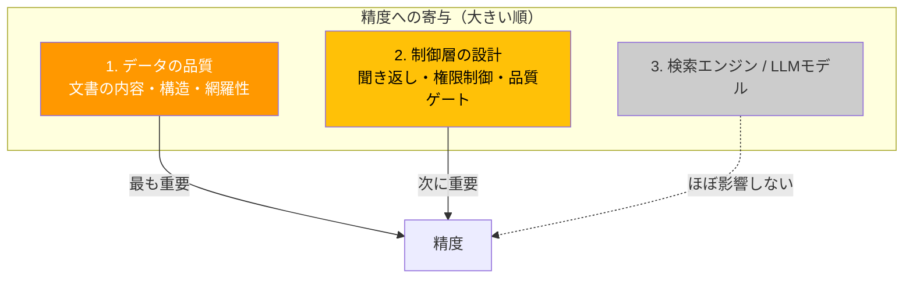

# 知見と提言 — 高精度RAGを構築するために

## PoCで判明した精度の構造



PoCでは検索エンジン（独自 vs Vertex）やLLMモデル（2.5 Flash vs 3 Flash）を変えても精度は変わらなかった。**精度を本質的に改善するのは、データの品質と、データに合わせた制御層の設計**であることが実証された。

### 実証データ

| 何を変えたか | 結果 | 学び |
|---|---|---|
| 検索エンジン（独自 → Vertex） | 85% → 84%（同等） | 検索基盤の選択は精度に影響しない |
| LLMモデル（2.5 Flash → 3 Flash） | 85% → 77%（むしろ低下） | LLMの基礎能力は既に十分な水準に達している |
| 制御層の個別調整 | 最大+5pt程度 | 現在のテストデータでは改善余地が限定的 |

### やっても効果がなかったこと

| 施策 | 結果 | 学び |
|------|------|------|
| Multi-Query Expansion | **逆効果（-2.7pt）** | クエリ展開がノイズになり型番検索を壊した |
| LLMモデルの上位版への切替 | **低下（-4〜9pt）** | モデル性能はボトルネックではない |
| Search Tuning（Vertex） | 見送り | 準備コスト（負例10,000件）に対してROIが低い |
| SFT（モデルチューニング） | 見送り | LLM性能が既に十分なため効果が限定的 |

---

## 提言: 高精度RAGの構築方針

PoCの知見を踏まえ、本番で高精度なRAGを構築するための方針を以下に示す。

### やるべきこと（効果が大きい順）


#### 1. データの整備（最優先）

精度の天井を決めるのはデータ。本番データに対して以下を整備する:

| 項目 | 内容 | PoCでの学び |
|------|------|------------|
| **文書の網羅性** | ユーザーが聞きそうな質問に答えられる文書が揃っているか | PoCでは検索結果0件（文書が存在しない）が失敗の主因だった |
| **文書の構造** | 見出し・表・リストが機械的に読み取りやすい形式か | Markdown形式が最も扱いやすかった |
| **メタデータ** | 権限レベル・カテゴリ・更新日が文書に付与されているか | 権限制御とノイズ排除に必須 |
| **テスト質問** | 実ユーザーの質問パターンを反映したテストデータ | 模擬データでは85%が天井だったが、本番データでは異なる可能性が高い |

#### 2. 評価サイクルを回す

PoCで構築した自動評価パイプラインを使い、変更のたびに精度を計測する:

```
文書をアップロード → テスト質問で自動評価 → 結果を見て改善 → 再評価
                    （1回約30分）
```

この「測って、直して、再測定」のサイクルを高速で回せる基盤が構築済み。

#### 3. 制御層をデータに合わせて調整

本番データの特性に合わせて、以下の制御層を調整する:

| 制御層 | 調整内容 | PoCでの知見 |
|--------|---------|------------|
| **聞き返し判定** | どの質問を「曖昧」とするかの基準 | PoCでは一部の正当な質問を曖昧と誤判定していた |
| **権限制御** | どの文書を誰に見せるかのルール | PoCでは4段階のバグを経て実装。本番ではVertexのメタデータフィルタも選択肢 |
| **品質ゲート** | 検索結果の信頼度が低い場合に回答を拒否する閾値 | PoCでは閾値未調整（0.0）のまま。本番データで最適値を設定 |

これらの調整はデータに依存するため、**本番データを受領してから取り組むのが効率的**。

### やらなくていいこと

| 施策 | 理由 |
|------|------|
| 検索エンジンの独自開発 | Vertex AI Search で同等の精度が1時間未満で得られる |
| LLMの上位モデルへの切替 | 現行モデル（Gemini 2.5 Flash）で十分。上位にしても精度は変わらない |
| LLMのファインチューニング | モデル性能はボトルネックではない |
| チャンク分割の最適化に時間をかける | Vertexを使えば自動。独自RAGでも効果は+4pt程度 |
