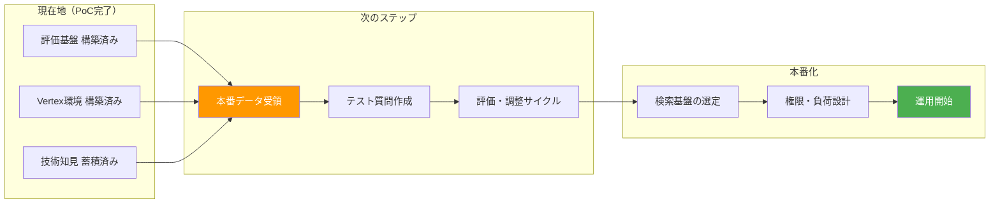

# 今後のロードマップ

## 本番に向けた全体像



## ステップ1: 本番データの受領（最優先）

PoCの最大の学びは「データの品質が精度を決める」こと。次に必要なのは本番データ。

| 必要なもの | 用途 |
|-----------|------|
| **実際の社内文書** | 検索対象としてアップロード |
| **実際のユーザー質問（想定）** | テストデータとして評価パイプラインに投入 |
| **権限ルール** | どの文書を誰に見せるかの定義 |

## ステップ2: 本番データでの評価サイクル

本番データを受領したら、PoCで構築済みの評価基盤で即座に精度を計測できる:

```
1. 文書をアップロード     ← Vertex: 1時間未満 / 独自RAG: 手順確立済み
      ↓
2. テスト質問を作成       ← 顧客と共同で実際の質問パターンを収集
      ↓
3. 自動評価で計測         ← 1回約30分
      ↓
4. 結果を見て制御層を調整  ← 聞き返し基準・権限ルール・品質ゲート閾値
      ↓
5. 再計測で効果確認       ← このサイクルを繰り返す
```

PoCで試行錯誤のフェーズは終わっている。何が効いて何が効かないかを把握済みなので、**本番データに対しては無駄な施策をスキップして最短ルートで精度を出せる**。

## ステップ3: 本番化の設計

精度が目標水準に達したら、本番運用に向けた設計に移行する。

| 項目 | PoCの状態 | 本番で必要なこと |
|------|----------|----------------|
| **検索基盤** | 独自RAG / Vertex 両方で検証済み | 運用負荷を考えるとVertexが有力。本番データで最終判断 |
| **権限制御** | 模擬データで仕組みを検証済み | 実際の部署・役職に合わせたルール設定 |
| **同時アクセス** | PoCは数人想定 | 全社展開ではスケーリング設計が必要 |
| **監査ログ** | クエリログ実装済み | 本番要件に合わせた拡張 |
| **フィードバック** | 未実装 | ユーザーからの👍👎でテストデータを自動拡充 |

## PoCで確立した「即座に判断できること」

本番データが来たときに迷わず判断できる:

| よくある疑問 | PoCの回答 |
|---|---|
| 検索エンジンは何を使う？ | **Vertex AI Search で十分**。1時間で構築可能、精度は独自RAGと同等 |
| LLMモデルは最新にすべき？ | **現行（Gemini 2.5 Flash）で十分**。上位にしても精度は変わらない |
| 精度が出ない場合はどこを直す？ | **文書の品質と制御層を見る**。検索エンジンやLLMを変えても改善しない |
| チューニングは必要？ | **まず制御層の調整から**。Search TuningやSFTは現時点ではROIが低い |
| どのくらいで精度が出る？ | **データ次第**。評価サイクルは1回30分で回せる基盤が整っている |
