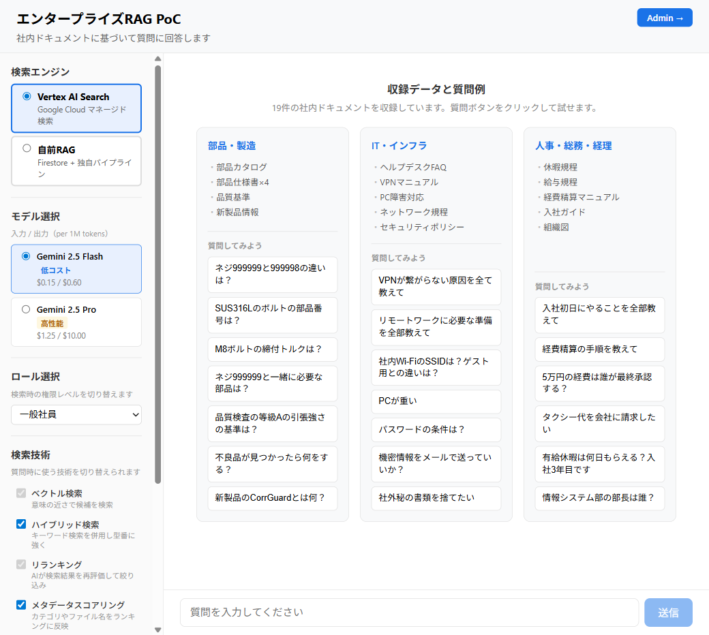
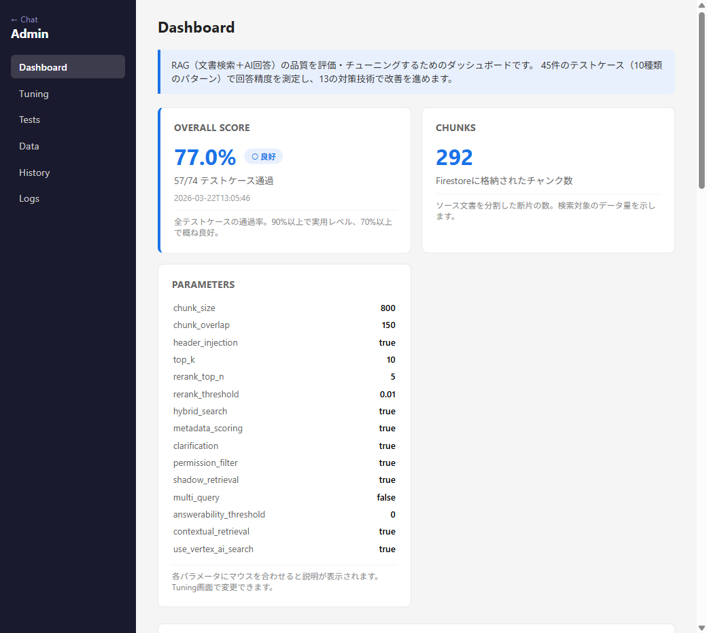
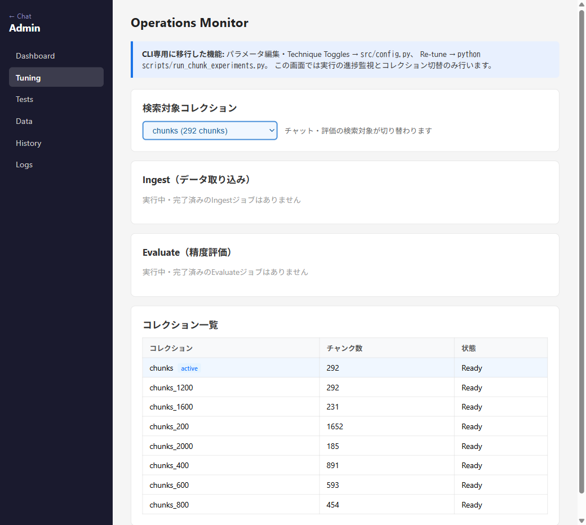
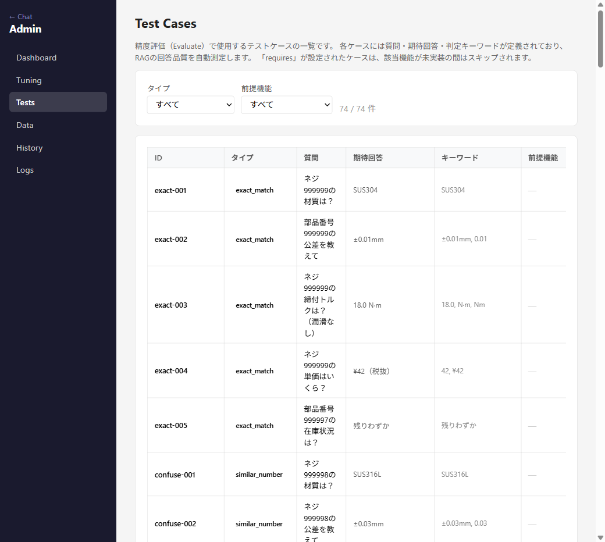
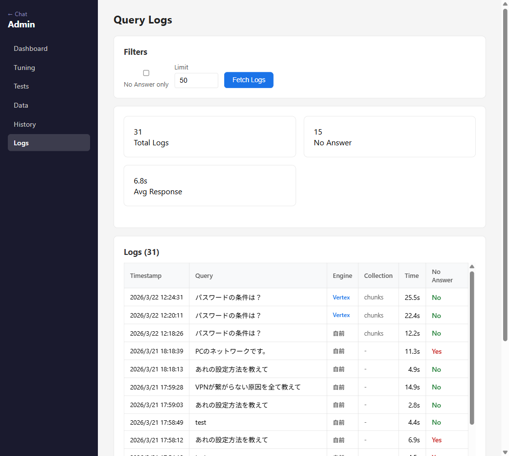
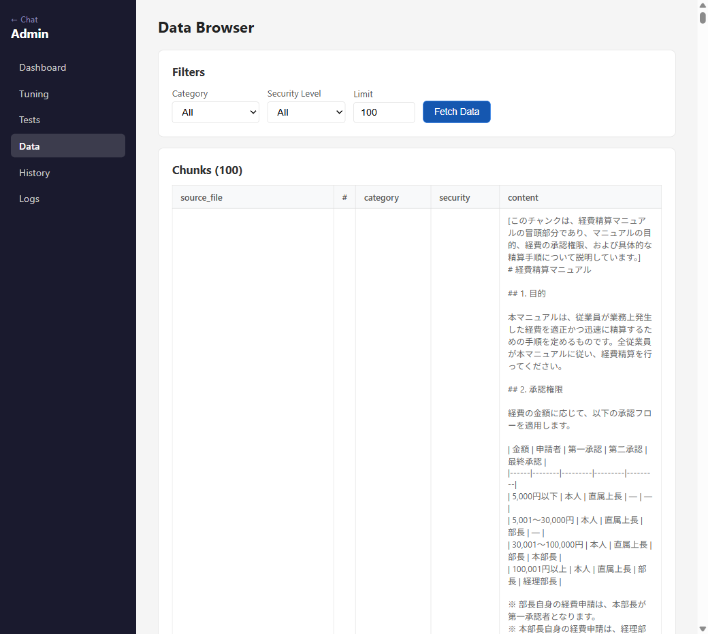

# 画面キャプチャ — PoCで構築したシステム

## チャット画面

ユーザーが社内文書に関する質問を入力し、AIが根拠付きで回答する画面。

- 左サイドバーで**検索エンジン**（Vertex AI Search / 独自RAG）を切替可能
- **モデル選択**（Gemini 2.5 Flash / Pro）
- **ロール選択**で権限レベルを切替（一般社員 / HR管理者 / 役員）
- **検索技術**のON/OFFをトグルで制御（9種類）
- 右側に収録データと質問例が表示され、クリックで即座に試せる

## 管理画面 — ダッシュボード

管理者向けの画面。現在のスコア・チャンク数・パラメータ設定を一覧表示。

- Overall Score と評価日時
- Firestoreのチャンク数
- 全パラメータの現在値（`use_vertex_ai_search` 含む）

## 管理画面 — Operations Monitor

コレクションの切替、Ingest/Evaluateジョブの監視を行う画面。

- 検索対象コレクションをプルダウンで切替
- 全コレクション（chunks, chunks_600, chunks_800, chunks_1200 等）のチャンク数と状態を一覧表示

## 管理画面 — テストケース一覧

74件のテストケースを確認できる画面。タイプ・前提機能でフィルタ可能。

- 各ケースのID・タイプ・質問・期待回答・キーワード・前提機能を表示
- 12パターン（exact_match, semantic, security 等）でフィルタ可能

## 管理画面 — クエリログ

ユーザーの質問・回答・使用した検索エンジン・応答時間を記録。

- **Engine**列で Vertex / 自前 を識別（青字 = Vertex）
- 応答時間、No Answer の有無を一覧表示
- 行クリックで詳細（回答全文、参照元文書、使用技術）を表示

## 管理画面 — データブラウザ

Firestoreに格納されたチャンクの内容・メタデータを確認できる画面。

- Category / Security Level でフィルタ可能
- チャンクの本文、メタデータ（カテゴリ、権限レベル）を直接確認
