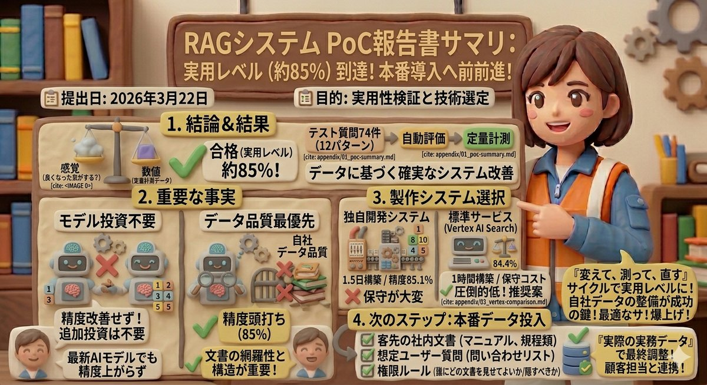

# RAGシステム PoC（概念実証）報告書

**提出日:** 2026年3月22日
**目的:** 社内ドキュメント検索AI（RAG）の実用性検証と、本番導入に向けた技術選定

---

## 1. 結論：実用レベル（精度 約85%）に到達。本番データでの最終調整へ移行可能です

模擬データを用いた検証の結果、全体の約85%の質問に対してAIが正しく回答できるシステム基盤が完成しました。

手探りでの構築を避け、事前に「74件のテスト質問（12パターンの業務想定）」を用意し、改善効果を自動かつ定量的に計測できる仕組みを構築した上で検証を行いました。これにより、感覚値ではなくデータに基づいた確実なシステム改善サイクルが回せる状態になっています。

> 注: 精度「約85%」は模擬データ74件での自動評価結果です。AI（LLM）による自動判定のため±10pt程度のぶれがあり、「おおよそ85%前後」と捉えるのが適切です。

## 2. 今回の検証で判明した「重要な事実」（無駄なコストを避けるために）

本検証により、AI検索の精度を上げるための「正しい投資先」が明確になりました。

- **「もっと賢いAI」を使っても精度は上がりません:**
  最新モデルへの切り替えも試みましたが、精度は改善せずむしろ低下しました。**AIモデルの性能はすでに十分な水準に達しており**、ここへの追加投資は不要です。

- **真のボトルネックは「自社データの品質」です:**
  システムをどれだけチューニングしても、現在のテストデータでは精度が85%前後で頭打ちになります。残りの15%を改善し、実業務で使えるレベルに引き上げるために最も重要なのは、AIではなく「読み込ませる社内文書の網羅性と構造（データ品質）」です。

## 3. 本番環境に向けたシステム選定：運用コスト重視の提案

Google Cloudの技術を用いて、「独自開発」と「標準サービス」の2パターンを構築・比較しました。

- **独自開発システム:** 約1.5日かけて構築し、細かな調整を重ねた結果、精度 **85.1%** を達成しました。
- **標準サービス（Vertex AI Search）:** Googleの標準機能をそのまま利用したところ、1時間未満の構築で、独自開発とほぼ同等の精度 **84.4%** を達成しました。

**【推奨案】**
わずかな精度差（0.7%）のために複雑な独自システムを保守し続けるのは得策ではありません。本番運用においては、構築・保守の手間が圧倒的にかからない **「標準サービス（Vertex AI Search）」の採用を強く推奨します**。

## 4. 次のステップ（顧客担当へのお願い）

技術的な検証と基盤構築（PoC）は完了しました。
最速で本番稼働を目指すため、以下の「実際の実務データ」をシステムに投入し、最終調整を行いたいと考えております。

1. **お客様の社内文書**（各部署で使われているマニュアルや規程類）
2. **想定されるユーザー質問**（現場からよく来る問い合わせのリスト）
3. **権限ルール**（「誰にどの文書を見せてよいか/隠すべきか」の定義）

お客様から上記データを取り寄せるか、お客様相当のデータをご用意いただけるよう、顧客担当からのご調整をお願いいたします。

---

## 添付資料

技術的な詳細は以下の添付資料（全7点）をご参照ください。

| # | 資料 | 内容 |
|---|------|------|
| 01 | [PoCサマリ](appendix/01_poc-summary.md) | 3つの成果の概要、テストデータ、スコアの読み方 |
| 02 | [技術評価](appendix/02_technology-evaluation.md) | 28%→85%の精度改善の道のり、各技術の効果、失敗の学び |
| 03 | [Vertex AI Search比較](appendix/03_vertex-comparison.md) | 同一データでの実測比較、セットアップ比較 |
| 04 | [知見と提言](appendix/04_findings.md) | 精度のボトルネック分析、やるべきこと/やらなくていいこと |
| 05 | [今後のロードマップ](appendix/05_next-steps.md) | 本番データ受領後の最速アプローチ |
| 06 | [申し送り](appendix/06_lessons-learned.md) | 繰り返し発生した問題、本番での注意点、チェックリスト |
| 07 | [画面キャプチャ](appendix/07_screenshots.md) | チャット画面、管理画面のスクリーンショット |
