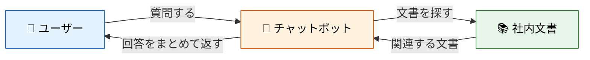
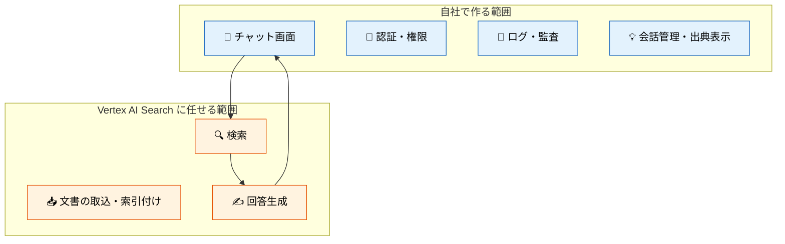
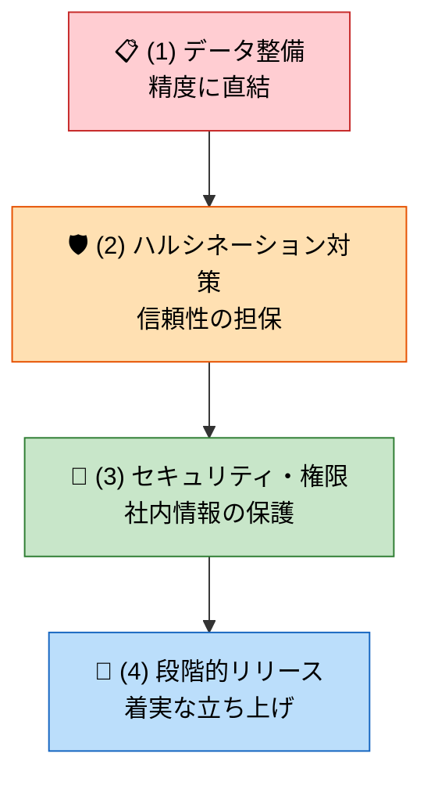
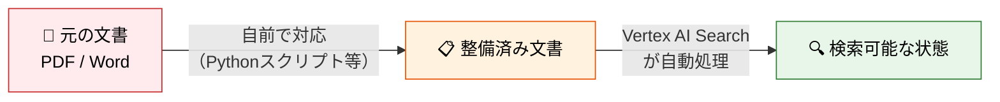
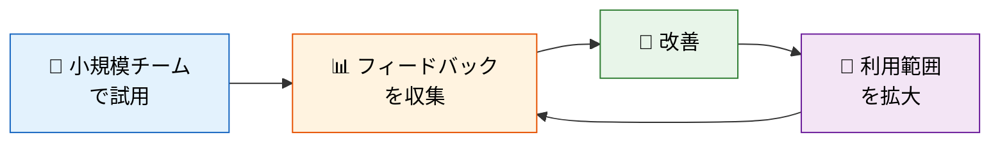
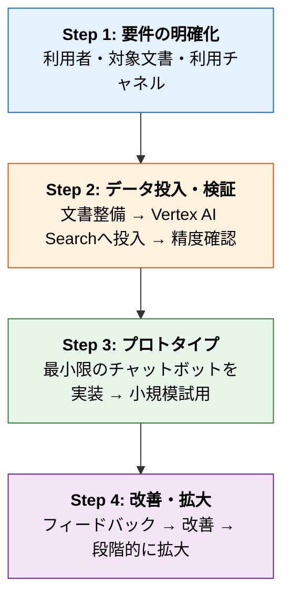

# チャットボット導入に向けた技術理解と方針

**作成日:** 2026年3月25日
**目的:** チャットボット導入の打診に対し、技術的な理解と実装方針を共有する

---

## 1. チャットボットとは何か

> **「社内の文書を検索して、AIが人間の言葉で回答してくれる仕組み」**

| | 従来の社内検索 | チャットボット |
|---|---|---|
| やること | キーワードで検索 → 文書一覧 → **自分で読む** | 質問する → **AIが読んで回答** |
| 結果 | 文書のリンク一覧 | 要約された回答＋出典 |

この「まず検索して、それを元にAIが回答する」仕組みを **RAG**（Retrieval-Augmented Generation）と呼びます。

---

## 2. 構築方針：Vertex AI Search を基盤とする

> **検索・回答生成という「重い部分」はGoogleのサービスに任せ、 自社は「チャットボットとしての体験づくり」と「データ品質」に集中する。**

### なぜ自前で作らないのか ― PoCでの実体験

| | 自前RAG（PoCで構築） | Vertex AI Search |
|---|---|---|
| **構築時間** | 1.5日 | **1時間未満** |
| **精度** | 85.1% | 84.4%（ほぼ同等） |
| **運用** | 自分で全部管理 | **Googleが管理** |

**ほぼ同じ精度なら、運用の手間がかからない方を選ぶべき。**

### 精度を上げるカギ ― PoCで判明した事実

| アプローチ | 効果 | 判定 |
|-----------|------|------|
| より賢いAIモデルを使う | 改善せず、むしろ低下 | ❌ 不要 |
| 検索ロジックを自前で磨く | 多少上がるが運用コスト大 | ❌ 割に合わない |
| **文書を整備して投入する** | **精度向上に最も直結** | ✅ **ここに注力** |

---

## 3. チャットボット実装で注意すべきポイント

### 全体像

---

### (1) データの整備 ― 回答精度に直結する

データ整備は**チャットボット構築で最も地道で重要な作業**です。
Vertex AI Searchが自動でやってくれる部分と、自前で対応が必要な部分があります。

#### Vertex AI Search が自動でやってくれること

| 処理 | 内容 |
|------|------|
| **テキスト抽出** | PDFからの文字認識（OCR）・レイアウト解析 |
| **文書の自動分割** | 投入された文書を検索に適したサイズに自動分割 |
| **検索索引の構築** | 意味検索・キーワード検索のための索引を自動生成 |

#### 自前で対応が必要なこと（Pythonスクリプト等で実施）

| 処理 | なぜ自動化できないか |
|------|-------------------|
| **メタデータの付与**（部署・カテゴリ等） | 「この文書はどの部署のものか」は業務知識がないと判断できない |
| **新旧バージョンの管理** | どれが最新かはファイル名や管理台帳から人が判断する必要がある |
| **不要部分の除去**（ヘッダー・フッター等） | 自動パーサーでも残る場合があり、個別対応が必要 |
| **複雑な表の構造保持** | 自動抽出で崩れるケースがあり、文書ごとの確認が要る |
| **元データの取得**（社内システムからの抽出） | データの在処や形式は組織ごとに異なる |

> **率直に言えば、データ整備は泥臭い作業です。**
> しかし、PoCで「精度のカギはAIモデルではなくデータ品質」と実証されている以上、**ここに手間をかけるのが最も費用対効果の高い投資**です。
> 逆に言えば、ここを省略すると、どれだけ良いAIを使っても精度は上がりません。

#### データ整備の具体例

| 元の状態 | 問題 | 整備後 |
|---------|------|--------|
| PDFの表が画像として埋め込まれている | AIが表の中身を読めず、検索にヒットしない | テキストとして抽出し、表の構造を保って投入 |
| 100ページの規程集を丸ごと1ファイルで投入 | 検索結果が大きすぎてAIが要点を絞れない | 章・条ごとに分割して投入 |
| ファイル名が「資料_v3_最終_確定.docx」 | 何の文書か判別できず検索精度が落ちる | タイトル・カテゴリ・部署・更新日をメタデータとして付与 |
| 同じ内容の文書が新旧バージョン混在 | 古い情報で回答してしまうリスク | 最新版のみを投入する運用ルールを策定 |
| ヘッダー・フッター・ページ番号がそのまま | 検索ノイズになり関係ない文書がヒットする | 前処理で除去してから投入 |

---

### (2) ハルシネーション対策 ― AIが嘘をつくリスクへの対処

> AIは文書にない情報を「もっともらしく」でっち上げることがある。
> これを**ハルシネーション**と呼び、チャットボットにおける最大のリスク。

データ整備と同様、Vertex AI Searchに任せられる部分と自社で対応する部分があります。

#### Vertex AI Search が自動でやってくれること

| 機能 | 仕組み |
|------|--------|
| **Grounding（根拠付け）** | 回答を必ず検索結果の文書内容に基づいて生成する。文書にない情報は使わない |
| **引用元の自動付与** | 回答のどの部分がどの文書に基づいているか、引用情報を自動で返してくれる |
| **信頼度スコア** | 回答の確信度をスコアで返す。低ければ「回答できない」と判断できる |

#### 自社で対応すること

| 対策 | 実装内容 |
|------|---------|
| **出典の表示UI** | Vertex AI Searchが返す引用情報を画面に表示する（「この回答は○○マニュアル §3に基づいています」等） |
| **回答拒否の閾値設定** | 信頼度スコアが低い場合に「この質問にはお答えできません」と返すロジック |
| **対象外の質問への案内** | 業務と無関係な質問（雑談等）に対する案内メッセージの設計 |

> **ポイント：** ハルシネーション対策の核心部分（文書に基づく回答生成・引用・信頼度判定）は
> Vertex AI Searchの標準機能として提供されている。
> 自社で実装するのは「それをユーザーにどう見せるか」のUI部分が中心。

---

### (3) セキュリティと権限 ― 社内情報を扱う以上、必須

| 観点 | 内容 |
|------|------|
| **認証** | 誰が使えるかを制御する（Google Workspace SSO等） |
| **文書の閲覧権限** | 文書ごとに「誰が検索・閲覧できるか」を制御する（下記例参照） |
| **操作ログ** | 誰がどんな質問をしたかの記録。コンプライアンス上も重要 |

#### 権限制御の具体例

| 文書の種類 | 閲覧できる人 | 制御の考え方 |
|-----------|------------|-------------|
| 社内マニュアル（一般） | 全社員 | 制限なし。誰でも検索・閲覧可 |
| 人事規程・給与テーブル | 人事部のみ | 部署単位で制御。他部署からは検索にもヒットしない |
| 経営会議の議事録 | 管理職以上 | 役職（ロール）で制御 |
| プロジェクトA の設計書 | プロジェクトメンバーのみ | プロジェクト・グループ単位で制御 |
| 顧客向け提案書 | 担当営業＋上長 | 個人・チーム単位で制御 |

> **ポイント：** 権限設計は文書の投入時にメタデータとして付与する。
> 「誰に見せてよいか」の定義は業務側で決める必要があり、技術だけでは決められない。

---

### (4) 段階的な立ち上げ

- いきなり全社公開ではなく、**小さく始めて育てる**
- 「この回答は役に立ちましたか？」等のフィードバック機能を最初から組み込む
- API利用料は利用者数×質問頻度で事前に試算しておく

---

## 4. 提案する進め方

---

## 5. 次回以降で決めたいこと

| 決めること | 選択肢の例 |
|-----------|-----------|
| 🎯 利用者の範囲 | 全社 / 特定部署 / 特定チーム |
| 📚 対象文書 | マニュアル / 社内Wiki / 規程集 / FAQ |
| 💬 利用チャネル | Webアプリ / Slack / Teams |
| 🔐 権限の要否 | 全員同じ文書を見せてよいか / 部署ごとに制限するか |
