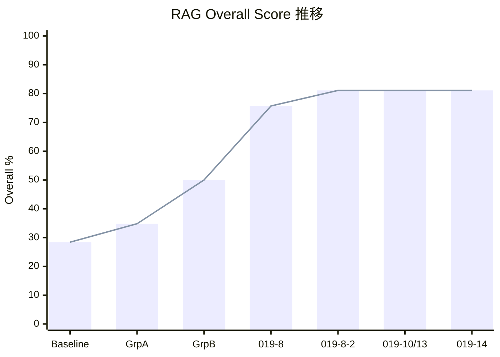
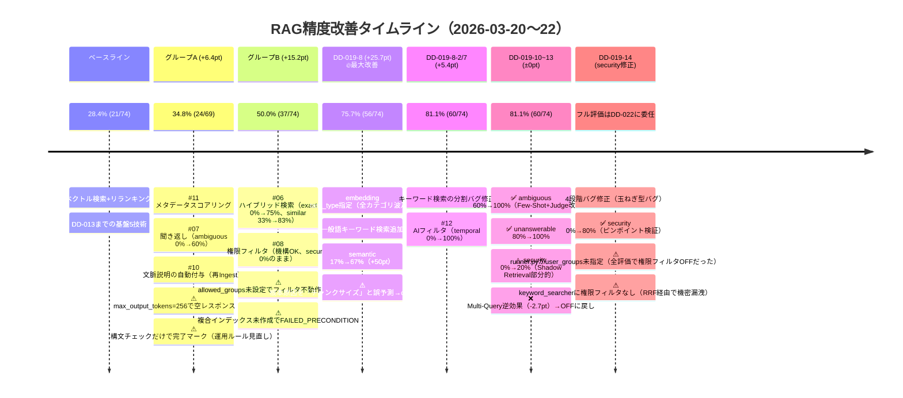

# RAG精度改善の実施記録

> DD-019 シリーズで実施した全施策の時系列記録。
> 何を変えて、何が起きて、スコアがどう動いたかを、失敗・勘違いも含めて記録する。
>
> **最終更新: 2026-03-22 20:00（DD-019-14 security 4段階バグ修正完了時点）**

## 変更の4軸

本プロジェクトの精度改善は以下の4軸で行われた：

| 軸 | 内容 | 変更時の影響 |
|---|---|---|
| **チャンクサイズ** | 文書の分割単位（文字数・重複幅） | 再Ingest必要 |
| **検索技術（機能）** | 検索・前処理・後処理パイプラインの技術ON/OFF | config切替で即時反映 |
| **テストデータ** | eval_dataset.jsonl のケース数・内容 | 評価スコアのベースが変わる |
| **評価方法** | LLM-as-Judge のプロンプト・判定基準 | 同じ回答でもスコアが変わる |

---

## スコア推移サマリー





| # | 時点 | Overall | 差分 | 主要施策 | 評価ファイル |
|---|------|---------|------|---------|-------------|
| 0 | ベースライン | **28.4%** (21/74) | — | DD-013まで（チャンキング+ベクトル検索+リランキング+LLM-as-Judge） | `eval_20260321_125102.json` |
| 1 | グループA完了 | **34.8%** (24/69) | +6.4pt | #11メタデータスコアリング, #07聞き返し, #10文脈説明 | `eval_20260321_183252.json` |
| 2 | グループB完了 | **50.0%** (37/74) | +15.2pt | #06ハイブリッド検索, #08権限フィルタ | `eval_20260321_195951.json` |
| 3 | DD-019-8完了 | **75.7%** (56/74) | +25.7pt | embedding task_type指定, 一般語キーワード検索 | `eval_20260321_215058.json` |
| 4 | DD-019-8-2完了 | **81.1%** (60/74) | +5.4pt | キーワード検索の分割バグ修正, AIフィルタ(#12) | `eval_20260322_054817.json` |
| 5 | DD-019-10/13適用 | **81.1%** (60/74) | ±0pt | 権限即拒否, 曖昧判定安定化（Multi-Query OFF） | `eval_20260322_080611.json` |
| — | DD-019-9 chunk=1200 | **85.1%** | — | チャンクサイズ1200実験（DD-019-10~13も同時適用） | `DD-019-9/result_B_chunk1200.json` |
| 6 | DD-019-14完了 | — | — | 4段階バグ修正: chunker YAML解析, keyword権限フィルタ, Shadow Retrieval差分判定, runner.py user_groups. security 0%→80%(ピンポイント). フル評価はDD-022に委任 | — |

---

## カテゴリ別スコア推移

| カテゴリ | ベースライン | GrpA | GrpB | DD-019-8 | DD-019-8-2 | DD-019-10/13 |
|---------|-----------|------|------|----------|------------|--------------|
| exact_match (8) | 0% | 0% | **75%** | **100%** | 100% | 88% |
| similar_number (6) | 33% | 33% | **83%** | **100%** | 100% | 100% |
| semantic (12) | 17% | 17% | 17% | **67%** | 67% | 50% |
| step_sequence (7) | 71% | 71% | 71% | **100%** | 100% | 100% |
| multi_chunk (7) | 29% | 29% | **71%** | **100%** | 100% | 100% |
| unanswerable (5) | 100% | 100% | 100% | 80% | 80% | **100%** |
| ambiguous (5) | 0% | **60%** | 60% | 60% | 60% | **100%** |
| cross_category (5) | 40% | 40% | 40% | **80%** | 80% | **100%** |
| security (5) | — | (skip) | 0% | 0% | 0% | **20%** |
| noise_resistance (6) | 33% | 33% | **50%** | 67% | 83% | 67% |
| table_extract (5) | 20% | 20% | 20% | **80%** | 80% | **100%** |
| temporal (3) | 0% | 0% | 0% | 33% | **100%** | 67% |

※ semantic, noise_resistance, temporal はLLM-as-Judgeの確率的ぶれにより評価ごとに±10〜20ptの変動がある

---

## 各施策の詳細記録

### ベースライン（DD-013まで）

| 軸 | 値 |
|---|---|
| チャンクサイズ | 800文字, 重複150文字 |
| 検索技術 | ベクトル検索 + リランキング |
| テストデータ | 74件（12カテゴリ） |
| 評価方法 | LLM-as-Judge（Gemini 2.5 Flash, 温度0） |
| Embedding | text-embedding-005, task_type未指定 |

---

### グループA: DD-019-1, 019-2, 019-3（並行実装）

**変更した軸**: 検索技術

| DD | 技術 | 概要 |
|---|---|---|
| DD-019-1 | #11 メタデータスコアリング | リランキング後にカテゴリ一致(+0.03)/ファイル名一致(+0.02)のボーナス |
| DD-019-2 | #07 聞き返し | Pre-RAGでLLMが曖昧判定、曖昧なら聞き返し |
| DD-019-3 | #10 文脈説明の自動付与 | Ingest時にLLMでチャンク固有の文脈説明を生成 |

**失敗・勘違い:**

1. **DD-019-1: 更新日軸を除外** — 当初3軸（更新日、カテゴリ、ファイル名）を検討したが、PoCでは全文書が同一Ingest日になるため日付ボーナスが機能しない → 2軸に縮小
2. **DD-019-2: max_output_tokens=256でthinking tokens枯渇** — Gemini 2.5 Flashのthinkingトークンで出力枠が消費され空レスポンス。DD-013で一度解決済みの既知問題なのに再発 → 2048に修正
3. **DD-019-2: 偽陽性5件発見** — 「画面が固まった」等がsemantic質問なのに曖昧と誤判定 → プロンプト厳格化で解決
4. **DD-019-3: 構文チェックだけで✅にしてしまった** — 実行検証をせずに完了マークを付けてしまい、後から修正。LLMの「やったふり」を防ぐDD運用ルールの契機となった
5. **DD-019-3: max_output_tokens問題が再発** — DD-019-2と同じ問題。2048に修正
6. **DD-019-3: 再Ingest時に429エラー4件** — Gemini APIのレート制限。全てWikipediaノイズ記事のため放置（99%成功）

---

### グループB: DD-019-4, 019-5（並行実装）

**変更した軸**: 検索技術 + テストデータ（DD-019-5）

| DD | 技術 | 概要 |
|---|---|---|
| DD-019-4 | #06 ハイブリッド検索 | ベクトル検索 + キーワード検索（型番正規表現抽出）→ RRF統合 |
| DD-019-5 | #08 権限フィルタリング | Firestore Pre-filtering（allowed_groups） |

**失敗・勘違い:**

1. **DD-019-5: salary_policy.mdのallowed_groups未設定** — DA批判レビューで発見。テストデータに権限設定が欠落しており、フィルタが効かない状態だった → メタデータ追加 + 再Ingest
2. **DD-019-5: 複合ベクトルインデックスが必要** — `where` + `find_nearest` の組み合わせには事前にインデックス作成が必須。初回実行時に `FAILED_PRECONDITION` エラー → `gcloud firestore indexes composite create` で手動作成
3. **DD-019-5: 「all」グループの設計ミス** — hr_adminロールに `["hr_admin"]` のみを設定すると、公開文書（`["all"]`）にマッチしない → 全ロールに `["all"]` を含める設計に修正
4. **DD-019-5: security 0%のまま** — フィルタ機構は正常動作するが、LLMが「権限不足」と明示的に回答しない。「RAGの失敗」ではなく「状態伝達の失敗」→ DD-019-10で対策

---

### グループD: DD-019-8（ボトルネック対策）

**変更した軸**: 検索技術（embedding + キーワード検索）

**なぜグループCより先にやったか**: グループB完了時に semantic 17%（12件中10件失敗）が最大ボトルネックと判明。グループC（cross_category + temporal = 最大+6pt）よりボトルネック対策（semantic = 最大+13pt + 波及効果）を優先

| DD | 概要 |
|---|---|
| DD-019-8 | embedding task_type指定（RETRIEVAL_DOCUMENT/QUERY）+ 一般語キーワード検索追加 |
| DD-019-8-2 | キーワード検索の分割バグ修正 |

**失敗・勘違い:**

1. **根本原因の誤予測** — 最初「チャンクサイズ問題」と仮説を立てたが、実はembedding task_type未指定とWikipediaノイズ89%の構造的問題だった。cosine similarity直接計算で根本原因を特定
2. **テストケースID不一致** — DD記載の失敗ケース一覧がeval_dataset.jsonlとズレ。代表3件のIDを修正

**特筆事項**: **+25.7ptはプロジェクト最大の改善**。semantic +50ptが主目的だったが、task_type指定の効果で exact_match, step_sequence, multi_chunk, table_extract も100%に到達

---

### グループC: DD-019-6, 019-7

**変更した軸**: 検索技術

| DD | 技術 | 結果 |
|---|---|---|
| DD-019-6 | #13 インテントルーティング | **スキップ** — Phase 0精査で cross_category 全5件を分析。複合質問はDD-019-8後で既に成功。唯一の失敗はルーティングで解決不可 |
| DD-019-7 | #12 AIフィルタ自動生成 | temporal 1/3→3/3(100%)。プロンプト改善のみで達成、セルフクエリモジュール不要 |

---

### DD-019-9: チャンクサイズ調整実験

**変更した軸**: チャンクサイズ

| 実験 | chunk_size | overlap | Overall |
|------|-----------|---------|---------|
| ベースライン | 800 | 150 | 81.1% |
| 実験A | 600 | 100 | 82.4% |
| **実験B** | **1200** | **200** | **85.1%** |

**注意**: 実験A/BはDD-019-10/13の施策が同時適用された状態。純粋なチャンクサイズ効果の切り分けには、ベースラインも同じコードで再計測が必要

---

### DD-019-10〜13: LLM分析ベースの4施策

**経緯**: Gemini 2.5 ProとGPT-4oに現状のスコアと課題を提示し、改善策を相談（[DD-019/llm_response_summary.md](../DD/DD-019/llm_response_summary.md)）。両者の提案を統合して4施策を起票

**変更した軸**: 検索技術 + 評価方法（DD-019-13）

| DD | 施策 | 対象 | 結果 |
|---|---|---|---|
| DD-019-10 | Shadow Retrieval（権限除外検出） | security 0%→100% | **部分的改善（20%）**。検索結果0件の場合のみ発動するため、権限外以外のチャンクもヒットするケースでは検出できない |
| DD-019-11 | Multi-Query Expansion | semantic 67%→90% | **逆効果（-2.7pt）**。展開クエリがノイズとなり型番・手順検索を悪化 → OFFに戻し |
| DD-019-12 | Answerability Gate | unanswerable 80%→100% | **仕組み導入のみ**。unanswerable 100%は他施策で達成済みのため閾値チューニング保留 |
| DD-019-13 | 曖昧判定の安定化 | ambiguous 60%→100% | **完全改善**。Few-Shot + Judge評価基準追加 |

**失敗・勘違い:**

1. **DD-019-11: Multi-Queryが精度を悪化させた** — GPT-4oの推奨施策だったが、「全クエリを同じ重みでRRF投入」という単純設計が裏目に。exact_match 100%→75%, similar_number 100%→67%に悪化。簡易評価でOFFに戻して回復を確認
2. **DD-019-10: security 20%止まり** — 両LLMが推奨した「Shadow Retrieval + アプリ側即拒否」を実装したが、検索結果が0件にならないケースが多く、期待した100%には届かず
3. **DD-019-13の変更が評価方法の軸に影響** — LLM-as-Judgeのプロンプトに「聞き返し評価基準」を追加したため、過去の評価と厳密には比較できない（ただし影響はambiguousのみ）

### DD-019-14: 残失敗ケース分析と90%達成施策

**変更した軸**: 検索技術（4段階のバグ修正）

**経緯**: DD-019-9 実験B（85.1%）の残り11件の失敗ケースを分析した結果、security テストが構造的に FAIL する「玉ねぎ型バグ」を4段階で発掘。

| # | バグ | 層 | 影響 |
|---|------|---|------|
| Bug 1 | `chunker.py` YAML ブロック形式リスト未対応 | Ingest | `meeting_minutes_exec.md` の `allowed_groups` が `["all"]` に |
| Bug 2 | `keyword_searcher.py` に権限フィルタなし | 検索 | ベクトル検索で除外してもキーワード検索経由で機密チャンク混入 |
| Bug 3 | Shadow Retrieval の条件が `search_results==0` のみ | 権限制御 | 公開文書がヒットする限り発動しない |
| Bug 4 | `runner.py` が `rag_flow()` に `user_groups` を渡さない | 評価 | **全評価で権限フィルタが無効**。最上流のバグ |

**結果**: security 0% → 80%（ピンポイント検証。フル評価は DD-022 に委任）

**失敗・勘違い:**

1. **Bug 4 を最後に発見** — 最上流のバグ（評価パイプラインの `user_groups` 未指定）を最後に発見。Bug 1〜3 を順番に直したが、全て「評価時に権限フィルタが OFF」という前提の上で空振りしていた。「テストが正しく動いているか」を最初に疑うべきだった
2. **LLM 捏造を疑った** — security-002, 003 が検索結果にない情報を回答したため「LLM の hallucination」と判断したが、実際は Bug 4 により権限フィルタ OFF → 機密チャンクが普通にヒット → LLM は正しく回答していた

詳細分析: [DD-019-14/security_bug_analysis.md](../DD/DD-019-14/security_bug_analysis.md)

---

## 繰り返し発生した問題

| 問題 | 発生DD | 根本原因 |
|------|-------|---------|
| max_output_tokens=256で空レスポンス | DD-013, 019-2, 019-3, 019-8 | Gemini 2.5 Flashのthinkingトークンが出力枠を消費 |
| 構文チェックのみで完了マーク | DD-019-3 | 実行検証をスキップ。DDテンプレートに機械検証ルールを追加して再発防止 |
| テストデータの不備 | DD-019-5(allowed_groups未設定) | Ingest前のバリデーション不足 |
| 評価パイプラインの引数不足 | DD-019-14(user_groups未指定) | runner.py が rag_flow() に user_groups を渡さず権限フィルタ無効 |

---

## 現在のシステム構成

```
ユーザークエリ
  ↓
[Pre-RAG] 曖昧判定 (Clarifier, Few-Shot付き)
  ↓
[Pre-RAG] AIフィルタ自動生成
  ↓
[検索] ハイブリッド検索
  ├─ ベクトル検索 (Firestore, Pre-filtering, task_type指定)
  └─ キーワード検索 (型番正規表現 + 一般語テキストマッチ + 権限フィルタ)
  ↓
[権限] Shadow Retrieval (フィルタなし/あり差分で権限除外を検出 → 即拒否)
  ↓
[後処理] RRF統合 → リランキング (Vertex AI Ranker)
  ↓
[後処理] メタデータスコアリング (カテゴリ/ファイル名ボーナス)
  ↓
[生成] Gemini 2.5 Flash で回答生成
```

### Config設定（デフォルト値）

| パラメータ | 値 | 備考 |
|---|---|---|
| chunk_size | 800 | DD-019-9で1200が有望だが未適用 |
| chunk_overlap | 150 | |
| hybrid_search | true | |
| metadata_scoring | true | |
| clarification | true | |
| permission_filter | true | |
| shadow_retrieval | true | |
| multi_query | **false** | 精度悪化のためOFF |
| answerability_threshold | 0.0 | 未チューニング |
| contextual_retrieval | true | |

---

## 残課題

| カテゴリ | 現在 | 課題 |
|---------|------|------|
| security | 80%（ピンポイント） | security-002 のみ未改善（ベクトル検索top-10に権限外文書が入らず差分検出不可） |
| semantic | 50〜67% | LLM-as-Judgeのぶれ含む。検索で引けないケースが残る |
| noise_resistance | 67〜83% | ぶれが大きい |
| chunk_size | 1200（Firestore） | DD-022 で 1200/1600/2000 の比較実験中。config.py デフォルトは 800 のまま |
