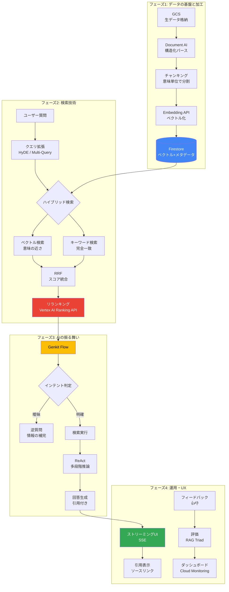

# エンタープライズRAG完全攻略

GCP（Google Cloud）上で3,000人規模のエンタープライズRAGを構築するための技術リサーチドキュメント（全8回）。

---

## フェーズ1: データの基盤と加工

| # | テーマ | 概要 |
|---|--------|------|
| [第1回](01_データ前処理.md) | データ前処理とインジェスト | GCS/Document AIを用いた「AIが読みやすいデータ」の生成 |
| [補足](01-2_コスト.md) | コスト試算 | 3,000人規模での初期費用・月次運用費の算出ロジック |
| [第2回](02_チャンキング戦略.md) | チャンキング戦略とメタデータ設計 | 意味の切れ目での分割、Excelの表データの解体手法 |
| [補足](02-2_チャンク調整.md) | チャンク調整の検証手法 | Genkit Evaluators / Vertex AI / Ragas による定量評価 |

## フェーズ2: 検索技術の深掘り

| # | テーマ | 概要 |
|---|--------|------|
| [第3回](03_セマンティック検索.md) | セマンティック検索とハイブリッド検索 | ベクトル検索とキーワード検索の併用、クエリ拡張 |
| [補足](03-2_深堀.md) | 検索エンジンの高度な設計 | RRF、HyDE、HNSWインデックス・チューニング |
| [第4回](04_リランキング.md) | リランキングとコンテキスト最適化 | Vertex AI Ranking APIによる二次評価、Lost in the Middle対策 |

## フェーズ3: AIの振る舞い

| # | テーマ | 概要 |
|---|--------|------|
| [第5回](05_Genkit.md) | Genkitによるエージェント・ワークフロー | インテント・ルーティング、逆質問、マルチステップ推論 |
| [第6回](06_セキュリティ.md) | セキュリティ・権限管理とプライバシー | Document Level Security、Firebase Auth連携、DLP |

## フェーズ4: 運用・評価・UX

| # | テーマ | 概要 |
|---|--------|------|
| [第7回](07_評価.md) | 評価とオブザーバビリティ | RAG Triad評価、トレース、精度劣化の監視 |
| [第8回](08_UIUX.md) | フロントエンドUXと継続的改善 | ストリーミングUI、引用表示、自動インデックス更新 |

---

## 全体アーキテクチャ

---

## なぜこれが必要なのか

「精度が出ない」原因の多くは第4回（リランキング）までで解決するが、**「会社で使ってもらえない」原因**は第6回（権限）や第8回（UX）に潜んでいる。

- **権限の壁**: 誰でも何でも検索できてしまうと、セキュリティ上公開できない
- **信頼の壁**: 根拠となるドキュメントへのリンクが不適切だと、ユーザーは回答を信じない
- **運用の壁**: マニュアルが更新されたとき、手動でやり直すようでは運用が回らない

---

## 意思決定記録（ADR）

本プロジェクトの技術選定は **「気軽に試せる・コスト最小・数値評価できる」** の3基準で判断している。
詳細は [ADR一覧](adr/index.md) を参照。

| テーマ | 採用 |
|--------|------|
| ドキュメント解析 | Gemini 2.5 Flash（マルチモーダル） |
| チャンキング | Recursive Character Text Splitter |
| Embedding | gemini-embedding-001 |
| 検索 | Firestore ベクトル検索のみ |
| リランキング | Vertex AI Ranking API |
| LLM | Gemini 2.5 Flash |
| 認証 | Firebase Auth |
| フレームワーク | Genkit |
| フロントエンド | Firebase Hosting |
