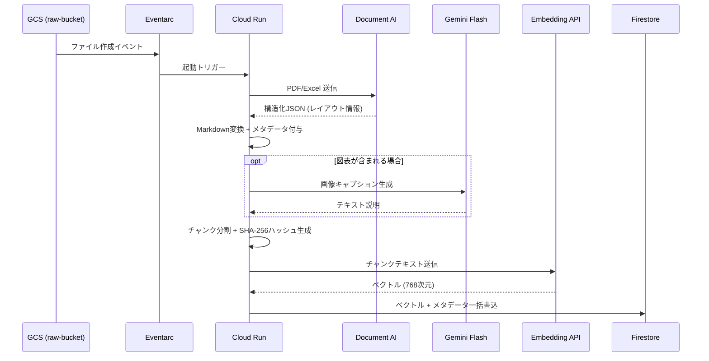

# 第1回: データ前処理とインジェストの極意

> 構造化インジェストとデータ・クレンジング — 商用グレードの精度と保守性を備えたインジェスト・パイプライン（ETL）の設計要点。

**補足資料**: [コスト試算](01-2_コスト.md)

---

## インジェスト・パイプライン全体像



---

## 1. Document AI による「セマンティック・パース」

単なるOCR（文字認識）では、段落の順序が入れ替わったり、表データがただの文字列の羅列になったりする。

* **Layout Parser / Form Parser の利用**:
    * Google Cloudの **Document AI** を使用し、ドキュメントを「Visual Elements」として解釈する。
    * 抽出結果のJSONから、`h1`, `h2` などのヘッダー構造を維持したまま **Markdown形式** に変換する。LLMはMarkdownの構造（`#`, `*`, `|---|`）を極めて正確に理解するため、検索ヒット時の回答精度が劇的に向上する。
* **マルチモーダル処理 (Gemini)**:
    * 図解やフローチャートが含まれる場合、テキスト化だけでは情報が欠落する。
    * 画像部分を切り出し、Gemini 2.5 Flash等に「この図は何を説明しているか」をプロンプトで記述（キャプション生成）させ、そのテキストを元のコンテキストに埋め込む。

## 2. データ・デンマライゼーション（非正規化）戦略

DBやExcelのデータをそのままベクトル化するのはアンチパターン。

* **コンテキストの注入**:
    * `part_id: 123, material: steel` というローデータに対し、インジェスト時にメタデータを結合（Join）し、「文章」として展開する。
* **メタデータのエンリッチメント**:
    * Firestoreへ格納する際、単なるベクトル（Embedding）だけでなく、以下のメタデータを付与する。
        * `source_url`: 元ファイルへのポインタ
        * `page_number`: 引用元ページ
        * `category`: IT / ネジ / 規定 などのタグ（第2回で解説する「フィルタリング」に必須）
        * `doc_version`: データの鮮度管理用

## 3. テクニカル・スタック: イベント駆動型パイプライン

3,000人規模の更新頻度に対応するため、スケーラブルな構成を組む。

1.  **GCS (Cloud Storage)**: `gs://raw-bucket/` にファイルが着地。
2.  **Eventarc / GCS Trigger**: ファイル作成イベントを検知し、**Cloud Run** を起動。
3.  **Cloud Run (Processing)**:
    * Document AI API をコールして構造化。
    * Pythonの `LangChain` や `LlamaIndex` 等のライブラリを用いて、論理的な区切りでチャンク分割（詳細は[第2回](02_チャンキング戦略.md)）。
4.  **Vertex AI Embedding API**:
    * `gemini-embedding-001`（推奨）または `text-multilingual-embedding-002` を使用。マルチモーダル対応が必要な場合は `gemini-embedding-2-preview` も選択肢。
    * 日本語の技術用語や型番に対しても高い次元圧縮精度を持つモデルを選択。
    * 参考: [Vertex AI Embedding モデル一覧](https://cloud.google.com/vertex-ai/generative-ai/docs/embeddings/get-text-embeddings)
5.  **Firestore (Vector Search)**:
    * ベクトルとメタデータを一括保存。

## 4. 冪等性（Idempotency）と一貫性の担保

* **Content-Addressable Storage**:
    * ファイルの内容から計算した `hash(SHA-256)` をドキュメントIDとして使用する。
    * これにより、同じ内容のファイルが再アップロードされても、ベクトルDB内に重複データが作られず、検索ノイズを最小限に抑えられる。
* **アトミックな更新**:
    * 1つのPDFから100個のチャンクが生成される場合、一部のチャンクだけが古いまま残るのを防ぐため、`parent_doc_id` でグルーピングし、更新時は全チャンクを入れ替えるロジックを実装する。

---

## 設計指針

「精度が出ない」というチームの多くは、**「PDFをただの長い文字列として、1000文字ごとに機械的に切っている」**ことが多い。第1回での最重要課題は、**「情報の意味的な最小単位（チャンク）を、メタデータ付きの綺麗なMarkdownとして切り出すパイプラインを自動化すること」**。

---

## クイックスタート: Document AI でPDFをパースする

### 前提条件

- GCPプロジェクトで Document AI API が有効化済み
- `gcloud auth application-default login` 完了
- `pip install google-cloud-documentai`

### 手順

```python
from google.cloud import documentai_v1 as documentai

def parse_pdf_to_markdown(project_id: str, location: str, processor_id: str, file_path: str) -> str:
    """Document AI Layout Parser でPDFをパースし、簡易Markdownに変換する"""
    client = documentai.DocumentProcessorServiceClient()
    resource_name = client.processor_path(project_id, location, processor_id)

    with open(file_path, "rb") as f:
        raw_document = documentai.RawDocument(content=f.read(), mime_type="application/pdf")

    request = documentai.ProcessRequest(name=resource_name, raw_document=raw_document)
    result = client.process_document(request=request)
    document = result.document

    # 構造化されたテキストを取得（レイアウト情報付き）
    markdown_lines = []
    for page in document.pages:
        for block in page.blocks:
            text = _extract_text(block.layout, document.text)
            markdown_lines.append(text)
        markdown_lines.append("\n---\n")  # ページ区切り

    return "\n".join(markdown_lines)


def _extract_text(layout, full_text: str) -> str:
    """Layout の text_anchor から元テキストを抽出"""
    response = ""
    for segment in layout.text_anchor.text_segments:
        start = int(segment.start_index)
        end = int(segment.end_index)
        response += full_text[start:end]
    return response


# 実行例
if __name__ == "__main__":
    md = parse_pdf_to_markdown(
        project_id="your-project-id",
        location="us",            # or "eu"
        processor_id="your-layout-parser-id",
        file_path="sample.pdf"
    )
    print(md)
```

!!! tip "Layout Parser の Processor ID"
    GCPコンソール → Document AI → プロセッサ一覧 から Layout Parser を作成し、IDを取得する。
    [公式ガイド: Layout Parser](https://cloud.google.com/document-ai/docs/layout-parse-chunk)

---

## 関連する横断トピック

- [メタデータ設計](cross-cutting/metadata-design.md)
- [Firestoreスキーマ設計](cross-cutting/firestore-schema.md)

---

→ 次回: [第2回 チャンキング戦略とメタデータ設計](02_チャンキング戦略.md)
