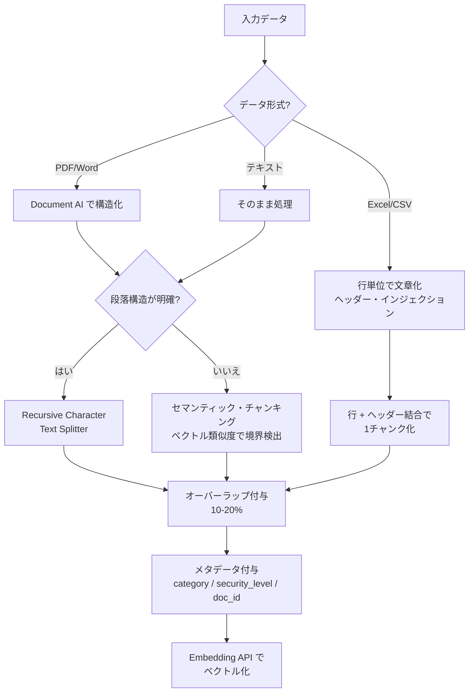

# 第2回: 高度なチャンキング戦略とメタデータ設計

> データが綺麗になった次は、「どう切って、どうタグ付けするか」。3,000人規模の多様なデータ（長大なマニュアルから1行の部品表まで）を扱うためのエンジニアリング手法。

**補足資料**: [チャンク調整の検証手法](02-2_チャンク調整.md)

---

## チャンク分割の判断フロー



---

## 1. 「意味の切れ目」を捉えるセマンティック・チャンキング

固定長（例: 500文字ずつ）で機械的に切ると、重要な文章が真っ二つに分断されるリスクがある。

* **Recursive Character Text Splitter（再帰的文字分割）**:
    * 段落(`\n\n`) → 文(`\n`) → 句(`,`) の順で、意味の区切りを優先して分割サイズを調整する。
* **セマンティック・チャンキング（高度な手法）**:
    * 文章間の「ベクトルの類似度」を計算し、意味が大きく変わる地点を自動で検出して区切る。Google Cloudの **Vertex AI Embedding API** を使って、隣接する文どうしの関連性をスコアリングし、境界線を引く実装が有効。

## 2. コンテキストを維持する「チャンク・オーバーラップ」

隣り合うチャンクにあえて「重なり（Overlap）」を持たせる。

* **なぜ必要か？**:
    * チャンクAの最後に「その理由は...」とあり、理由がチャンクBにある場合、Aだけを検索してもAIは理由を答えられない。
* **実装の工夫**:
    * 通常10%〜20%程度のオーバーラップを設定するが、ITマニュアルのような手順書では、**「前の手順の1ステップ分」を常に含める**といったロジックを組むと、手順の取りこぼしが激減する。

## 3. 「ネジ番号問題」を解決するヘッダー・インジェクション

Excelや表形式のデータを扱う際の決定的な工夫。

* **課題**:
    * 表の「100行目」だけを切り出すと、それが「何の項目か（ヘッダー）」が分からなくなる。
* **実装**:
    * 各チャンクの冒頭に、**親ドキュメントのタイトルや表の見出しを強制的に結合**する。
    * 例: 「[ネジ番号: 999999 / 仕様書] 材質: SUS304...」
    * こうすることで、どの断片を拾ってもAIが「これはネジ999999の話だ」と確信を持って回答できる。

## 4. 検索効率を極めるメタデータ設計

ベクトル検索（曖昧検索）に、Firestoreの強力なフィルタリング（厳密検索）を組み合わせるための「タグ付け」。

* **必須メタデータの例**:
    * `category`: `it_helpdesk`, `parts_catalog`, `hr_policy` （検索範囲の限定用）
    * `security_level`: `general`, `admin_only` （権限による出し分け）
    * `doc_id`: 元ファイルへの紐付け
    * `updated_at`: 最新情報の優先度付け用
* **Firestoreでのハイブリッド・クエリ**:
    * 「`category == 'parts_catalog'` の中から、ベクトルが近いものを探す」という**フィルタ付き検索**を実行する。これにより、ITヘルプの質問にネジの回答が混ざるノイズを物理的に遮断できる。

---

## 設計指針

精度が出なかった原因の多くは、**「情報の断片化（Fragmented Context）」**。

1. チャンクが小さすぎて意味が通らなくなっていないか？
2. 逆に大きすぎて、検索ノイズ（関係ない話）が混ざっていないか？
3. 「ネジ番号」というキーワードが、全チャンクにメタデータとして付与されているか？

---

## クイックスタート: LangChain でセマンティックチャンキング

### 前提条件

- `pip install langchain langchain-text-splitters`

### 手順

```python
from langchain_text_splitters import RecursiveCharacterTextSplitter

def chunk_document(text: str, chunk_size: int = 800, chunk_overlap: int = 150) -> list[dict]:
    """Recursive Character Text Splitter でチャンク分割し、メタデータを付与する"""
    splitter = RecursiveCharacterTextSplitter(
        chunk_size=chunk_size,
        chunk_overlap=chunk_overlap,
        separators=["\n\n", "\n", "。", "、", " "],  # 日本語向けセパレータ
    )
    chunks = splitter.split_text(text)

    return [
        {
            "content": chunk,
            "metadata": {
                "chunk_index": i,
                "chunk_size": len(chunk),
            }
        }
        for i, chunk in enumerate(chunks)
    ]


def inject_header(chunks: list[dict], doc_title: str, category: str) -> list[dict]:
    """各チャンクの冒頭にドキュメントタイトルとカテゴリを注入（ヘッダー・インジェクション）"""
    header = f"[{doc_title} / {category}] "
    for chunk in chunks:
        chunk["content"] = header + chunk["content"]
        chunk["metadata"]["category"] = category
        chunk["metadata"]["doc_title"] = doc_title
    return chunks


# 実行例
if __name__ == "__main__":
    sample_text = open("parsed_document.md").read()
    chunks = chunk_document(sample_text)
    chunks = inject_header(chunks, doc_title="ネジ仕様書 v2.1", category="parts_catalog")
    for c in chunks[:3]:
        print(f"[{c['metadata']['chunk_index']}] {c['content'][:80]}...")
```

!!! tip "チャンクサイズの目安"
    まず800文字・オーバーラップ150で始め、[補足: チャンク調整の検証手法](02-2_チャンク調整.md)の方法でスコアを比較しながら最適値を探る。

---

→ 次回: [第3回 セマンティック検索とハイブリッド検索の設計](03_セマンティック検索.md)
