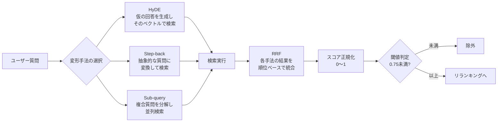

# 補足: 検索エンジンの高度な設計

> ハイブリッド・アーキテクチャの数学的背景、Google Cloudの内部仕様、実装上のクリティカルなポイント。

---

## クエリ変形パイプライン

---

## 1. 埋め込みモデル（Embedding）の戦略的選択

単に `text-embedding` を使うのではなく、次元数とタスクタイプを最適化する。

* **Model**: `gemini-embedding-001`（推奨）または `text-multilingual-embedding-002` ([モデル一覧](https://cloud.google.com/vertex-ai/generative-ai/docs/embeddings/get-text-embeddings))
    * マルチモーダル対応（画像・動画・音声も埋め込み可能）が必要な場合は `gemini-embedding-2-preview`（3072次元、Matryoshka対応）も選択肢。
* **次元数の最適化 (Dimensionality)**:
    デフォルトの768次元ではなく、特定のユースケース（例: ネジ番号の特定など）では、情報を凝縮するために次元数を調整、あるいは出力ベクトルを正規化して **Cosine Similarity** での計算効率を最大化する。
* **Task Type パラメータ**:
    API呼び出し時に `task_type="RETRIEVAL_QUERY"`（質問時）と `"RETRIEVAL_DOCUMENT"`（インジェスト時）を明示的に使い分けることで、クエリとドキュメント間のベクトル空間におけるアライメント（整列）を最適化する。

## 2. ハイブリッド検索の「スコアリング」アルゴリズム

「ベクトル検索の結果」と「キーワード検索の結果」は、そのままでは足し算できない。値のレンジ（分布）が異なるため。

* **RRF (Reciprocal Rank Fusion)**:
    異なる検索ロジックの「順位」のみを用いてスコアを統合するアルゴリズム。
    $$\text{RRFScore}(d) = \sum_{r \in R} \frac{1}{k + r(d)}$$
    （ここで $k$ は定数、通常は 60。$r(d)$ はドキュメント $d$ の各検索手法での順位）
    これにより、「意味的に近い」ものと「型番が完全一致したもの」のバランスを数学的に安定させる。
* **Google Cloudでの実装**:
    Firestore Vector Search はベクトルの「距離」を返すが、全文検索（キーワード）には **Cloud Search** または **Elasticsearch/OpenSearch** をサイドカーとして動かし、Cloud Functions 上で RRF ロジックを実行して Top-K を抽出する。

## 3. クエリ変形（Query Transformation）の高度化

単純な言い換えではなく、検索の「質」を変える3つの手法。

* **HyDE (Hypothetical Document Embeddings)**:
    ユーザーの質問に対し、Gemini（2.5 Flash等）に「仮の回答（嘘が含まれていても良い）」を一度生成させ、その**「回答のベクトル」で検索**をかける。
    * *理由*: 質問（短い）よりも回答（長い）の方が、ドキュメント（長い）とベクトル空間上で近くなりやすいため（対照学習の特性）。
* **Step-back Prompting**:
    「ネジ 999999 の公差は？」という具体的すぎる質問から、「ネジの公差に関する一般的な規定は？」という抽象的な質問を生成し、上位概念の資料も同時に取得する。
* **Sub-query Decomposition**:
    「VPNが繋がらず、かつネジの在庫も知りたい」といった複合質問を、独立した2つの検索クエリに分解し、並列実行する。

## 4. Firestore Vector Search のインデックス・チューニング

3,000人規模のデータ量になると、全探索（Flat Search）はレイテンシの面で不可能。

* **HNSW (Hierarchical Navigable Small World)**:
    Firestoreが内部で採用しているグラフベースの近似最近傍探索（ANN）インデックスを利用する。
* **M (最大接続数) と ef_construction の調整**:
    インデックス作成時のパラメータを調整し、検索速度（レイテンシ）と精度（Recall）のトレードオフを最適化する。
    * 「ネジ番号」のように一点突破が必要なデータには、HNSWの層を深くするか、メタデータでの事前フィルタリング（Pre-filtering）を徹底し、探索範囲を物理的に絞り込む設計を死守する。

## 5. ネガティブ・サンプリングと閾値管理

検索結果が「ハズレ」だった場合に LLM を黙らせるための実装。

* **Distance Thresholding**:
    Cosine Similarity が $0.75$ 未満のチャンクは、たとえ検索順位1位でもコンテキストから除外する。
* **Relevant Score Normalization**:
    複数の検索手法のスコアを 0〜1 に正規化し、検索結果の「自信度」を LLM にシステムプロンプトとして伝える（例: 「以下の情報は信頼度 60% の資料です」）。

---

## 設計指針

**「ユーザーの言葉を信じすぎて、そのままベクトル空間に投げ込む」**のが最大の失敗パターン。検索の前にクエリをLLMで調理し（HyDE/RRF）、検索後にスコアで冷酷に切り捨てるフィルタリング・パイプラインを構築する。

---

→ 次回: [第4回 リランキングとコンテキスト最適化](04_リランキング.md)
