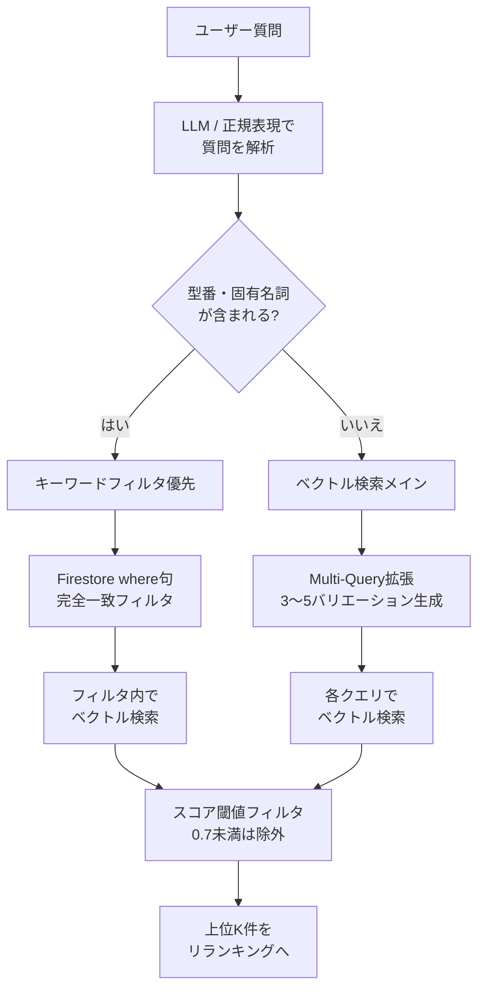

# 第3回: セマンティック検索とハイブリッド検索の設計

> 3,000人規模の会社では、「PCが重い」といった曖昧な悩みと「ネジ番号999999」という厳密な照会が混在する。これらを両立させるための「ハイブリッド検索」と「クエリ拡張」の技術。

**補足資料**: [検索エンジンの高度な設計](03-2_深堀.md)

---

## ハイブリッド検索のルーティング



---

RAGにおける「検索の失敗」は2種類ある。

1. **見落とし（Low Recall）**: 関連する資料があるのに見つけられない。
2. **ノイズ（Low Precision）**: 関係ない資料を拾ってしまい、AIが混乱する。

## 1. ベクトル検索（セマンティック検索）の限界を知る

ベクトル検索は「意味の近さ」で探すため、「電源が入らない」に対して「起動しない」という資料を見つけるのは得意。しかし、**「型番・専門用語・短い略称」には極めて弱い**。

* **例**: 「ネジ番号 999999」をベクトル化すると、AIは「999998」や「ネジの画像」を「近い」と判断してしまい、肝心の「999999」を外すことがある。

## 2. Google Cloud での「ハイブリッド検索」の実装

この弱点を補うのが、**「キーワード（完全一致）検索」と「ベクトル（意味）検索」の併用**。

* **Firestoreでのフィルタリング**:
    [第2回](02_チャンキング戦略.md)で付与したメタデータを利用する。
    ```typescript
    // Genkit/Firestoreでの検索イメージ
    const results = await firestore.collection('chunks')
      .where('parts_no', '==', '999999') // 厳密なキーワードマッチ
      .findNearest('embedding', queryVector, {
        limit: 5,
        distanceMeasure: 'COSINE'
      });
    ```
* **ルーティング・ロジック**:
    ユーザーの質問から「型番らしき文字列」を正規表現やLLMで抽出。型番がある場合は「キーワードフィルタ」を優先し、ない場合は広範な「ベクトル検索」を行うルーティングを Cloud Functions 内に実装する。

## 3. クエリ拡張（Query Expansion）による網羅性の向上

ユーザーの質問文をそのまま検索に使うのは非効率。質問文が短すぎたり、言葉が足りなかったりするため。

* **Multi-Query手法**:
    LLM（Gemini 2.5 Flash等）を使い、1つの質問から「検索用のバリエーション」を3〜5つ生成させる。
    * **質問**: 「VPNが繋がらない」
    * **拡張**: 「VPN 接続エラー」「テレワーク ログイン 失敗」「AnyConnect 認証エラー」
* **メリット**:
    1つのクエリではヒットしなかった隠れた正解を、別のキーワードが釣り上げてくれる確率が大幅に上がる。

## 4. 検索結果の「スコア」の扱い

FirestoreなどのベクトルDBは、検索結果と一緒に「距離（スコア）」を返す。

* **閾値（Threshold）の設計**:
    「似ている順に5件」を常に取ってくるのではなく、「スコアが0.7以下のものは、たとえ上位でもゴミ（無関係）とみなして捨てる」というロジックを挟む。
* **なぜ重要か？**:
    全く関係ない資料をLLMに渡すと、LLMは「渡された以上、ここから答えを作らなきゃ」と無理をして**ハルシネーション（嘘）**を誘発するため。

---

## 設計指針

1. 「ネジ番号」のような固有名詞を、ベクトル検索だけで探そうとしない（メタデータフィルタを使う）
2. ユーザーの入力した「生の声」だけで検索しない（LLMで検索クエリを整形・拡張する）
3. スコアの低い「ハズレ資料」をLLMに渡さない

---

## クイックスタート: Firestore Vector Search + メタデータフィルタ

### 前提条件

- Firestoreプロジェクトにベクトルインデックスを作成済み
- `npm install firebase-admin @google-cloud/firestore`

### 手順

```typescript
import { getFirestore, FieldValue } from "firebase-admin/firestore";

const db = getFirestore();

/**
 * メタデータフィルタ付きベクトル検索
 * カテゴリで絞り込んでからベクトル近傍探索を実行する
 */
async function hybridSearch(
  queryVector: number[],
  category: string,
  limit: number = 5,
  scoreThreshold: number = 0.7
) {
  const collection = db.collection("chunks");

  // メタデータフィルタ + ベクトル検索
  const results = await collection
    .where("category", "==", category)
    .findNearest("embedding", queryVector, {
      limit: limit,
      distanceMeasure: "COSINE",
    });

  const snapshot = await results.get();

  // スコア閾値でフィルタリング
  return snapshot.docs
    .map((doc) => ({
      id: doc.id,
      content: doc.data().content,
      metadata: doc.data().metadata,
      score: doc.data().score,
    }))
    .filter((doc) => doc.score >= scoreThreshold);
}
```

!!! tip "ベクトルインデックスの作成"
    FirestoreのベクトルインデックスはコンソールまたはCLIで事前に作成が必要。
    [公式ガイド: Firestore Vector Search](https://firebase.google.com/docs/firestore/vector-search)

---

## 関連する横断トピック

- [メタデータ設計](cross-cutting/metadata-design.md)
- [プロンプト設計](cross-cutting/prompt-design.md)

---

→ 次回: [第4回 リランキングとコンテキスト最適化](04_リランキング.md)
