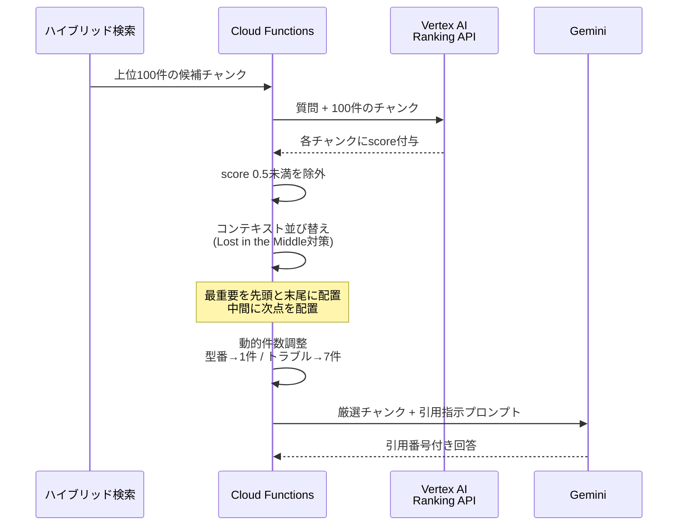

# 第4回: リランキング（再順位付け）とコンテキスト最適化

> 検索で「候補」を30〜50件持ってきた後、LLMに渡す情報の「純度」を極限まで高める。RAGの精度を商用レベルに引き上げる最終兵器。

---

## リランキング・パイプライン

---

## 1. Bi-Encoder（検索） vs. Cross-Encoder（リランク）

なぜ検索結果をそのまま使ってはいけないのか。その理由は「計算の解像度」にある。

* **Bi-Encoder (ベクトル検索)**:
    質問とドキュメントを別々にベクトル化し、その距離を測る。高速だが、単語同士の**「ミクロな関係性（文脈）」**を無視する。
* **Cross-Encoder (リランキング)**:
    質問とドキュメントを**セットで1つのモデル**に放り込み、全文の相関（Attention）を計算する。
    * Cross-Encoderは「この質問に対して、この回答はどれくらい直接的な証拠になるか？」を 0.0〜1.0 の確率値で判定する。ベクトル検索で見落とされた「論理的な一致」をここで救い出す。

## 2. Vertex AI Ranking API の深層

Google Cloudが提供する **[Vertex AI Ranking API](https://cloud.google.com/generative-ai-app-builder/docs/ranking)** は、Cross-Encoderの処理をマネージドで提供するサービス。

* **推論の質**:
    Googleが長年の検索エンジン開発で培ったモデルが使われており、日本語の助詞の違い（「が」と「を」の差など）による意味の変容まで精緻にスコアリングする。
* **実装上の要点**:
    上位50件のチャンクをAPIに投げると、各チャンクに `score` が付与されて返ってくる。
    * スコアが $0.5$ 以下のものは、たとえ検索順位が高くても「関係ない」と判断してコンテキストから排除するロジックを実装する。これにより、LLMのハルシネーションを物理的に防ぐ。

## 3. 「Lost in the Middle」問題への対策

LLMには、**「渡された情報の最初と最後はよく覚えているが、真ん中にある情報を無視しやすい」**という特性（Lost in the Middle）がある。

* **コンテキストの並び替え（Re-ordering）**:
    リランキングで出たスコアが高い順に並べるのが基本だが、あえて **「最重要情報を1番目と最後に配置し、2番目に重要なものをその間に挟む」** といった配置の最適化を行うことで、LLMの抽出能力を最大化できる。
* **動的コンテキストウィンドウ**:
    質問の複雑さに応じて、リランキング後の採用件数を変える。「ネジ番号」なら上位1件のみ。「VPNトラブル」なら関連度が高い上位7件、といった具合。

## 4. 引用（Citation）の厳密な紐付け

3,000人規模の会社では「誰が言ったか（どの資料か）」が正解そのものより重要な場合がある。

* **メタデータの透過性**:
    リランキングを通過した各チャンクには、必ず `[Source ID: 123, Page: 5]` といったタグを内部的に保持させる。
* **プロンプト・エンジニアリング**:
    LLMに対し、「回答の各文章の末尾に、必ず引用元番号を付与せよ。根拠がない場合は『不明』と答えよ」という強い制約を課す。リランキングによって「純度の高い情報」だけが渡されているため、LLMは迷わず正確な引用を行えるようになる。

## 5. パフォーマンスとコストのトレードオフ

Cross-Encoderは計算負荷が高いため、全データに適用するのは不可能。

* **Top-K の選定**:
    ベクトル検索で上位100件を取得（安価・高速）し、その100件に対してのみリランキングを実行（高精度・高単価）する。この **「粗い検索 → 精密な選別」** のパイプラインを Cloud Functions 内で非同期・並列実行させる設計が、商用環境でのベストプラクティス。

---

## 設計指針

検索エンジンは「似ているもの」を並べるだけで、「正しいもの」を並べているわけではない。**「検索エンジンを信じず、リランカーという審判に二重チェックさせる」**疑り深いアーキテクチャを組むことが、精度を飛躍させるブレイクスルー。

---

→ 次回: [第5回 Genkitによるエージェント・ワークフローの実装](05_Genkit.md)
