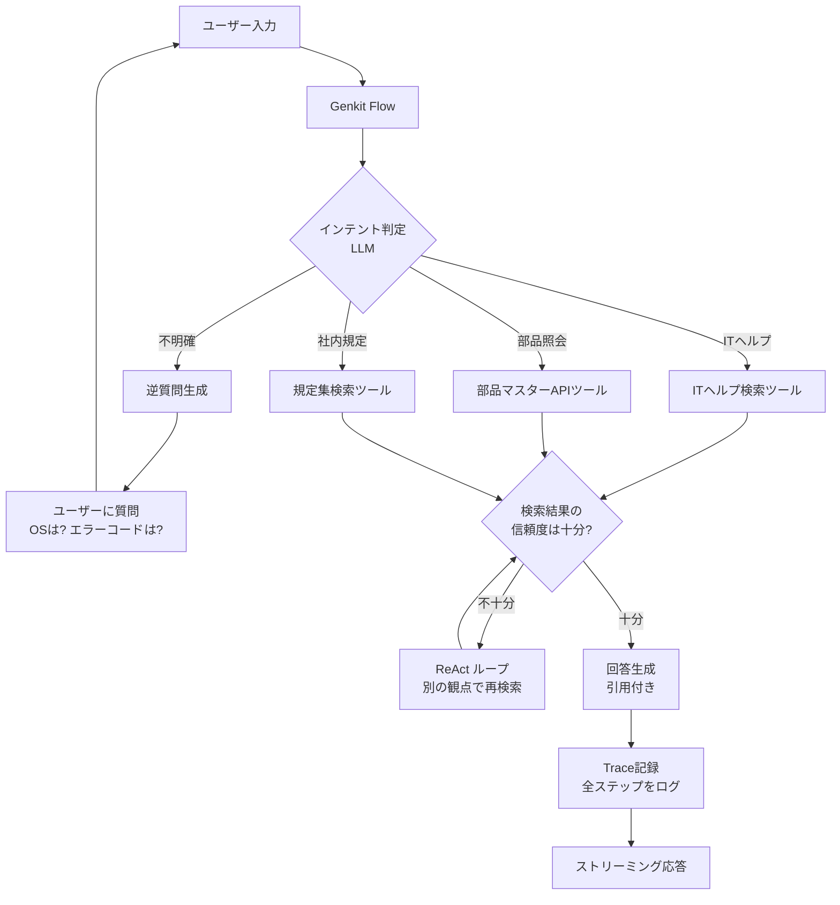

# 第5回: Genkitによるエージェント・ワークフローの実装

> 第4回までで「高品質な検索結果」を出す準備は整った。しかし、ユーザーの質問が絶望的に曖昧な場合、どんなに優れた検索エンジンでも正解は出せない。AIに**「検索する前に考え、足りなければ聞き返し、段階的に答えに近づく」**自律的な振る舞いをさせる。

---

## エージェント・ワークフロー全体像



従来のRAGは「入力 → 検索 → 生成」の直線（Linear）実行だが、ここで追求するのは**「ループと分岐（Agentic）」**を持つワークフロー。

## 1. インテント・ルーティング（意図による分岐）

3,000人規模の会社では、質問の性質が多岐にわたる。まずは「何についての質問か」をLLMに判定させ、最適なツールを選ばせる。

* **実装の工夫**:
    [Genkit](https://firebase.google.com/docs/genkit/overview)の `defineTool` を使い、特定の検索エンジン（ITヘルプ用、ネジ在庫DB用、規定集用）を「道具」として定義する。
* **設計のポイント**:
    「ネジ番号 999999 について...」という入力があれば、AIは全文検索ではなく「部品マスターAPI」というツールを選択するようにプロンプトとスキーマを設計する。

## 2. クエリの具体化と「逆質問」のロジック

「質問が悪いから詳しく入力して」とユーザーに突き放すのではなく、AIが**「何が足りないか」を具体的に提示する**仕組み。

* **Self-Correction（自己修正）ループ**:
    1.  ユーザーの質問を解析し、検索に必要な「エンティティ（OS名、エラーコード、型番など）」が欠けていないか判定。
    2.  欠けている場合、検索をスキップして「OSはWindowsですか？Macですか？」とレスポンスを返す。
* **実装の工夫**:
    Genkitの `Flow` 内で、`if` 分岐を使って「対話継続モード」と「検索実行モード」を切り替える。これにより、無駄なベクトル検索コストを抑えつつ、ユーザー体験を向上させる。

## 3. マルチステップ・リーゾニング（多段階推論）

複雑な問い合わせ（例: 「VPNが繋がらない。昨日までは使えていたが、設定変更はしていない」）に対して、AIに思考のステップを踏ませる。

* **ReActプロンプティング**:
    AIに「Thought（思考）」「Action（行動）」「Observation（観察）」のサイクルを回させる。
    * **Thought**: 「VPNの接続不可。まずは認証エラーかネットワークエラーかを確認する必要がある」
    * **Action**: 認証エラーに関するFAQを検索。
    * **Observation**: 検索結果から「パスワード期限切れ」の可能性が浮上。
    * **Final Answer**: 「パスワードの有効期限を確認してください」
* **Genkitでの実装**:
    `run` メソッドを使い、各ステップの出力をログとして残しながら、動的に次のステップを決定するパイプラインを構築する。

## 4. 状態管理（State Management）と履歴の保持

3,000人規模のヘルプデスクでは、一回の手続きが数往復に及ぶことがある。

* **Firestoreによるセッション管理**:
    過去のやり取り（チャット履歴）をベクトル化して、今の質問とセットでLLMに渡す。
* **コンテキスト・圧縮**:
    履歴が長くなりすぎるとプロンプトの上限を超えるため、古い会話をLLMに要約（Summarize）させ、**「現在の状況のサマリー」**として保持し続ける設計が、長期的な対話の精度を支える。

## 5. Genkit Developer UI によるデバッグ

エージェント型ワークフローの最大の悩みは「AIがなぜその判断をしたか」がブラックボックス化すること。

* **Trace（トレース）の活用**:
    GenkitのUIを使えば、AIが「どのツールを選び」「どのプロンプトで」「どんな検索結果を受け取ったか」をタイムライン形式で可視化できる。
* **デバッグの手順**:
    精度が出ない時は、このトレースを追い、「検索が悪い」のか「思考（ルーティング）が悪い」のかを特定し、そこだけをピンポイントで修正する。

---

## 設計指針

AIを「単なる翻訳機（検索結果を整えるだけ）」ではなく、**「監督（検索の要否を判断し、結果を精査する）」**として設計する。「質問が曖昧なら検索しない」という**勇気ある停止**をロジックに組み込むことが、ユーザーからの信頼（＝嘘を言わない）に繋がる。

---

## クイックスタート: Genkit Flow + defineTool

### 前提条件

- `npm install genkit @genkit-ai/googleai`
- 環境変数 `GOOGLE_API_KEY` を設定

### 手順

```typescript
import { genkit, z } from "genkit";
import { googleAI, gemini25Flash } from "@genkit-ai/googleai";

const ai = genkit({ plugins: [googleAI()] });

// ツールの定義: 部品検索API
const searchPartsTool = ai.defineTool(
  {
    name: "searchParts",
    description: "部品番号で部品マスターを検索する。部品番号が質問に含まれる場合に使用。",
    inputSchema: z.object({
      partNumber: z.string().describe("部品番号（6桁の数字）"),
    }),
    outputSchema: z.object({
      partNumber: z.string(),
      material: z.string(),
      tolerance: z.string(),
    }),
  },
  async ({ partNumber }) => {
    // 実際にはFirestoreや外部APIを叩く
    return {
      partNumber,
      material: "SUS304",
      tolerance: "±0.01mm",
    };
  }
);

// Flow の定義: ツール付きのRAGフロー
const ragFlow = ai.defineFlow(
  { name: "ragFlow", inputSchema: z.string(), outputSchema: z.string() },
  async (question) => {
    const response = await ai.generate({
      model: gemini25Flash,
      tools: [searchPartsTool],
      prompt: `あなたは社内ヘルプデスクのAIアシスタントです。
ユーザーの質問に対して、利用可能なツールを使って正確に回答してください。
情報が不足している場合は、何が必要か具体的に聞き返してください。

質問: ${question}`,
    });
    return response.text;
  }
);

// 実行
const answer = await ragFlow("ネジ番号999999の公差を教えて");
console.log(answer);
```

!!! tip "Genkit Developer UI"
    `npx genkit start` で開発UIが起動し、Flowの実行・トレース確認がブラウザでできる。
    [公式ガイド: Genkit Tool Calling](https://firebase.google.com/docs/genkit/tool-calling)

---

## 関連する横断トピック

- [コスト管理](cross-cutting/cost-management.md)
- [Firestoreスキーマ設計](cross-cutting/firestore-schema.md)
- [プロンプト設計](cross-cutting/prompt-design.md)

---

→ 次回: [第6回 セキュリティ・権限管理とプライバシー](06_セキュリティ.md)
