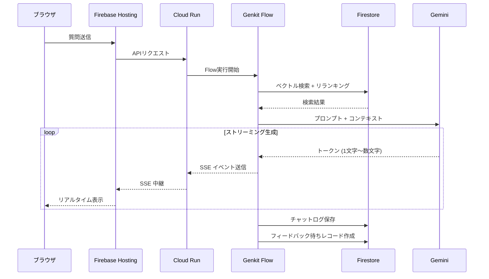

# 第8回: フロントエンドUXと継続的改善（LLMOps）

> どんなに裏側が優れていても、画面が使いにくかったり、回答が遅かったりすれば、社員は以前の「人への問い合わせ」に戻ってしまう。AIを「信頼される同僚」に変える最後の仕上げ。

---

## ストリーミング応答フロー



---

## 1. 「待たせない」ストリーミングUXの実装

LLMの回答生成には数秒〜数十秒かかる。これをそのまま待たせると「フリーズした」と思われる。

* **Streaming Output**:
    GenkitとFirebase Hosting（またはCloud Run）を使い、**Server-Sent Events (SSE)** で回答を1文字ずつストリーミング表示する。
    * 最初の1文字目（First Token）をいかに速く出すかが勝負。検索中には「資料を検索しています...」といった中間状態をアニメーションで見せ、ユーザーの体感待ち時間を制御する。

## 2. 「根拠の可視化」による信頼の構築

RAGにおいて、回答文と同じくらい重要なのが**「ソース（引用元）」**。

* **Citations UI**:
    回答文の中に `[1]` のようなリンクを置き、クリックすると右側に**PDFの該当ページがプレビューされる**、あるいは**GCSの署名付きURL（Signed URL）**で直接開けるようにする。
    * ユーザーが「AIが言っていることは本当か？」を1秒で確認できる状態にすることで、ハルシネーションのリスクをユーザー自身が補完できる。

## 3. 自動インデックス更新（LLMOpsパイプライン）

3,000人規模の会社では、マニュアルは日々更新される。手動でインデックスを張り替える運用は破綻する。

* **完全自動化パイプライン**:
    1.  **GCSに新ファイルが置かれる** or **既存ファイルが更新される**。
    2.  **Eventarc** が検知し、Cloud Run（[第1回](01_データ前処理.md)のパイプライン）を自動起動。
    3.  差分だけを抽出・ベクトル化し、Firestoreを更新。
* **Blue/Greenデプロイ的なインデックス更新**:
    古いチャンクを物理削除する前に、新しいチャンクを書き込む。検索が一時的に途切れたり、新旧の情報が混ざったりするのを防ぐ。

## 4. エッジケースへの「人間系」エスケープルート

AIが「わかりません」と答えたとき、またはユーザーが「解決しなかった」ボタン（[第7回](07_評価.md)）を押したときの導線。

* **Human-in-the-loop**:
    解決しなかった場合、そのチャットログをそのまま**Slackや既存のチケットシステム（Jiraなど）へ転送**するボタンを用意する。
    * 社員は二度説明する手間が省け、ヘルプデスク担当者は「AIがどこまで答えて、どこで詰まったか」を把握した状態で対応を開始できる。

## 5. 3,000人のトラフィックを支えるインフラ設計

* **Quotas & Limits**:
    Gemini API（2.5 Flash/Pro、3.1 Pro等）のレート制限（RPM/TPM）に当たらないよう、Cloud Functions側で**リクエストキューイング**や、部署ごとのクォータ制限を実装する。
* **Caching Strategy**:
    全く同じ質問（または極めて類似した質問）が1時間以内にあった場合、AIを動かさずキャッシュ（Firestoreに保存した過去の回答）を返すことで、コスト削減と超高速レスポンスを実現する。

---

## クイックスタート: SSEストリーミング応答

### 前提条件

- Genkit セットアップ済み（[第5回](05_Genkit.md)参照）
- `npm install express`

### サーバー側（Cloud Run / Express）

```typescript
import express from "express";
import { genkit, z } from "genkit";
import { googleAI, gemini25Flash } from "@genkit-ai/googleai";

const ai = genkit({ plugins: [googleAI()] });
const app = express();
app.use(express.json());

app.post("/api/chat", async (req, res) => {
  const { question } = req.body;

  // SSE ヘッダー設定
  res.setHeader("Content-Type", "text/event-stream");
  res.setHeader("Cache-Control", "no-cache");
  res.setHeader("Connection", "keep-alive");

  // ストリーミング生成
  const { stream } = await ai.generateStream({
    model: gemini25Flash,
    prompt: question,
  });

  for await (const chunk of stream) {
    const text = chunk.text;
    if (text) {
      res.write(`data: ${JSON.stringify({ text })}\n\n`);
    }
  }

  res.write("data: [DONE]\n\n");
  res.end();
});

app.listen(3000);
```

### クライアント側（ブラウザ）

```javascript
async function askQuestion(question) {
  const response = await fetch("/api/chat", {
    method: "POST",
    headers: { "Content-Type": "application/json" },
    body: JSON.stringify({ question }),
  });

  const reader = response.body.getReader();
  const decoder = new TextDecoder();

  while (true) {
    const { done, value } = await reader.read();
    if (done) break;

    const lines = decoder.decode(value).split("\n");
    for (const line of lines) {
      if (line.startsWith("data: ") && line !== "data: [DONE]") {
        const { text } = JSON.parse(line.slice(6));
        document.getElementById("answer").textContent += text;
      }
    }
  }
}
```

---

## シリーズ総括

* **第1〜2回**で「耳と目（データ）」を整え、
* **第3〜4回**で「記憶（検索）」を鋭くし、
* **第5回**で「思考（ロジック）」を授け、
* **第6〜7回**で「規律（安全・評価）」を与え、
* **第8回**で「言葉（UX・改善）」を磨き上げた。

まずは、**「GCSにファイルを置いたら、チャット画面にその内容が反映される」という最小構成（MVP）**から始めるのが推奨。

---

→ [目次に戻る](00_全体構想.md)
