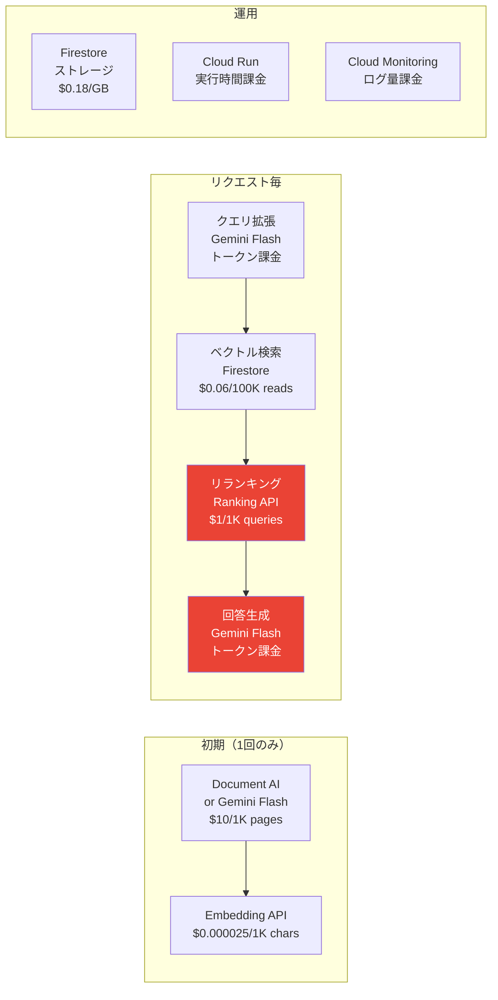

# コスト管理

> コスト発生ポイントの全体マップと最適化戦略。料金の詳細は [補足: コスト試算](../01-2_コスト.md) を参照。

---

## コスト発生ポイントマップ

!!! note "コスト支配項目"
    月次運用で最もコストが大きいのは **LLM推論（回答生成）** と **リランキング**。この2つの最適化がコスト管理の鍵。

## 最適化戦略サマリ

| 戦略 | 効果 | 参照先 |
|------|------|--------|
| **Gemini 2.5 Flash 単一モデル** | Pro比で約17倍安い。精度不足はEvaluatorで検知してから切り替え | [ADR-006](../adr/ADR-006_LLM.md) |
| **Document AI キャッシュ** | 解析結果をGCSに保存し、再解析を防止 | [第1回](../01_データ前処理.md) |
| **スコア閾値フィルタ** | リランキング後にスコア低の除外 → LLMに渡すトークン削減 | [第4回](../04_リランキング.md) |
| **動的コンテキストウィンドウ** | 質問の種類に応じてチャンク数を調整（型番→1件、トラブル→7件） | [第4回](../04_リランキング.md) |
| **逆質問による検索スキップ** | 質問が曖昧な場合は検索しない → 無駄なAPI呼び出しを削減 | [第5回](../05_Genkit.md) |
| **回答キャッシュ** | 類似質問に過去の回答を返す → LLM呼び出しゼロ | [第8回](../08_UIUX.md) |
| **Cloud Monitoring** | Token Usage / Latency / Success Rate を監視し、異常を早期検知 | [第7回](../07_評価.md) |
