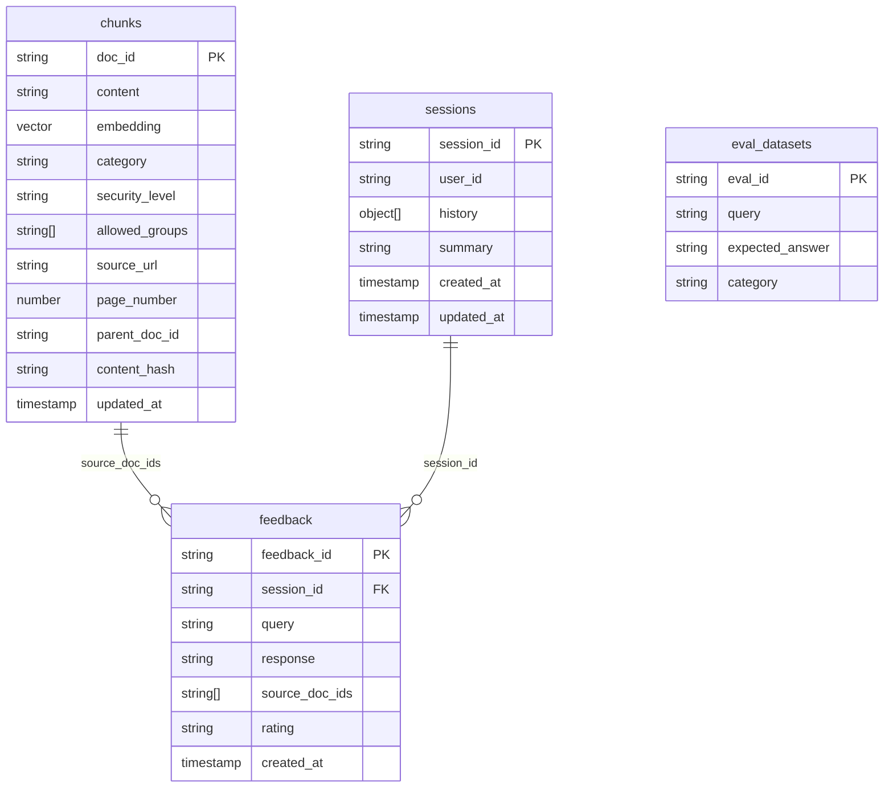

# Firestoreスキーマ設計

> 本プロジェクトで使用するFirestoreのコレクション設計。ベクトル格納・セッション管理・フィードバック・評価まで一元管理。

---

## コレクション一覧

## 各コレクションの詳細

### `chunks` — ベクトル + メタデータ格納

| 用途 | 参照先 |
|------|--------|
| ベクトル検索の対象データ | [第1回](../01_データ前処理.md)、[第3回](../03_セマンティック検索.md) |
| メタデータフィルタリング | [メタデータ設計](metadata-design.md) |
| 権限ベースの Pre-filtering | [第6回](../06_セキュリティ.md) |

**インデックス**:

- ベクトルインデックス: `embedding` フィールド（COSINE距離）
- 複合インデックス: `category` + `embedding`（フィルタ付き検索用）
- 複合インデックス: `allowed_groups` + `embedding`（権限付き検索用）

### `sessions` — チャット履歴・セッション管理

| 用途 | 参照先 |
|------|--------|
| 対話継続時のコンテキスト保持 | [第5回](../05_Genkit.md) |
| 履歴の要約（コンテキスト圧縮） | [第5回](../05_Genkit.md) |

### `feedback` — ユーザーフィードバック

| 用途 | 参照先 |
|------|--------|
| 👍/👎 の記録 | [第7回](../07_評価.md) |
| 「再学習・評価待ち」キューとして利用 | [第7回](../07_評価.md) |

### `eval_datasets` — ゴールデンデータセット

| 用途 | 参照先 |
|------|--------|
| Genkit Evaluator の入力データ | [第7回](../07_評価.md) |
| CI/CDでの自動回帰テスト | [第7回](../07_評価.md) |
