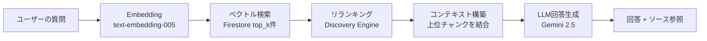

# API設計

> 最終更新: 2026-03-21 | 対応DD: DD-012, DD-012-2

## 設計思想

### なぜ2つのCloud Functionsか

| 関数 | 役割 | タイムアウト | 理由 |
|------|------|------------|------|
| `chat` | RAGチャット | 120秒 | ユーザー向け。応答速度重視 |
| `admin` | 管理系API全般 | 540秒 | Ingest/Evaluateは数分かかる。長いタイムアウトが必要 |

チャットと管理を分離することで、管理系の重い処理がチャットの応答性能に影響しない。

### なぜpath-basedルーティングか

`admin` 関数は1つの関数で7エンドポイントを捌く。関数ごとに分けない理由:
- Cloud Functionsのコールドスタートを最小化（関数が少ない方が有利）
- Firebaseの無料枠内でデプロイ・管理が簡潔
- PoCフェーズでは過剰な分離より開発速度を優先

## RAGパイプライン（データフロー）

チャットAPIの中核。ユーザーの質問がどう処理されて回答になるか:

各ステップのパラメータ（`top_k`, `rerank_top_n`, `rerank_threshold`）がTuning画面から調整可能。パラメータを変えて評価を回すことで精度を改善していく。

## エンドポイント一覧

### chat関数（`POST /api`）

RAGパイプラインを実行し回答を返す。副作用としてクエリログをFirestoreに保存。

### admin関数（`/api/admin/*`）

| パス | メソッド | 目的 |
|------|---------|------|
| `/config` | GET | 現在のチューニングパラメータを取得 |
| `/config` | PUT | パラメータを変更（ランタイムのみ、再デプロイで初期値に戻る） |
| `/ingest` | POST | ソース文書をチャンク分割→Embedding→Firestore保存 |
| `/evaluate` | POST | テストケースでRAGを実行し、スコアリング結果を保存 |
| `/evaluate/results` | GET | 過去の評価結果を取得（History画面用） |
| `/chunks` | GET | Firestoreのチャンク一覧を取得（Data Browser用） |
| `/logs` | GET | クエリログを取得（Logs画面用） |

### 設計上の注意点

- **CORS**: 開発時のみ `localhost:5180` を許可。本番はFirebase Hosting経由（same-origin）なのでCORS不要
- **パラメータの永続性**: `PUT /config` はメモリ上の値を変更するだけ。再デプロイで `config.py` の初期値に戻る。PoCでは十分だが、本番化する場合はFirestore永続化が必要
- **Ingest/Evaluateの実行時間**: 数分かかるため `admin` 関数のタイムアウトは540秒。フロントエンドでもローディング表示が必要
