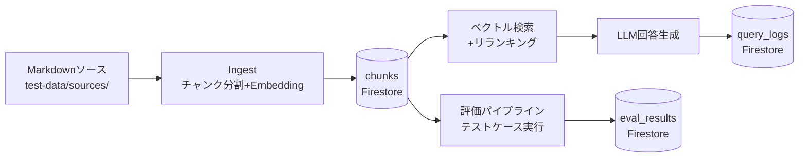
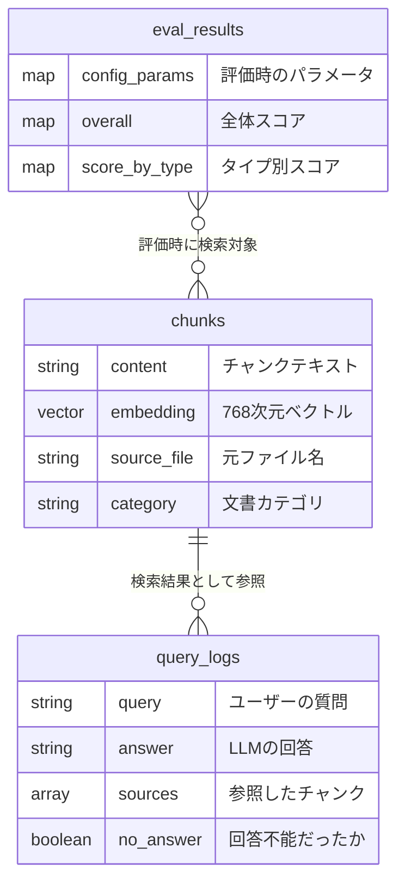

# データモデル

> 最終更新: 2026-03-21 | 対応DD: DD-012, DD-012-2

## 設計判断: なぜFirestoreでベクトルDBを兼用するか

RAG系プロジェクトでは専用ベクトルDB（Pinecone, Weaviate等）を使うのが一般的だが、本PoCではFirestoreにベクトル検索機能（768次元、COSINE距離）を使って兼用している。

**理由:**
- PoCフェーズではインフラをシンプルに保ちたい（GCPサービスを最小限に）
- チャンクのメタデータ（カテゴリ、セキュリティレベル）とベクトルを同じ場所に置ける
- Firestoreのベクトル検索は数百〜数千チャンク規模では十分な性能
- 将来スケールが必要になったら専用ベクトルDBに移行可能（チャンクのデータ構造は変わらない）

## データのライフサイクル

1. **ソース文書** → Ingestでチャンク分割・Embedding生成 → **chunks** に保存
2. ユーザーの質問 → chunksをベクトル検索 → リランキング → LLM回答 → **query_logs** に記録
3. テストケースでRAGを自動実行 → スコアリング → **eval_results** に保存

## コレクションの役割

| コレクション | 一言 | ライフサイクル |
|-------------|------|-------------|
| `chunks` | RAGの知識ベース | Ingestで全入れ替えまたは差分追加。重複はcontent_hashで検出 |
| `query_logs` | 実運用の記録 | チャットAPIの応答ごとに自動蓄積。分析・品質モニタリング用 |
| `eval_results` | チューニングの証跡 | 評価実行ごとに追加。Before/After比較で改善効果を検証 |

## 概念ER図

> Firestoreにリレーション制約はない。上図はアプリケーションレベルの論理的な関係を示す。

## 未実装: セキュリティフィルタ

chunksには `security_level` と `allowed_groups` フィールドが存在するが、検索時のフィルタは未実装（DD-013で調査対象）。現状は全チャンクが検索対象になる。
