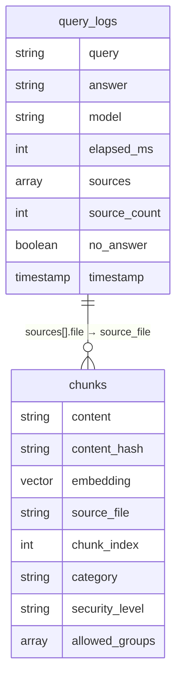

# DB定義書

> 最終更新: 2026-03-21 | 対応DD: DD-012

## コレクション一覧

| コレクション | 用途 | ドキュメントID |
|-------------|------|---------------|
| `chunks` | 文書チャンク + ベクトル埋め込み | 自動生成 |
| `query_logs` | チャットクエリ・回答の記録 | 自動生成 |

## chunks

RAGの検索対象となる文書チャンクを格納する。インジェスト時に Markdown ファイルを分割し、Embedding と共に保存する。

### フィールド定義

| フィールド | 型 | 必須 | デフォルト | 説明 |
|-----------|---|------|-----------|------|
| `content` | string | Yes | — | チャンクのテキスト内容（`[タイトル]\n本文` 形式） |
| `content_hash` | string | Yes | — | content の SHA-256 ハッシュ（重複チェック用） |
| `embedding` | vector(768) | Yes | — | text-embedding-005 による埋め込みベクトル |
| `source_file` | string | Yes | — | 元ファイル名（例: `FAQ_IT-Helpdesk.md`） |
| `chunk_index` | integer | Yes | — | ファイル内のチャンク連番（0始まり） |
| `category` | string | Yes | `"general"` | 文書カテゴリ（frontmatter の `category` から取得） |
| `security_level` | string | Yes | `"public"` | セキュリティレベル（frontmatter の `security_level` から取得） |
| `allowed_groups` | array\<string\> | Yes | `["all"]` | アクセス許可グループ（frontmatter の `allowed_groups` から取得） |

### ベクトル検索

- **フィールド**: `embedding`
- **次元数**: 768
- **距離測度**: COSINE
- **検索パラメータ**: `top_k`（デフォルト: 10）

### 書き込み

- **バッチサイズ**: 500件/バッチ
- **重複検出**: `content_hash` の一致で判定。重複時はスキップ
- **実装**: `src/ingest/store.py` — `store_chunks()`

### チャンク生成

- **分割**: `langchain_text_splitters.RecursiveCharacterTextSplitter`
- **chunk_size**: 800（デフォルト）
- **chunk_overlap**: 150（デフォルト）
- **セパレータ優先順**: `\n## ` → `\n### ` → `\n\n` → `\n` → ` `
- **ヘッダーインジェクション**: 各チャンク先頭に `[ドキュメントタイトル]` を付与
- **メタデータ**: Markdown frontmatter から category, security_level, allowed_groups を抽出

## query_logs

チャットAPIへの全クエリと回答を記録する。分析・デバッグ・品質モニタリングに使用。

### フィールド定義

| フィールド | 型 | 必須 | デフォルト | 説明 |
|-----------|---|------|-----------|------|
| `query` | string | Yes | — | ユーザーの質問テキスト |
| `answer` | string | Yes | — | LLMの回答テキスト |
| `model` | string | Yes | `""` | 使用モデル名（例: `gemini-2.5-flash`） |
| `elapsed_ms` | integer | Yes | — | 応答時間（ミリ秒） |
| `sources` | array\<object\> | Yes | — | 参照ソース一覧（各要素: `{file: string, score: number}`） |
| `source_count` | integer | Yes | — | 参照ソース数 |
| `no_answer` | boolean | Yes | — | 回答に「記載がありません」を含むか |
| `timestamp` | timestamp | Yes | — | サーバータイムスタンプ（`firestore.SERVER_TIMESTAMP`） |

### 書き込み

- **タイミング**: チャットAPI（`POST /api`）の応答成功後
- **エラー処理**: 書き込み失敗時はログ出力のみ（チャット応答には影響しない）
- **実装**: `main.py` — `_save_query_log()`

### 読み取り

- **デフォルトソート**: `timestamp` DESC
- **フィルタ**: `no_answer == true` でフィルタ可能
- **上限**: max 200件（`limit` パラメータ、デフォルト 50）

## Firestore インデックス

`firestore.indexes.json` で定義。

### 複合インデックス

| コレクション | フィールド | 用途 |
|-------------|-----------|------|
| `query_logs` | `no_answer` ASC + `timestamp` DESC | 無回答ログの時系列フィルタ |
| `chunks` | `source_file` ASC + `chunk_index` ASC | ファイル内チャンクの順序取得 |

### ベクトルインデックス

| コレクション | フィールド | 次元数 | 距離測度 |
|-------------|-----------|--------|---------|
| `chunks` | `embedding` | 768 | COSINE |

> ベクトルインデックスは Firebase コンソールまたは初回クエリ時に自動作成される。`firestore.indexes.json` には含まれない。

## ER図

> `query_logs.sources[].file` は `chunks.source_file` を参照するが、Firestore にリレーション制約はない。アプリケーションレベルの論理参照。
