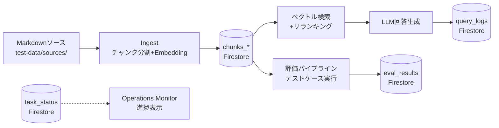
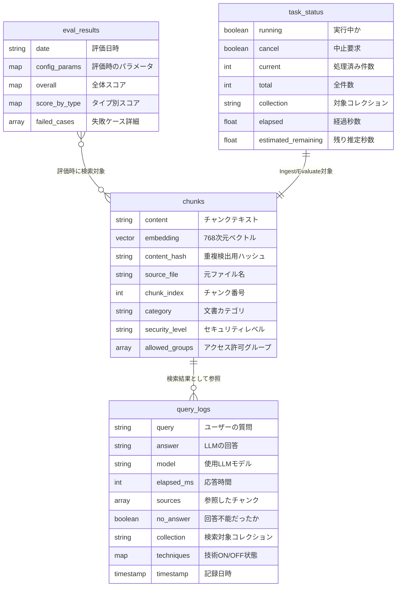

# データモデル

> 最終更新: 2026-03-22 | 対応DD: DD-012, DD-012-2, DD-022

## 設計判断: なぜFirestoreでベクトルDBを兼用するか

RAG系プロジェクトでは専用ベクトルDB（Pinecone, Weaviate等）を使うのが一般的だが、本PoCではFirestoreにベクトル検索機能（768次元、COSINE距離）を使って兼用している。

**理由:**
- PoCフェーズではインフラをシンプルに保ちたい（GCPサービスを最小限に）
- チャンクのメタデータ（カテゴリ、セキュリティレベル）とベクトルを同じ場所に置ける
- Firestoreのベクトル検索は数百〜数千チャンク規模では十分な性能
- 将来スケールが必要になったら専用ベクトルDBに移行可能（チャンクのデータ構造は変わらない）

## データのライフサイクル

1. **ソース文書** → Ingestでチャンク分割・Embedding生成 → **chunks_*** に保存
2. ユーザーの質問 → chunks_*をベクトル検索 → リランキング → LLM回答 → **query_logs** に記録
3. テストケースでRAGを自動実行 → スコアリング → **eval_results** に保存
4. Ingest/Evaluateの実行状態 → **task_status** に書き込み → Operations Monitorで表示

## コレクションの役割

| コレクション | 一言 | ライフサイクル |
|-------------|------|-------------|
| `chunks` | RAGの知識ベース（デフォルト） | Ingestで全入れ替えまたは差分追加。重複はcontent_hashで検出 |
| `chunks_{size}` | チャンクサイズ実験用 | `chunks_600`, `chunks_1200` 等。コレクション切替で検索対象を変更可能（DD-022） |
| `query_logs` | 実運用の記録 | チャットAPIの応答ごとに自動蓄積。collection名・技術ON/OFF状態も記録 |
| `eval_results` | チューニングの証跡 | 評価実行ごとに追加。Before/After比較で改善効果を検証 |
| `task_status` | ジョブ実行状態 | Ingest/Evaluateの進捗をリアルタイム共有。`task_id` は `{操作}:{コレクション名}` 形式（例: `ingest:chunks_1200`） |

## 概念ER図

> Firestoreにリレーション制約はない。上図はアプリケーションレベルの論理的な関係を示す。

## コレクション切替（DD-022）

チャンクサイズの異なる複数コレクションを並存させ、Operations Monitor（`/admin/tuning`）から切替可能:

- `config.collection_name` を動的に変更（`PUT /collections/active`）
- 検索・Ingest・Evaluate の全コードが `config.collection_name` を参照
- 新コレクション作成時は Firestore ベクトルインデックスの手動作成が必要（[手順書](../../guide/chunk-experiment.md)）

## セキュリティフィルタ

chunksの `allowed_groups` フィールドによる権限制御が実装済み:

- **ベクトル検索**: Firestore Pre-filtering（`array_contains_any`）で権限外チャンクを除外
- **キーワード検索**: Python側で `allowed_groups` をフィルタ
- **Shadow Retrieval**: フィルタあり/なし検索の差分で権限除外を検出し、即拒否
