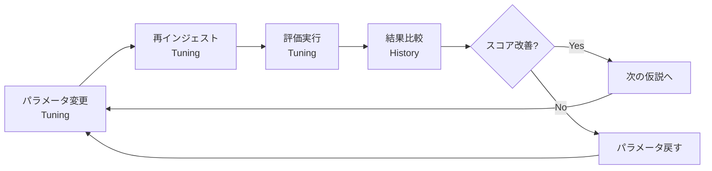
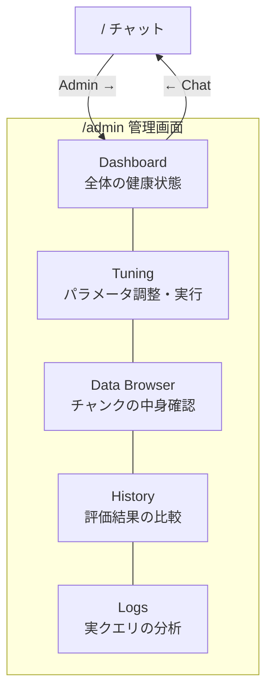

# 画面設計

> 最終更新: 2026-03-21 | 対応DD: DD-012, DD-012-2

## このプロジェクトの2つの顔

本システムは**2種類のユーザー**に向けた画面を持つ:

| ユーザー | 画面 | 目的 |
|---------|------|------|
| 一般社員 | チャット（`/`） | 社内ドキュメントについてAIに質問する |
| RAG開発者 | 管理画面（`/admin/*`） | RAGパイプラインの精度を計測・チューニングする |

チャット画面は「RAGの成果物」、管理画面は「RAGを育てるツール」。

## チューニングサイクル（管理画面の核心）

管理画面の存在意義は、RAGの精度改善を**仮説検証サイクル**として回せることにある:

**例**: 「chunk_sizeを800→600に変えたら、semantic検索のスコアは上がるか？」
→ Tuningでパラメータ変更 → Re-tune実行 → Historyで前回と比較 → 判断

## 画面遷移

## 各画面の役割

### チャット（`/`）
ユーザーが質問を入力し、RAGパイプラインが検索・回答する。回答にはソース文書の参照が付く。**ここでの体験品質が、管理画面で改善すべき対象そのもの。**

### Dashboard（`/admin`）
RAGの「今の状態」を一目で把握する画面。全体スコア、テストタイプ別のスコア分布、チャンク数。**「どこが弱いか」を見つけて、Tuningでの仮説を立てる起点。**

### Tuning（`/admin/tuning`）
パラメータを変更し、Ingest→Evaluateを実行する画面。**チューニングサイクルの操作をすべてここで行える。** Re-tuneボタンで一括実行も可能。画面上部に操作フロー（① パラメータ変更 → ② Re-tune → ③ Historyで比較）のガイドを表示。各パラメータにはインライン説明（分割サイズ、重複幅、検索件数、絞り込み件数、足切りスコア）を付与。

### History（`/admin/history`）
過去の評価結果を時系列で並べ、Before/Afterを選んで比較する画面。一覧では「前回からの変更」列に変更内容を要約表示し、「スコア変動」列で前回比を色分け表示。2件選択時の比較セクションでは、パラメータ差分（変更行を黄色ハイライト）とタイプ別スコアΔ（緑=改善、赤=悪化）を対比し、**「この変更は効果があったか？」を判断する。** テストタイプ名は日本語ラベル付き（例: ambiguous → 曖昧質問対応）。

### Data Browser（`/admin/data`）
Firestoreに格納されたチャンクの中身を閲覧する画面。カテゴリ・セキュリティレベルでフィルタ可能。**「チャンクの切れ方は適切か？」「ヘッダーインジェクションは効いているか？」の目視確認用。**

### Logs（`/admin/logs`）
実際のユーザークエリと回答のログ。no_answer（回答不能）フィルタあり。ログ行クリックで右側パネルに詳細（Query・Answer・Sources）を表示し、一覧を見ながら切り替え可能。**「実運用でどんな質問が来ていて、どこで失敗しているか」を把握する。**
