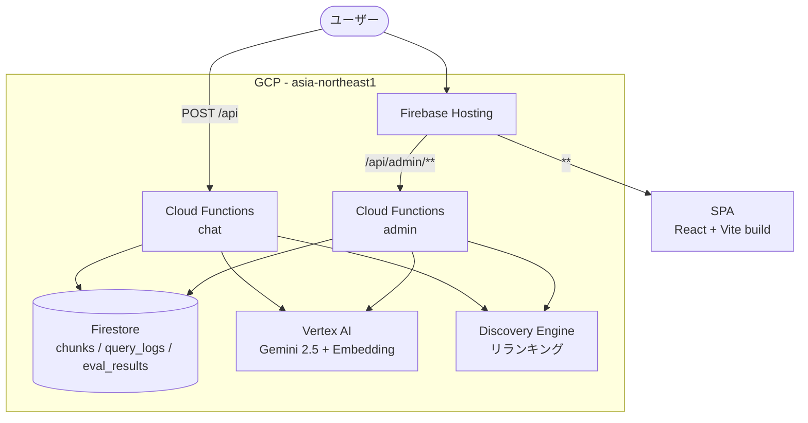
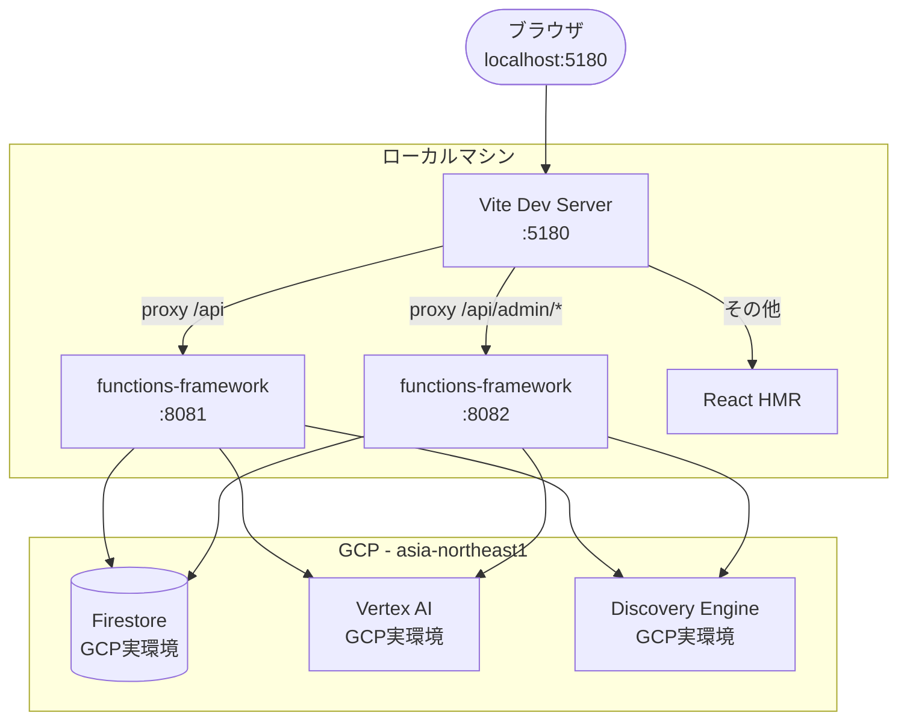

# 環境構成

> 最終更新: 2026-03-21 | 対応DD: DD-012, DD-012-2

## 本番環境（Firebase）

> DD-016完了後の構成を前提。eval_resultsのFirestore化が含まれる。Evaluate/Ingestはローカル専用。

本番ではすべてがGCP上で完結する。ユーザーはFirebase Hostingにアクセスし、APIコールはHostingのrewriteルールでCloud Functionsにルーティングされる。

## 開発環境（ローカル）

ローカルではVite Dev ServerがAPIリクエストをfunctions-frameworkにプロキシする。**Firestoreや Vertex AIはGCPの実環境を直接使う**（エミュレータは使わない）。

## 開発 vs 本番 の差分

| 項目 | 開発 | 本番 |
|------|------|------|
| **フロントエンド** | Vite Dev Server（HMR）| Firebase Hosting（静的ビルド） |
| **API実行** | functions-framework（ローカルプロセス）| Cloud Functions Gen2 |
| **APIルーティング** | Viteのproxy設定 | Firebase Hostingのrewriteルール |
| **CORS** | 必要（localhost:5180 → localhost:808x）| 不要（same-origin） |
| **Firestore** | GCP実環境を直接使用 | 同左 |
| **Vertex AI** | GCP実環境を直接使用 | 同左 |
| **test-data** | ローカルファイルシステム | Cloud Functionsにデプロイ（DD-016） |
| **eval_results保存** | Firestore + ローカルファイル | Firestoreのみ（DD-016） |
| **パラメータ永続性** | メモリのみ（プロセス再起動でリセット）| メモリのみ（再デプロイでリセット）|

**重要な設計判断**: Firestoreエミュレータを使わず、開発時もGCP実環境のFirestoreに接続する。理由はPoCフェーズでのセットアップ簡素化と、開発/本番のデータ乖離を防ぐため。

## GCPサービス一覧

| サービス | 用途 | リージョン |
|---------|------|-----------|
| Firebase Hosting | SPA配信 + APIリライト | グローバル |
| Cloud Functions Gen2 | chat + admin（Python 3.12）| asia-northeast1 |
| Firestore | ベクトルDB兼ドキュメントストア | (default) |
| Vertex AI | Gemini 2.5 Flash/Pro + text-embedding-005（768次元）| asia-northeast1 |
| Cloud Discovery Engine | リランキングAPI | global |

## 環境変数

| 変数 | 必須 | 説明 |
|------|------|------|
| `GOOGLE_CLOUD_PROJECT` | Yes | GCPプロジェクトID（`.env.local` で設定。本番はGCPが自動セット） |
| `GOOGLE_CLOUD_LOCATION` | Yes | Vertex AIリージョン（`.env.local` で設定） |
| `API_PORT` | No（8081）| 開発: chat APIポート |
| `ADMIN_PORT` | No（8082）| 開発: admin APIポート |
| `UI_PORT` | No（5180）| 開発: Viteポート |
