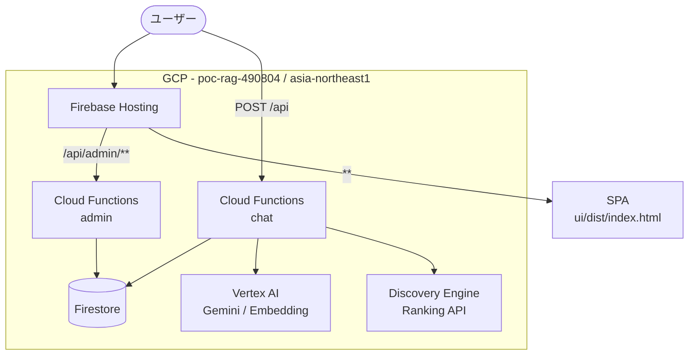

# 環境構成

> 最終更新: 2026-03-21 | 対応DD: DD-012

## GCPサービス依存



### サービス一覧

| サービス | 用途 | リージョン |
|---------|------|-----------|
| Firebase Hosting | SPA配信 + API rewrite | グローバル |
| Cloud Functions Gen2 | chat（RAG API）+ admin（管理API） | asia-northeast1 |
| Firestore | ベクトルDB（chunks）+ クエリログ（query_logs） | (default) |
| Vertex AI | Gemini 2.5 Flash/Pro（LLM）+ text-embedding-005（768次元） | asia-northeast1 |
| Cloud Discovery Engine | リランキングAPI（`default_ranking_config`） | global |

### Cloud Functions 構成

| 関数名 | メモリ | タイムアウト | min_instances | 用途 |
|--------|--------|------------|---------------|------|
| `chat` | 1 GB | 120秒 | 0 | RAGチャットAPI |
| `admin` | 1 GB | 540秒 | 0 | 管理系API（7エンドポイント） |

**ランタイム**: Python 3.12 / `firebase-functions`

## 環境変数

### `.env`（ルートディレクトリ）

| 変数 | 必須 | 例 | 説明 |
|------|------|---|------|
| `GOOGLE_CLOUD_PROJECT` | Yes | `poc-rag-490804` | GCPプロジェクトID |
| `GOOGLE_CLOUD_LOCATION` | Yes | `asia-northeast1` | Vertex AI リージョン |

テンプレート: `.env.example`

### 開発サーバーポート（環境変数で変更可）

| 変数 | デフォルト | 用途 |
|------|-----------|------|
| `API_PORT` | 8081 | chat API サーバー |
| `ADMIN_PORT` | 8082 | admin API サーバー |
| `UI_PORT` | 5180 | Vite 開発サーバー |

## Firebase 設定

### プロジェクト（`.firebaserc`）

```json
{ "projects": { "default": "poc-rag-490804" } }
```

### Hosting（`firebase.json`）

| 設定 | 値 |
|------|---|
| public | `ui/dist` |
| リライト | `/api/admin/**` → admin 関数、`**` → `/index.html` |
| キャッシュ | `index.html`: no-store / `assets/**`: 1年 immutable |

### Functions デプロイ除外（`firebase.json` ignore）

```
.git, .github, .venv, __pycache__, node_modules, doc, site,
test-data, data_cache, results, streamlit, ui, scripts,
.env, .env.*, *.md, *.lock, mkdocs.yml, pyproject.toml, .claude
```

## Vite プロキシ（ローカル開発）

| パス | 転送先 | パスリライト |
|------|--------|------------|
| `/api/admin` | `http://localhost:8082` | `/api/admin` を除去 |
| `/api` | `http://localhost:8081` | `/api` を除去 |

**設定**: `ui/vite.config.ts`

マッチ順序: `/api/admin` が先に評価され、残りの `/api` が chat に転送される。

## 依存パッケージ

### Python（`pyproject.toml`）

| パッケージ | バージョン | 用途 |
|-----------|-----------|------|
| `firebase-functions` | >=0.4.0 | Cloud Functions フレームワーク |
| `google-cloud-firestore` | >=2.25.0 | Firestore クライアント |
| `vertexai` | >=1.0.0 | Vertex AI SDK（LLM + Embedding） |
| `google-cloud-discoveryengine` | >=0.13.0 | Ranking API |
| `langchain-text-splitters` | >=0.3.0 | ドキュメント分割 |
| `python-dotenv` | >=1.1.0 | .env 読み込み |
| `functions-framework` | >=3.0.0 | ローカル開発サーバー |

### フロントエンド（`ui/package.json`）

| パッケージ | バージョン | 用途 |
|-----------|-----------|------|
| `react` | ^19 | UI フレームワーク |
| `react-dom` | ^19 | DOM レンダリング |
| `react-router-dom` | ^7 | クライアントサイドルーティング |
| `react-markdown` | ^10 | Markdown レンダリング |
| `vite` | ^8 | ビルドツール |
| `typescript` | ~5.9 | 型チェック |
